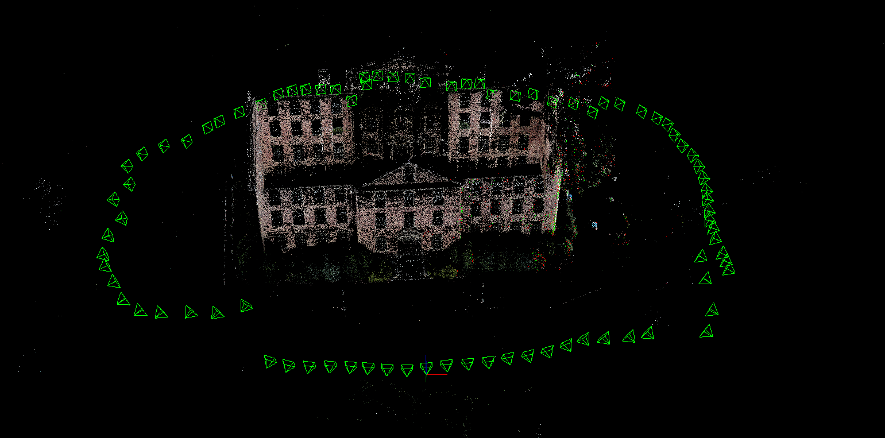
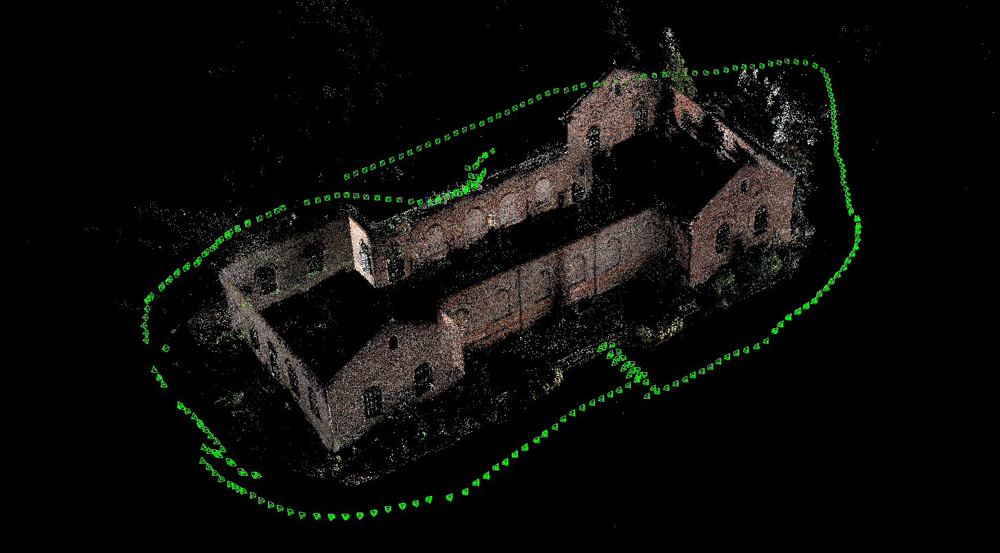
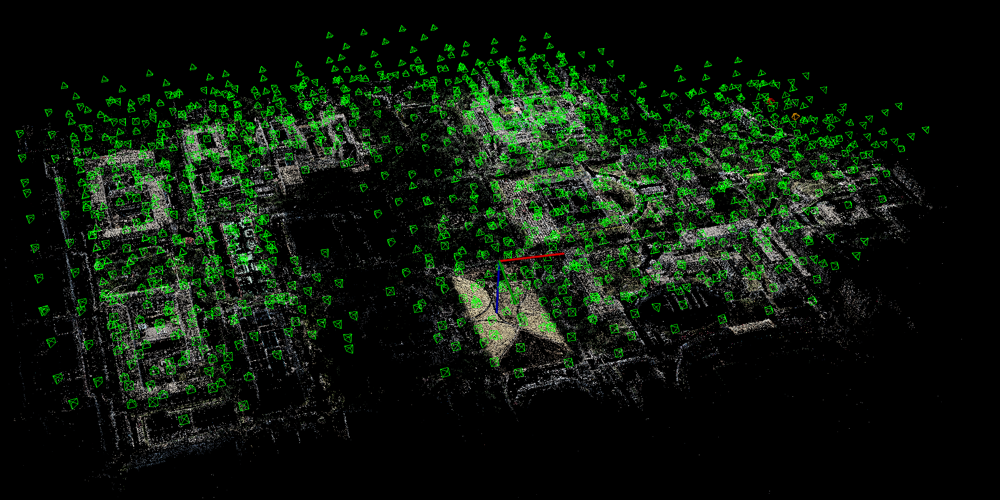
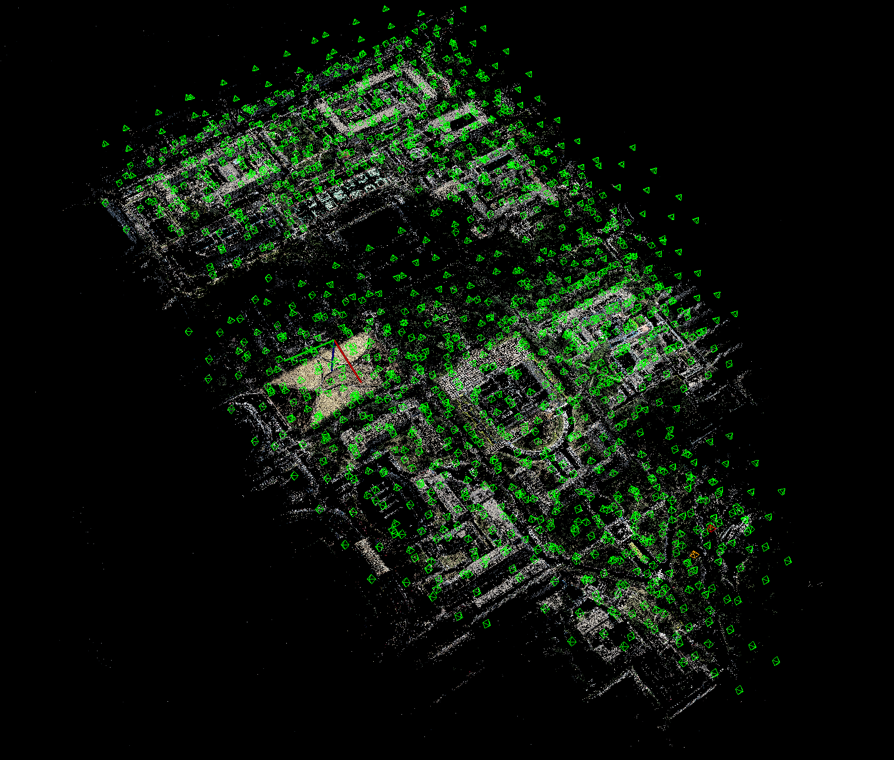

# MonocularSfM : Monocular Structure from Motion

## Introuction

MonocularSfm是一个三维重建的程序, 可以对有序或者无序的图片进行三维重建.

程序的输入是**图片**和**相机参数**(包括相机内参`fx`, `fy`, `cx`, `fy`和畸变参数`k1`, `k2`, `p1`, `p2`[可选]).

程序的输出是**三维稀疏点云**和已注册图像的**投影矩阵**.


### south-building



### person-hall


### 东北大学



Number points3D			: `542084`

Number images			: `1329`

Mean reprojection error : `0.33772 [px]`


## Dependencies
* [Eigen](http://eigen.tuxfamily.org) version 3.2
* [OpenCV](http://opencv.org) version 3.x or higher
* [Ceres](http://ceres-solver.org) version 1.10 or higher

## Building
```
mkdir build && cd build
cmake ..
make -j3
```

## How to Run
```
# step1: Extract features
./FeatureExtraction ../config/NEU.yaml

# step2: Calculate the matching (according to the different data sets, decide to use **order matching** or **violent matching**, which is achieved by modifying the parameters of the configuration file in config)
./ComputeMatches ../config/NEU.yaml

# step3: Check the match, by displaying the matching pairs between different images, to confirm whether the first two steps are correct (can be skipped).
./CheckMatches ../config/NEU.yaml

# step4: Rebuild
./Reconstruction ../config/NEU.yaml

```
For more details, please check the `yaml` file in the `config` folder

Or directly use the python script file `pipeline.py`
```
./pipeline ./config/NEU.yaml
```

## Dataset

You can download the datasets from [here](https://onedrive.live.com/?authkey=%21AAQumsDDwZBIW3w&id=C58A258D760E1B58%2146879&cid=C58A258D760E1B58), which provided by [COLMAP](https://colmap.github.io/datasets.html#datasets)


* **Gerrard Hall**: 100 high-resolution images of the “Gerrard” hall at UNC Chapel Hill, which is the building right next to the “South” building. The images are taken with the same camera but different focus using a wide-angle lens.
* **Graham Hall**: 1273 high-resolution images of the interior and exterior of “Graham” memorial hall at UNC Chapel Hill. The images are taken with the same camera but different focus using a wide-angle lens.
* **Person Hall**: 330 high-resolution images of the “Person” hall at UNC Chapel Hill. The images are taken with the same camera using a wide-angle lens.
* **South Building**: 128 images of the “South” building at UNC Chapel Hill. The images are taken with the same camera, kindly provided by Christopher Zach.


## Knowledge
 See the [wiki](https://github.com/nebula-beta/MonocularSfM/wiki) page

## Citations
[1] Snavely N, Seitz S M, Szeliski R. [Photo Tourism: Exploring Photo Collections In 3D](http://phototour.cs.washington.edu/Photo_Tourism.pdf)[J]. Acm Transactions on Graphics, 2006, 25(3):págs. 835-846.

[2] Wu C. [Towards Linear-Time Incremental Structure from Motion](http://ccwu.me/vsfm/vsfm.pdf)[C]// International Conference on 3d Vision. IEEE Computer Society, 2013:127-134.

[3] Schönberger J L, Frahm J M. [Structure-from-Motion Revisited](https://demuc.de/papers/schoenberger2016sfm.pdf)[C]// Computer Vision and Pattern Recognition. IEEE, 2016.
