# Practical Computer Vision

# Lesson 1 - Introduction to Computer Vision 

## 1.1. Understading the human visual system

Before we jump into OpenCV functionalities, we need to understand why those functions were built in the first place. It's important to understand how the human visual system works so that you can develop the right algorithms.

The goal of computer vision algorithms is to understand the content of images and videos. Humans seem to do it effortlessly! So, how do we get machines to do it with the same accuracy?

Let's consider the following diagram:


The human eye captures all the information that comes along the way, such as color, shape, brightness, and so on. In the preceding image, the human eye captures all the information about the two main objects and stores it in a certain way. Once we understand how our system works, we can take advantage of it to achieve what we want.

For example, here are a few things we need to know:

- Our visual system is more sensitive to low-frequency content than high-frequency content. Low-frequency content refers to planar regions where pixel values don't change rapidly, and high-frequency content refers to regions with corners and edges where pixel values fluctuate a lot. We can easily see if there are blotches on a planar surface, but it's difficult to spot something like that on a highly-textured surface.

- The human eye is more sensitive to changes in brightness than to changes in color.

- Our visual system is sensitive to motion. We can quickly recognize if something is moving in our field of vision, even though we are not directly looking at it.

- We tend to make a mental note of salient points in our field of vision. Let's say you look at a white table with four black legs and a red dot at one of the corners of the table surface. When you look at this table, you'll immediately make a mental note that the surface and legs have opposing colors and that there is a red dot on one of the corners. Our brain is really smart that way! We do this automatically so that we can immediately recognize an object if we encounter it again.

To get an idea of our field of view, let's look at the top view of a human, and the angles at which we see various things:


<b> How do humans understand image content? </b>

If you look around, you will see a lot of objects. You encounter many different objects every day, and you recognize them almost instantaneously without any effort. When you see a chair, you don't wait for a few minutes before realizing that it is in fact a chair. You just know that it's a chair right away.

Computers, on the other hand, find it very difficult to do this task. Researchers have been working for many years to find out why computers are not as good as we are at this.

To get an answer to that question, we need to understand how humans do it. The visual data processing happens in the ventral visual stream. This ventral visual stream refers to the pathway in our visual system that is associated with object recognition. It is basically a hierarchy of areas in our brain that helps us recognize objects.

Humans can recognize different objects effortlessly, and can cluster similar objects together. We can do this because we have developed some sort of invariance toward objects of the same class. When we look at an object, our brain extracts the salient points in such a way that factors such as orientation, size, perspective, and illumination don't matter.

A chair that is double the normal size and rotated by 45 degrees is still a chair. We can recognize it easily because of the way we process it. Machines cannot do that so easily. Humans tend to remember an object based on its shape and important features. Regardless of how the object is placed, we can still recognize it.

In our visual system, we build up these hierarchical invariances with respect to position, scale, and viewpoint that help us to be very robust. If you look deeper into our system, you will see that humans have cells in their visual cortex that can respond to shapes such as curves and lines.

As we move further along our ventral stream, we will see more complex cells that are trained to respond to more complex objects such as trees, gates, and so on. The neurons along our ventral stream tend to show an increase in the size of the receptive field. This is coupled with the fact that the complexity of their preferred stimuli increases as well.

<b> Why is it difficult for machines to understand image content? </b>

We now understand how visual data enters the human visual system, and how our system processes it. The issue is that we still don't fully understand how our brain recognizes and organizes this visual data. In machine learning, we just extract some features from images, and ask the computers to learn them using algorithms. We still have these variations, such as shape, size, perspective, angle, illumination, occlusion, and so on.

For example, the same chair looks very different to a machine when you look at it from the profile view. Humans can easily recognize that it's a chair, regardless of how it's presented to us. So, how do we explain this to our machines?

One way to do this would be to store all the different variations of an object, including sizes, angles, perspectives, and so on. But this process is cumbersome and time-consuming. Also, it's actually not possible to gather data that can encompass every single variation. The machines would consume a huge amount of memory and a lot of time to build a model that can recognize these objects.

Even with all this, if an object is partially occluded, computers still won't recognize it. This is because they think this is a new object. So when we build a computer vision library, we need to build the underlying functional blocks that can be combined in many different ways to formulate complex algorithms.

## 1.2. A Fast Introduction to Computer Vision

Computer vision applications have become quite ubiquitous in our lives. The applications are varied, ranging from apps that play Virtual Reality (VR) or Augmented Reality (AR) games to applications for scanning documents using smartphone cameras. On our smartphones, we have QR code scanning and face detection, and now we even have facial recognition techniques. Online, we can now search using images and find similar looking images. Photo sharing applications can identify people and make an album based on the friends or family found in the photos. Due to improvements in image stabilization techniques, even with shaky hands, we can create stable videos.

With the recent advancements in deep learning techniques, applications like image classification, object detection, tracking, and so on have become more accurate and this has led to the development of more complex autonomous systems, such as drones, self-driving cars, humanoids, and so on. Using deep learning, images can be transformed into more complex details; for example, images can be converted into Van Gogh style paintings.

Such progress in several domains makes a non-expert wonder, how computer vision is capable of inferring this information from images. The motivation lies in human perception and the way we can perform complex analyzes of the environment around us. We can estimate the closeness of, structure and shape of objects, and estimate the textures of a surface too. Even under different lights, we can identify objects and even recognize something if we have seen it before.

Considering these advancements and motivations, one of the basic questions that arises is what is computer vision? In this chapter, we will begin by answering this question and then provide a broader overview of the various sub-domains and applications within computer vision. 

### 1.2.1. What constitutes computer vision?

In order to begin the discussion on computer vision, observe the following image:


Even if we have never done this activity before, we can clearly tell that the image is of people skiing in the snowy mountains on a cloudy day. This information that we perceive is quite complex and can be sub divided into more basic inferences for a computer vision system.

The most basic observation that we can get from an image is of the things or objects in it. In the previous image, the various things that we can see are trees, mountains, snow, sky, people, and so on. Extracting this information is often referred to as image classification, where we would like to label an image with a predefined set of categories. In this case, the labels are the things that we see in the image. 

A wider observation that we can get from the previous image is landscape. We can tell that the image consists of <b> Snow </b>, <b> Mountain </b>, and <b> Sky </b>, as shown in the following image:


Although it is difficult to create exact boundaries for where the Snow, Mountain, and Sky are in the image, we can still identify approximate regions of the image for each of them. This is often termed as segmentation of an image, where we break it up into regions according to object occupancy. 

Making our observation more concrete, we can further identify the exact boundaries of objects in the image, as shown in the following figure:


In the image, we see that people are doing different activities and as such have different shapes; some are sitting, some are standing, some are skiing. Even with this many variations, we can detect objects and can create bounding boxes around them. Only a few bounding boxes are shown in the image for understanding—we can observe much more than these. 

While, in the image, we show rectangular bounding boxes around some objects, we are not categorizing what object is in the box. The next step would be to say the box contains a person. This combined observation of detecting and categorizing the box is often referred to as object detection. 

Extending our observation of people and surroundings, we can say that different people in the image have different heights, even though some are nearer and others are farther from the camera. This is due to our intuitive understanding of image formation and the relations of objects. We know that a tree is usually much taller than a person, even if the trees in the image are shorter than the people nearer to the camera. Extracting the information about geometry in the image is another sub-field of computer vision, often referred to as image reconstruction. 

### 1.2.2. Computer vision is everywhere

- <b> Image classification: </b> In the past few years, categorizing images based on the objects within has gained popularity. This is due to advances in algorithms as well as the availability of large datasets. Deep learning algorithms for image classification have significantly improved the accuracy while being trained on datasets like ImageNet. We will study this dataset further in the next chapter. The trained model is often further used to improve other recognition algorithms like object detection, as well as image categorization in online applications. In this book, we will see how to create a simple algorithm to classify images using deep learning models. 

- <b> Object detection: </b> Not just self-driving cars, but robotics, automated retail stores, traffic detection, smartphone camera apps, image filters and many more applications use object detection. These also benefit from deep learning and vision techniques as well as the availability of large, annotated datasets. We saw an introduction to object detection in the previous section that produces bounding boxes around objects and also categorize what object is inside the box. 

- <b> Object tracking: </b> Following robots, surveillance cameras and people interaction are few of the several applications of object tracking. This consists of defining the location and keeps track of corresponding objects across a sequence of images.

- <b> Image geometry: </b> This is often referred to as computing the depth of objects from the camera. There are several applications in this domain too. Smartphones apps are now capable of computing three-dimensional structures from the video created onboard. Using the three-dimensional reconstructed digital models, further extensions like AR or VR application are developed to interface the image world with the real world. 

- <b> Image segmentation: </b> This is creating cluster regions in images, such that one cluster has similar properties. The usual approach is to cluster image pixels belonging to the same object. Recent applications have grown in self-driving cars and healthcare analysis using image regions. 

- <b> Image generation: </b> These have a greater impact in the artistic domain, merging different image styles or generating completely new ones. Now, we can mix and merge Van Gogh's painting style with smartphone camera images to create images that appear as if they were painted in a similar style to Van Gogh's.

### 1.2.3. Image color conversions

An image is made up pixels and is usually visualized
according to the value stored. There is also an additional
property that makes different kinds of image. Each of the
value stored in a pixel is linked to a fixed representation. For
example, a pixel value of ten can represent gray intensity
value ten or blue color intensity value 10 and so on. It is
therefore important to understand different color types and
their conversion. In this section, we will see color types and
conversions using OpenCV :

- <b> Grayscale: </b> This is a simple one channel image with
values ranging from 0 to 255 that represent the
intensity of pixels.


- <b> HSV and HLS: </b> These are another representation of
color representing H is hue, S is saturation, V is
value, and L is lightness. These are motivated by thehuman perception system.


- <b> LAB color space: </b> Denoted L for lightness, A for
green-red colors, and B for blue-yellow colors, this
consists of all perceivable colors. This is used to
convert between one type of color space (for
example, RGB) to others (such as CMYK) becauseof its device independence properties. On devices
where the format is different to that of the image that
is sent, the incoming image color space is first
converted to LAB and then to the corresponding
space available on the device.


## Lesson 2 - Image Filtering and Transformations in OpenCV

## 2.1. Introduction to filters

Filters are operations on an image to modify them so that
they are usable for other computer vision tasks or to give us
required information. These perform various functions such
as removing noise from an image, extracting edges in an
image, blurring an image, removing unwanted objects etc.
We will see their implementations and understand the results.

Filtering techniques are necessary because there are several
factors that may lead to noise in an image or undesired
information in an image. Taking a picture in sunlight,
induces lots of bright and dark areas in the image or an
improper environment like night time, the image captured by
a camera may contain a lot of noise. Also, in cases of
unwanted objects or colors in an image, these are also
considered noise.

An example of salt and pepper noise looks like the
following:


In several applications, noise plays an important role in
improving a system's capabilities, especially when we will
use Deep Learning based models in the upcoming chapters.
It is quite crucial for several applications, to know how
robust the application is against noise becomes very
important. As an example, we would want the model
designed for applications like image classification to work
with noisy images as well, hence noise is deliberately added
in the images to test the application precision.

### 2.1.1. Linear filters

To begin with, the simplest kind of filter is a point operator,
where each pixel value is multiplied by a scalar value. This
operation can be written as follows:

$g(i, j) = K x f(i, j)$

Here:

- The input image is $F$ and the value of pixel at $(i,j)$ is
denoted as $f(i,j)$
- The output image is $G$ and the value of pixel at $(i,j)$ is
denoted as $g(i,j)$
- $K$ is scalar constant

Such an operation on an image is termed a linear filter.
There are many more kinds of linear filters which you will be
reading about further in this section. In addition to
multiplication by a scalar value, each pixel can also be increased or decreased by a constant value. So overall point
operation can be written as follows:

$g(i, j) = K x f(i, j) + L$

This operation can be applied both to grayscale images and
RGB images. For RGB images, each channel will be
modified with this operation separately. The following is the
result of varying both K and L. The first image is input on the
left. In the second image, K=0.5 and L=0.0 , while in the third
image, K is set to 1.0 and L is 10 . For the final image on the
right, K=0.7 and L=25 . As you can see, varying K changes the
brightness of the image and varying L changes the contrast of
the image:


### 2.1.2. 2D linear filters

While the preceding filter is a point-based filter, image pixels
have information around the pixel as well. In the previous
image of the flower, the pixel values in the petal are all
yellow. If we choose a pixel of the petal and move around,
the values will be quite close. This gives some more
information about the image. To extract this information in
filtering, there are several neighborhood filters.

In neighborhood filters, there is a kernel matrix which
captures local region information around a pixel. To explain
these filters, let's start with an input image, as follows:


This is a simple binary image of the number 2. To get certain
information from this image, we can directly use all the pixel
values. But instead, to simplify, we can apply filters on this.
We define a matrix smaller than the given image which operates in the neighborhood of a target pixel. This matrix is
termed kernel; an example is given as follows:


The operation is defined first by superimposing the kernel
matrix on the original image, then taking the product of the
corresponding pixels and returning a summation of all the
products. In the following figure, the lower 3 x 3 area in the
original image is superimposed with the given kernel matrix
and the corresponding pixel values from the kernel and
image are multiplied. The resulting image is shown on the
right and is the summation of all the previous pixel products:


This operation is repeated by sliding the kernel along image
rows and then image columns.

```python
# design a kernel matrix, here is uniform 5x5
kernel = np.ones((5,5),np.float32)/25
# apply on the input image, here grayscale
dst = cv2.filter2D(gray,-1,kernel)
```

However, as you can see previously, the corner pixel will
have a drastic impact and results in a smaller image because
the kernel, while overlapping, will be outside the image
region. This causes a black region, or holes, along with the
boundary of an image. To rectify this, there are some
common techniques used:

- Padding the corners with constant values maybe 0 or
255, by default OpenCV will use this.

- Mirroring the pixel along the edge to the external
area

- Creating a pattern of pixels around the image

The choice of these will depend on the task at hand. In
common cases, padding will be able to generate satisfactory
results.

The effect of the kernel is most crucial as changing these
values changes the output significantly. We will first see
simple kernel-based filters and also see their effects on the
output when changing the size.

### 2.1.3. Box filters

This filter averages out the pixel value as the kernel matrix is
denoted as follows:


Applying this filter results in blurring the image. The results
are as shown as follows:


In frequency domain analysis of the image, this filter is a low
pass filter. The frequency domain analysis is done using
Fourier transformation of the image, which is beyond the
scope of this introduction. We can see on changing the kernel
size, the image gets more and more blurred:


As we increase the size of the kernel, we can observe that
resulting image gets more blurred. This is due to averaging
out of peak values in the small neighborhood where the
kernel is applied. The result for applying kernel of size 20 x
20 can be seen in the following image:


However, if we use a very small filter of size (3, 3) there is
negligible effect on the output, due to the fact that the kernel
size is quite small compared to the photo size. In most
applications, kernel size is heuristically set according to
image size:


### 2.1.4. Properties of linear filters

Several computer vision applications are composed of step
by step transformations of an input photo to output. This is
easily done due to several properties associated with a
common type of filters, that is, linear filters:

- The linear filters are commutative such that we can
perform multiplication operations on filters in any
order and the result still remains the same:

$a * b = b * a$

- They are associative in nature, which means the order
of applying the filter does not effect the outcome:

$(a * b) * c = a * (b * c)$

- Even in cases of summing two filters, we can
perform the first summation and then apply the filter,
or we can also individually apply the filter and then sum the results. The overall outcome still remains the
same:

$ b = (k + l) * a $

- Applying a scaling factor to one filter and
multiplying to another filter is equivalent to first
multiplying both filters and then applying scaling
factor.

These properties play a significant role later, when we look
at computer vision tasks such as object detection,
segmentation, and so on. A suitable combination of these
filters enhances the quality of information extraction and as a
result, improves the accuracy.

### 2.1.5. Non-linear filters

While in many cases linear filters are sufficient to get the
required results, in several other use cases performance can
be significantly increased with the use of non-linear filters.
As the name suggests, these filters are composed of more
complex operations, have some kind of non-linearity, and as
a result these filters do not follow some or all of the
properties of linear filters.

We will understand these filters with implementations.

### 2.1.6. Smoothing a photo

Applying a box filter with hard edges doesn't result in a
smooth blur on the output photo.

To improve this, the filter can be made smoother around the
edges. One of the popular such filters is a Gaussian filter.
This is a non-linear filter which enhances the effect of the
center pixel and gradually reduces the effects as the pixel
gets farther from the center. Mathematically, a Gaussian
function is given as:

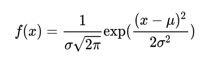

where $\mu$ is the mean and $\sigma$ is the variance

An example kernel matrix for this kind of filter in a two-
dimensional discrete domain is given as follows:

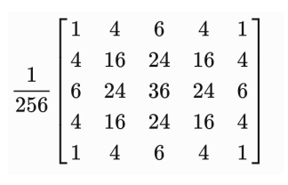

This two-dimensional array is used in normalized form and
effect of this filter also depends on its width by changing the
kernel width has varying effects on the output as discussed in
further section. Applying Gaussian kernel as filter removes
high-frequency components which results in removing strong
edges and hence a blurred photo:

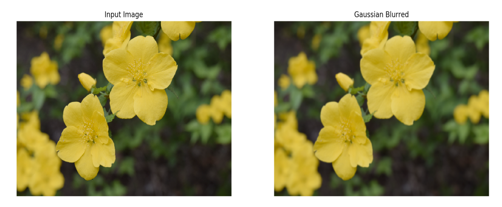

### 2.1.7. Histogram equalization

The basic point operations, to change the brightness and
contrast, help in improving photo quality but require manual
tuning. Using histogram equalization technique, these can be
found algorithmically and create a better-looking photo.
Intuitively, this method tries to set the brightest pixels to
white and the darker pixels to black. The remaining pixel
values are similarly rescaled. This rescaling is performed by
transforming original intensity distribution to capture all
intensity distribution. An example of this equalization is as
following:

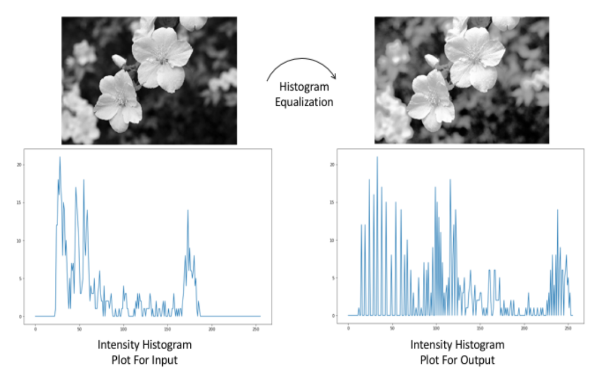

The preceding image is an example of histogram
equalization. On the right is the output and, as you can see,
the contrast is increased significantly. The input histogram is
shown in the bottom figure on the left and it can be observed
that not all the colors are observed in the image. After
applying equalization, resulting histogram plot is as shown
on the right bottom figure. To visualize the results of
equalization in the image, the input and results are stacked
together in following figure:

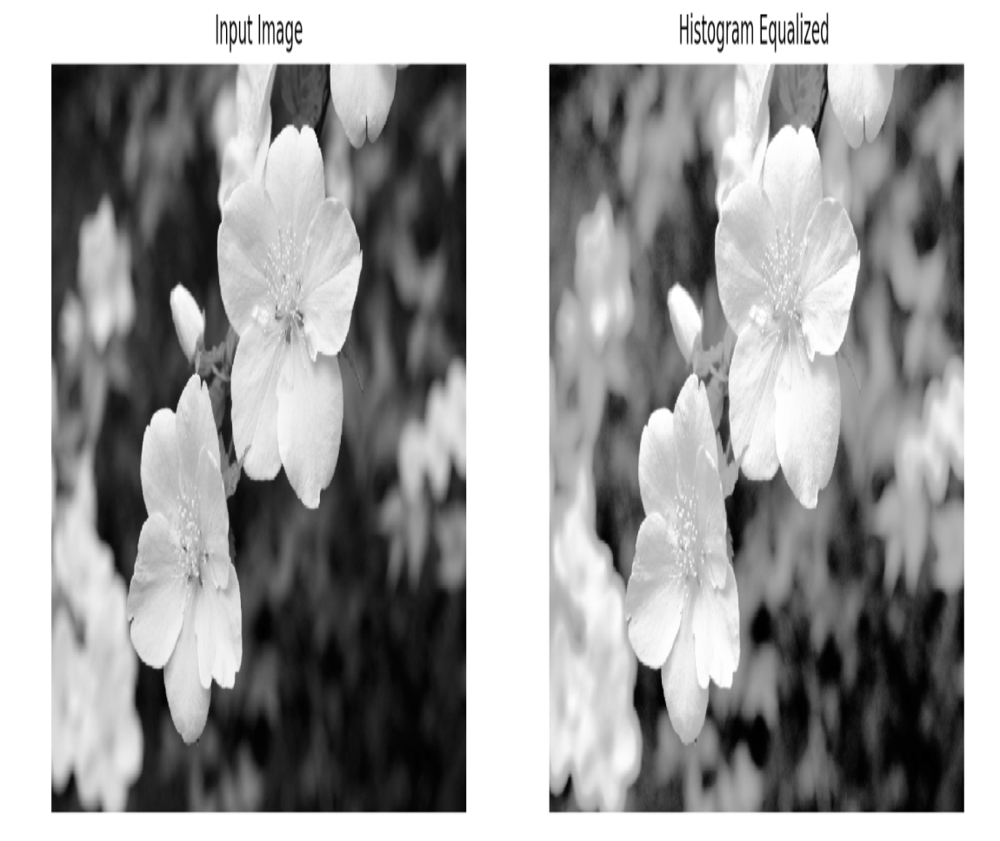

### 2.1.8. Median filter

This filter uses the same technique of neighborhood filtering;
the key technique in this is the use of a median value. As
such, the filter is non-linear. It is quite useful in removing
sharp noise such as salt and pepper.

Instead of using a product or sum of neighborhood pixel
values, this filter computes a median value of the region.
This results in the removal of random peak values in the
region, which can be due to noise like salt and pepper noise.
This is further shown in the following figure with different
kernel size used to create output.

In this image first input is added with channel wise random
noise as:

```python
# read the image
flower = cv2.imread('../figures/flower.png')
# initialize noise image with zeros
noise = np.zeros(flower.shape[:2])
# fill the image with random numbers in given range
cv2.randu(noise, 0, 256)

# add noise to existing image, apply channel wise
noise_factor = 0.1
noisy_flower = np.zeros(flower.shape)
for i in range(flower.shape[2]):
    noisy_flower[:,:,i] = flower[:,:,i] + np.array(noise_factor*n)
# convert data type for use
noisy_flower = np.asarray(noisy_flower, dtype=np.uint8)
```

The created noisy image is used for median filtering as:

```python
# apply median filter with different kernel sizes

# apply median filter of kernel size 5
kernel_5 = 5
median_5 = cv2.medianBlur(noisy_flower,kernel_5)
# apply median filter of kernel size 3
kernel_3 = 3
median_3 = cv2.medianBlur(noisy_flower,kernel_3)
```

In the following photo, you can see the resulting photo after
varying the kernel size (indicated in brackets). The rightmost
photo is the smoothest of them all:

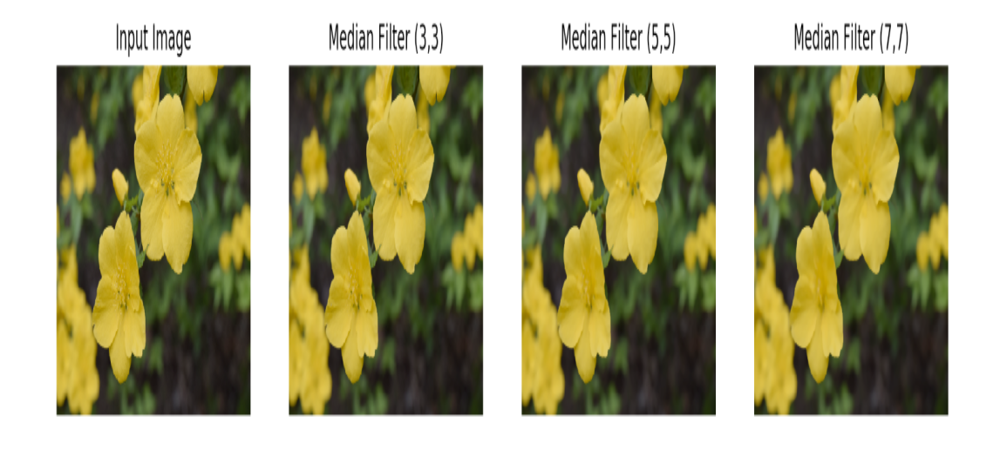

The most common application for median blur is in
smartphone application which filters input image and adds
additional artifacts to add artistic effects.

### 2.1.9. Image gradients

These are more edge detectors or sharp changes in a
photograph. Image gradients widely used in object detection
and segmentation tasks. In this section, we will look at how
to compute image gradients. First, the image derivative is
applying the kernel matrix which computes the change in a
direction.

The Sobel filter is one such filter and kernel in the x direction
is given as follows:

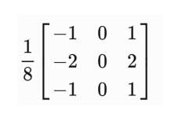

The kernel in the y direction is given as follows:

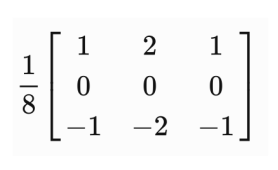

This is applied in a similar fashion to the linear box filter by
computing values on a superimposed kernel with the photo.
The filter is then shifted along the image to compute allvalues. Following is some example results, where X and Y
denote the direction of the Sobel kernel:

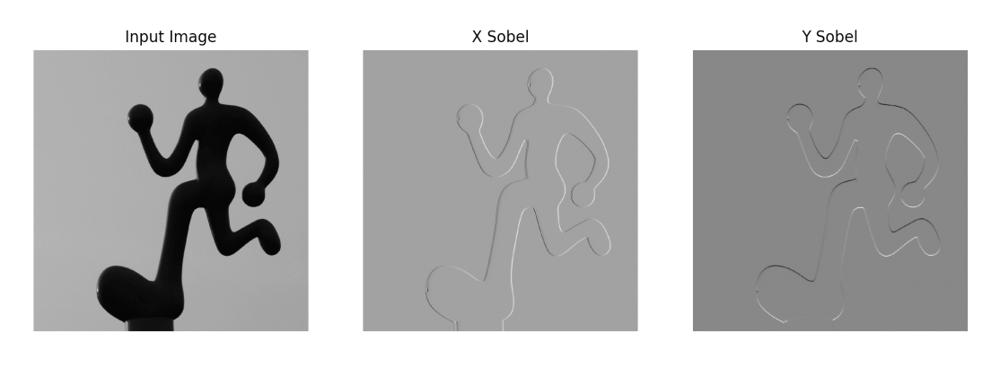

This is also termed as an image derivative with respect to
given direction(here X or Y). The lighter resulting
photographs (middle and right) are positive gradients, while
the darker regions denote negative and gray is zero.

While Sobel filters correspond to first order derivatives of a
photo, the Laplacian filter gives a second-order derivative of
a photo. The Laplacian filter is also applied in a similar way
to Sobel:

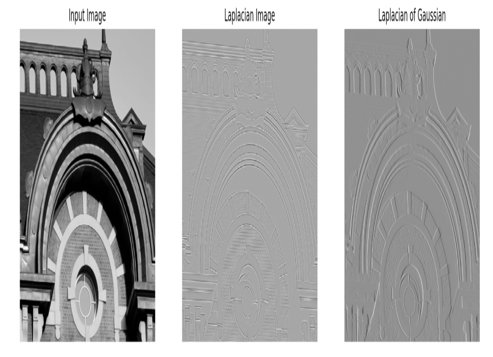

Code example:

```python
# sobel
x_sobel = cv2.Sobel(img,cv2.CV_64F,1,0,ksize=5)
y_sobel = cv2.Sobel(img,cv2.CV_64F,0,1,ksize=5)
# laplacian
lapl = cv2.Laplacian(img,cv2.CV_64F, ksize=5)
# gaussian blur
blur = cv2.GaussianBlur(img,(5,5),0)
# laplacian of gaussian
log = cv2.Laplacian(blur,cv2.CV_64F, ksize=5)
```

## 2.2. Image transformations

Transformation operations on an image are usually referred
to as geometric transformations, applied on a photo. There
are several other kinds of transformations as well but in this
section we will refer to geometric transformations. These
consist of, but are not limited to, shifting an image, rotating
an image along an axis, or projecting it onto different planes.

At the core of transformation is a matrix multiplication of
our image. We will look at different components of this
matrix and the resulting image.

### 2.2.1. Translation

Displacement of an image in any direction can be done by
creating a transformation matrix and applying the
transformation to our image. The transformation matrix for
translation only is given as:

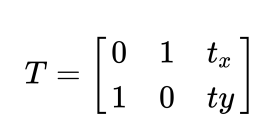

where $t_x$ is translation in $x$ direction and $t_y$ in $y$ direction in
image reference. On choosing different values of translation
matrix, results are shown as follows:

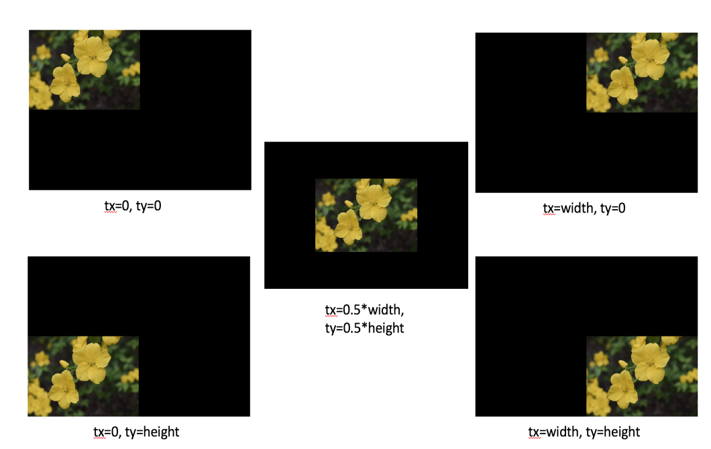

In the previous figure, output is images are larger than the
input image to show the effects of translation otherwise only
visible region of images which are inside the original image
size will be shown.

Code for creating this translation is given as follows, here
change the values of tx and ty to generate different
translations:

### 2.2.2. Rotation

Similar to translation, rotating an image is also possible by
creating a transformation matrix. Instead of creating
translation matrix, in OpenCV , given a rotation angle θ, a
rotation matrix is created of the form:

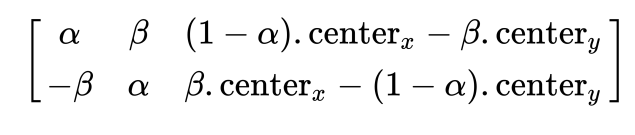

where:

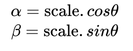

An example of applying result is as follows:

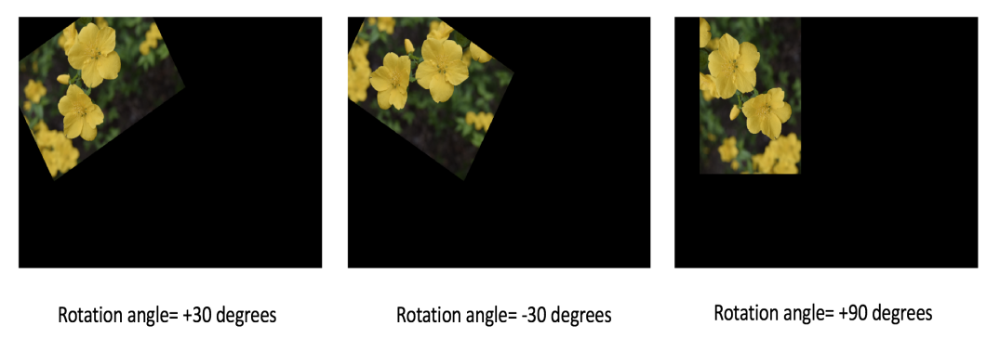

Similarly, transformations also can be done by combining
both rotation and translation with scaling and as a result, the
angle between the lines will be preserved.

### 2.2.3. Affine transformation

With an Affine transform, only parallel lines will be
preserved in the output. An example output image is as
follows:

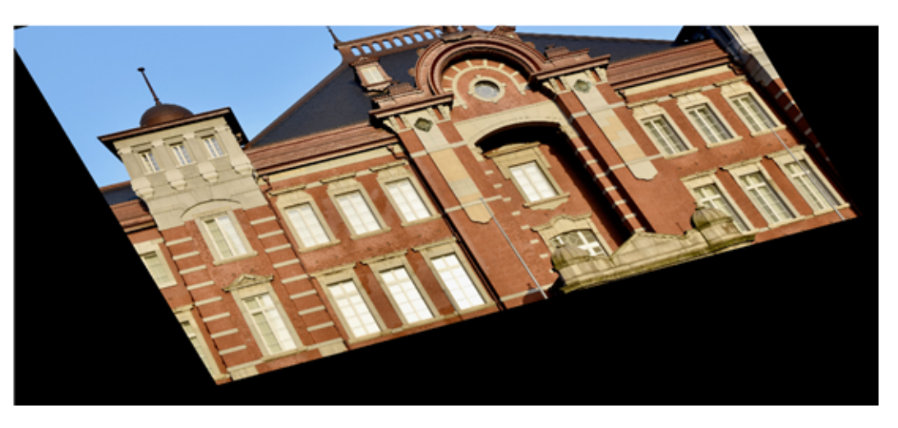

### 2.2.4. Image pyramids

Pyramids refer to rescaling a photograph either increasing
the resolution or decreasing it. These are often used to
increase the computation efficiency of computer vision
algorithms such as image matching in a huge database. In
such cases, image matching is computed on a downsampled
image and later on the search is iteratively refined for a
higher resolution of the image.

The downsampling and upsampling often depend on the
pixel selection process. One of the simplest processes is
selecting alternative rows and column pixel values to create a
downsampled version of the photo as follows:

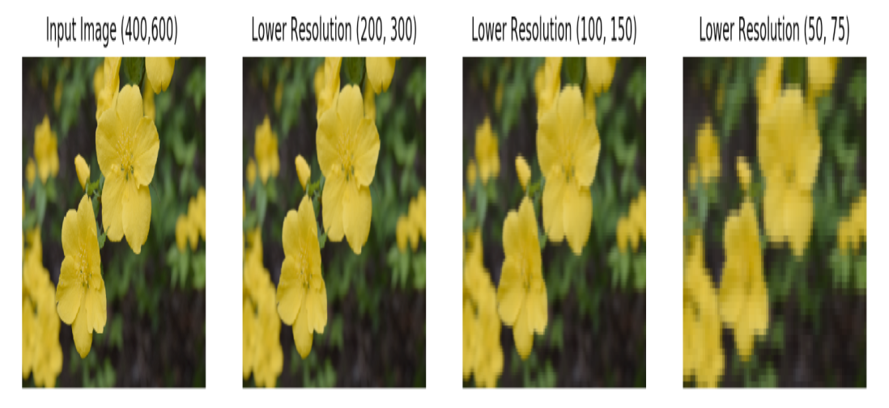

However, if we try to upsample from the rightmost picture in
the previous figure, the results look as follows:

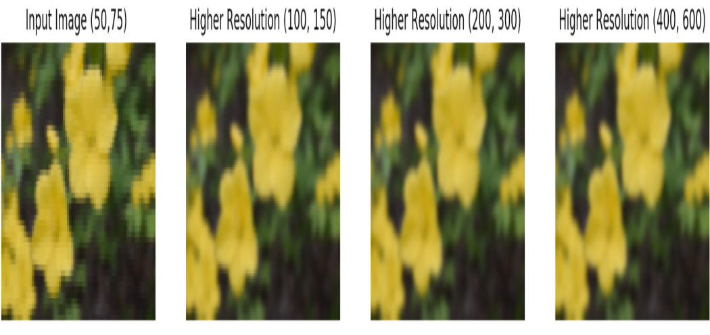

It can easily be seen that the rightmost picture above is not
the same as the original one that we started with. This is due
to the fact that we lose information during downsampling
and hence the image cannot be recreated in the same way as the original one. In OpenCV , there is also blurring of input
image before downsampling or upsampling. This also further
makes it harder to keep the resolution intact.

## Lesson 3 - What is a Feature?

In the previous lesson, our main focus was filtering an
image and applying different transformations on it. These are
good techniques to analyze images but are not sufficient for
the majority of computer vision tasks. For example, if we
were to make a product detector for a shopping store,
computing only edges may not be enough to say whether the
image is of an orange or an apple. On the other hand, if a
person is given the same task, it is very intuitive to
differentiate between an orange and an apple. This is because
of the fact that human perception combines several
features, such as texture, color, surface, shape, reflections,
and so on, to distinguish between one object with another.
This motivates to look for more details that relates to
complex features of objects. These complex features can then
be used in high level image vision tasks like image
recognition, search, and so on. There are, however, cases
where someone just walks straight into a glass wall, which is
due not being able to find enough features to say whether it
is free space or glass.

In this lesson, we will first begin with an explanation
features and its importance in computer vision. Later in the
chapter, we will different types of features extractors like
Harris Corner Detector, FAST keypoint detectors, ORB
features detectors. The visualization of the keypoints using
each of them are also described using OpenCV. Lastly, the
effectiveness of ORB features is shown with two similar
applications. We will also see a brief discussion on black box
features.

### 3.1. Features use cases

Following are some of the generic applications that are
popular in computer vision:

- We have two images and we would like to quantify
whether these images match each other. Assuming a
comparison metric, we say that the image matches
when our comparison metric value is greater than a
threshold.

- In another example, we have a large database of
images, and for a new image, we want to perform an
operation similar to matching. Instead of
recomputing everything for every image, we can
store a smaller, easier to search and robust enough to
match, representation of images. This is often
referred to as a feature vector of the image. Once a
new image comes, we extract similar representation
for the new image and search for the nearest match
among the previously generated database. This
representation is usually formulated in terms of
features.

- Also, in the case of finding an object, we have a
small image of an object or a region called
a template. The goal is to check whether an image
has this template. This would require matching key
points from the template against the given sample
image. If the match value is greater than a threshold,
we can say the sample image has a region similar to
the given template. To further enhance our finding,
we can also show where in the sample image lies our
template image.

Similarly, a computer vision system needs to learn several
features that describes an object such that it is quite easy to
distinguish from other objects.

When we design software to do image matching or object
detection in images, the basic pipeline for detection is
formulated from a machine learning perspective. This means
that we take a set of images, extract significant information,
learn our model and use the learned model on new images to
detect similar objects. In this section, we will explore more
on this.

In general, an image matching procedure looks as follows:

- The first step is to extract robust features from a
given image. This involves searching through the
whole image for possible features and then
thresholding them. There are several techniques for
the selection of features such as SIFT, SURF,
FAST, BRIEF, ORB detectors, and so on.
The feature extracted, in some cases, needs to be
converted into a more descriptive form such that it is
learnt by the model or can be stored for re-reading.

- In the case of feature matching, we are given a
sample image and we would like to see whether this
matches a reference image. After feature detection
and extraction, as shown previously, a distance
metric is formed to compute the distance between
features of a sample with respect to the features of
reference. If this distance is less than the threshold,
we can say the two images are similar.

- For feature tracking, we omit previously explained
feature matching steps. Instead of globally matching
features, the focus is more on neighborhood
matching. This is used in cases such as image
stabilization, object tracking, or motion detection.

### 3.2. Why are features important?

Features play a major role in creating good quality computer
vision systems. One of the first features we can think of
is pixels. In order to create a comparison tool, we use an
average of squared distance between the pixel values of two
images. These, however, are not robust because rarely will
you see two images that are exactly the same. There is
always some camera movement and illumination changes
between images, and computing a difference between pixel
values will be giving out large values even when the images
are quite similar.

There are, however, other kinds of features that take into
account local and global properties of an image. The local
properties are referred to as image statistics around the
neighborhood of the image, while global refers to
considering overall image statistics. Since both local, and
global properties of an image provide significant information
about an image, computing features that can capture these
will make them more robust and accurate in applications.

The most basic form of feature detector is point features. In
applications such as panorama creation on our smartphones,
each image is stitched with the corresponding previous
image. This stitching of image requires correct orientation of
an image overlapped at pixel level accuracy. Computing
corresponding pixels between two images requires pixel
matching.

### 3.3. Feature detectors

### 3.2.1. Harris Corner Detection

We start feature point detection using the Harris Corner
Detection technique. In this, we begin with choosing a
matrix, termed a window, which is small in size as compared
to the image size.

The basic idea is to first overlay chosen window on the input
image and observe only the overlayed region from the input
image. This window is later shifted over the image and the
new overlayed region is observed. In this process, there arise
three different cases:

- If there is a flat surface, then we won't be able to see
any change in the window region irrespective of the
direction of movement of the window. This is
because there is no edge or corner in the window
region.

- In our second case, the window is overlayed on edge
in the image and shifted. If the window moves along
the direction of the edge, we will not be able to see
any changes in the window. While, if the window ismoved in any other direction, we can easily observe changes in the window region.

- Lastly, if the window is overlayed on a corner in the
image and is shifted, where the corner is an
intersection of two edges, in most of the cases, we
will be able to observe the changes in the window
region.

Harris Corner Detection uses this property in terms of a score
function. Mathematically, it is given as:

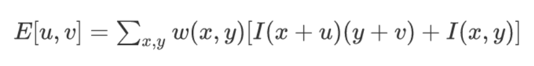

where $w$ is a window, $u$ and $v$ are the shift and $I$ is image
pixel value. The output $E$ is the objective function and
maximizing this with respect to $u$ and $v$ results in corner
pixels in the image $I$.

The Harris Corner Detection score value will show whether
there is an edge, corner, or flat surface. An example of Harris
Corners of different kinds of images is shown in the
following figure:

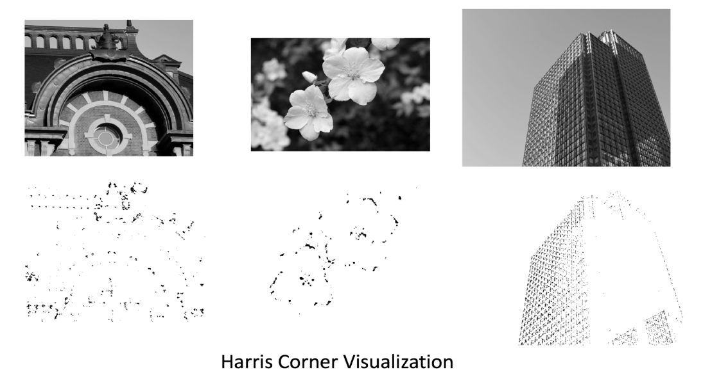

In the previous figure, the upper row has input images, while
the bottom row has detected corners. These corners are
shown with small gray pixels values corresponding to the
location in the input image.

```python
# load image and convert to grayscale
img = cv2.imread('../figures/flower.png')
gray = cv2.cvtColor(img, cv2.COLOR_BGR2GRAY)

# harris corner parameters
block_size = 4 # Covariance matrix size
kernel_size = 3 # neighbourhood kernel
k = 0.01 # parameter for harris corner score

# compute harris corner
corners = cv2.cornerHarris(gray, block_size, kernel_size, k)

# create corner image
display_corner = np.ones(gray.shape[:2])
display_corner = 255*display_corner# apply thresholding to the corner score
thres = 0.01 # more than 1% of max value
display_corner[corners>thres*corners.max()] = 10 #display pixel value

# set up display
plt.figure(figsize=(12,8))
plt.imshow(display_corner, cmap='gray')
plt.axis('off')
```

We can generate different number of corners for an image by
changing the parameters such as covariance matrix block
size, neighbourhood kernel size and Harris score parameter.

### 3.2.2. FAST keypoint detector

Many features detectors are not useful for real-time
applications such as a robot with a camera is moving on the
streets. Any delay caused may decrease the functionality of
the robot or complete system failure. Features detection is
not the only part of the robot system but if this effects the
runtime, it can cause significant overhead on other tasks to
make it work real time.

<b> FAST (Features from Accelerated Segment Test) </b>, was
introduced by Edward Rosten and Tom Drummond in
2006. The algorithm uses pixel neighborhood to compute key
points in an image. The algorithm for FAST feature detection
is as follows:

1. An interesting point candidate pixel $(i,j)$ is selected
with an intensity $I (i,j)$:

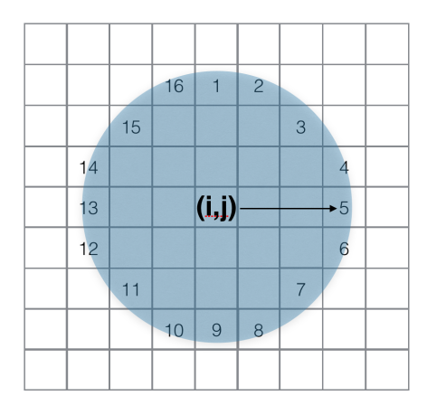

2. In a circle of 16 pixels, given a threshold $t$, estimate n
adjoining points which are brighter than pixel $(i,j)$
intensity by a threshold $t$ or darker than $(i,j)$ pixel
intensity by a threshold $t$. This will become $n$ pixels
which are either less than $(I(i,j) + t)$ or greater than
$(I(i,j) - t)$. This n was chosen as 12.

3. In a high-speed test, only four pixels (as shown in the
figure) at 1, 9, 5, and 13 are looked at. The intensity
value of at least three pixels of these decides whether
the center pixel p is a corner. If these values are
either greater than the $(I(i,j) + t)$ or less than $(I(i,j) -
t)$ then the center pixel is considered a corner.

In OpenCV , the steps to compute FAST features are as
follows:

1. Initialize detector using cv2.FastFeatureDetector_create()

2. Setup threshold parameters for filtering detections

3. Setup flag if non-maximal suppression to be used for
clearing neighbourhood regions of repeated
detections

4. Detect keypoints and plot them on the input image

In the following figure, there are plots of FAST corners (in
small circles) on the input image with varying threshold
values. Depending on the image, a different choice of
thresholds produce different number of key feature points:

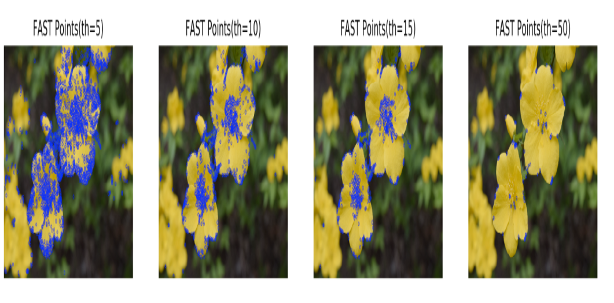

```python
def compute_fast_det(filename, is_nms=True, thresh = 10):
    """
    Reads image from filename and computes FAST keypoints.Returns image with keypoints
    filename: input filename
    is_nms: flag to use Non-maximal suppression
    thresh: Thresholding value
    """
    img = cv2.imread(filename)
    # Initiate FAST object with default values
    fast = cv2.FastFeatureDetector_create()
    # find and draw the keypoints
    if not is_nms:
    fast.setNonmaxSuppression(0)
    fast.setThreshold(thresh)
    kp = fast.detect(img,None)
    cv2.drawKeypoints(img, kp, img, color=(255,0,0))
    return img
```

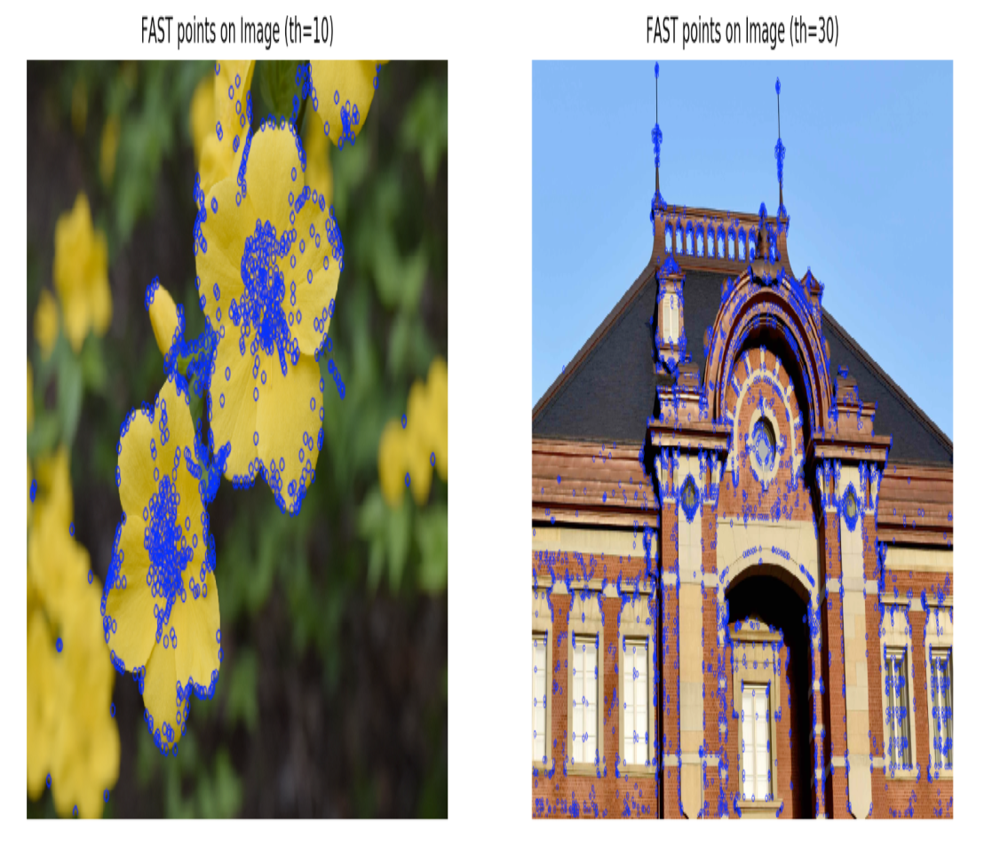

This shows that choice of parameters is quite crucial for
different images. Though a common threshold value may not
work for all image, a good approximation can be used
depending on the similarity of images.

### 3.2.3. ORB feature detector

Using previously described corner detectors are fast to
compute, however in matching two images, it is difficult to
select which two image corners are matched for
corresponding pixels. An additional information that
describes properties a corner is required. A combination of
detected keypoints, such as corners, and corresponding
descriptors makes comparing images more efficient and
robust.

ORB features detection features were described by Ethan
Rublee et al. in 2011 and have since been one of the popular
features in various applications. This combines two
algorithms: FAST feature detector with an orientation
component and BRIEF Descriptors, hence the name
<b> Oriented FAST and Rotated BRIEF (ORB) </b>. The major
advantage of using ORB features is the speed of detections
while maintaining robust detections. This makes them useful
for several real-time applications like robotics vision system,
smartphone apps, and so on.

In this chapter we have already seen FAST feature detectors,
we will further continue describing BRIEF descriptor and
finally build on ORB detector.

<b> FAST feature limitations </b>

FAST Features as described in the previous section computes
corner in the image using neighborhood pixels. By creating a
comparison test along the circular region around a pixel,
features are computed rapidly. FAST features are quite
efficient for real-time applications; these do not produce
rotation information of the features. This causes a limitation
if we are looking for orientation invariant features.

In ORB, FAST features are used with orientation
information as well. Using a circular radius of 9 pixels, a
vector between computed intensity centroid and center of the
corner is used to describe orientation at the given corner.
This intensity centroid for a given patch is computed as
follows :

- For an image I and a patch window, compute
moments using:

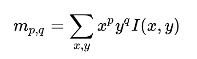

- Using previous moments, intensity centroid of given
patch is given as:

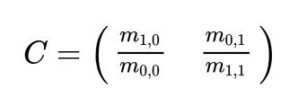

Since, we already know the center O of the patch, a vector
joining $\vec{oc}$
is the orientation of the patch. In further sections,
we will see an overall implementation of ORB feature
detectors which uses this method.

<b> BRIEF Descriptors and their limitations </b>

The popular feature descriptors like SIFT or SURF outputs
large vectors of dimensions 128 and 64 respectively. In
applications such as image search, it is quite likely that the
features are stored and searched for features rather than the
original image. This becomes computationally complex and
memory may be inefficient if the number of images reaches a
few hundred thousand. In such cases, simple dimensionality
reduction is an added step and may reduce overall efficiency.
The descriptor proposed by Michael Calonder and their co-
authors. in <i> BRIEF: Binary Robust Independent Elementary
Features </i> resolves issues by consuming less memory.

BRIEF computes differences of intensities in a small patch of
an image and represents it as a binary string. This not only
makes it faster but also the descriptor preserves good
accuracy. However, there is no feature detector in BRIEF but
combining it with FAST detectors makes it efficient.

<b> ORB features using OpenCV </b>

The following code uses ORB features implementation in
OpenCV.

It is a three-step process, which is described as follows:

- First create an ORB object and update parameter
values:

```python
orb = cv2.ORB_create()

# set parameters
orb.setScoreType(cv2.FAST_FEATURE_DETECTOR_TYPE_9_16)
```

- Detect keypoints from previously created ORB
object:

```python
# detect keypoints
kp = orb.detect(img,None)
```

- Lastly, compute descriptors for each keypoints
detected:

```python
# for detected keypoints compute descriptors.
kp, des = orb.compute(img, kp)
```

The overall code for ORB keypoints detections and
descriptor extractor is given as:

```python
import numpy as np
import matplotlib.pyplot as plt
import cv2

# With jupyter notebook uncomment below line
# %matplotlib inline
# This plots figures inside the notebook
def compute_orb_keypoints(filename):
    """
    Reads image from filename and computes ORB keypoints
    Returns image, keypoints and descriptors.
    """
    # load image
    img = cv2.imread(filename)
    # create orb object
    orb = cv2.ORB_create()
    # set parameters
    # FAST feature type
    orb.setScoreType(cv2.FAST_FEATURE_DETECTOR_TYPE_9_16)
    # detect keypoints
    kp = orb.detect(img,None)# for detected keypoints compute descriptors.
    kp, des = orb.compute(img, kp)
    return img, kp, des
```

An example of generated keypoints is as shown in the
following figure (in circles):

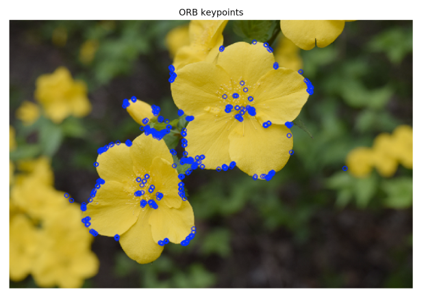

As you can see in the following figure, different images
produce different feature points for various shapes of objects:

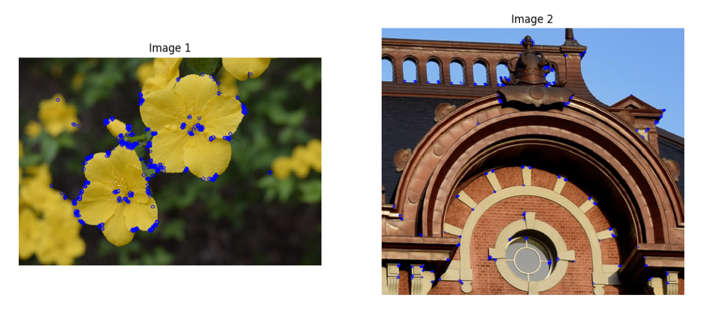

In this section, we saw formulation of ORB features that not
only combines robust features, but also provides descriptors
for easier comparison to other features. This is a strong
formulation of feature detector, however explicitly designing
a feature detector for different task will require efficient
choice of parameters such as patch size for FAST detector,
BRIEF descriptor parameters etc. For a non-expert, setting
these parameters may be quite cumbersome task. In
following section, we will begin with discussion on black
box features and its importance in creating computer vision
systems.

### 3.2.3 Black box features

The features we discussed previously are highly dependent
on an image to image basis. Some of the challenges observed
in detecting features are:

- In case of illumination changes, such as nighttime
image or daylight images there would be a significant
difference in pixel intensity values as well as
neighborhood regions

- As object orientation changes, keypoint descriptor
changes significantly. In order to match
corresponding features, a proper choice of descriptor
parameters is required

Due to these challenges, several parameters used here need
to be tuned by experts.

In recent years, a lot has been happening with neural
networks in the field of computer vision. The popularity of
them has risen due to higher accuracy and less hand-tuned
parameters. We can call them black box features—though theterm black refers only to the way they are designed. In a
majority of these model deployments, the parameters are
learned through training and require the least supervision of
parameters setting. The black box modeling feature detection
helps in getting better features by learning over a dataset of
images. This dataset consists of possible different variations
of images, as a result the learnt detector can extract better
features even in wide variation of image types.

## 3.3. Application

### 3.3.1. Find your object in an image

The most common application for using features is given an
object, find the best possible match for it in the image. This
is often referred to as template matching, where the object
at hand is a usually small window called a template and goal
is to compute the best-matched features from this template to
a target image. There exist several solutions to this, but for
the sake of understanding, we will use ORB features.

Using ORB features, we can do feature matching in a brute
force way as follows:

- Compute features in each image (template and
target).

- For each feature in a template, compare all the
features in the target detected previously. The
criterion is set using a matching score.

- If the feature pair passes the criterion, then they are
considered a match.

- Draw matches to visualize.

As a pre-requisite, we will follow previously shown codes
for extracting features as:

```python
def compute_orb_keypoints(filename):
    """
    Takes in filename to read and computes ORB keypoints
    Returns image, keypoints and descriptors
    """
    img = cv2.imread(filename)
    # create orb object
    orb = cv2.ORB_create()
    # set parameters
    orb.setScoreType(cv2.FAST_FEATURE_DETECTOR_TYPE_9_16)
    # detect keypoints
    kp = orb.detect(img,None)
    # using keypoints, compute descriptor
    kp, des = orb.compute(img, kp)
    return img, kp, des
```

Once we have keypoints and descriptors from each of the
images, we can use them to compare and match.

Matching keypoints between two images is a two-step
process:

- Create desired kind of matcher specifying the
distance metric to be used. Here we will use Brute-
Force Matching with Hamming distance:

```python
bf = cv2.BFMatcher(cv2.NORM_HAMMING, crossCheck=True)
```
- Using descriptors for keypoints from each image,
perform matching as:

```python
matches = bf.match(des1,des2)
```

In the following code, we will show overall Brute-Force
method of matching keypoints from one image to another
using corresponding descriptors only:

```python
def brute_force_matcher(des1, des2):
    """
    Brute force matcher to match ORB feature descriptors
    des1, des2: descriptors computed using ORB method for 2 image
    returns matches
    """
    # create BFMatcher object
    bf = cv2.BFMatcher(cv2.NORM_HAMMING2, crossCheck=True)
    # Match descriptors.
    matches = bf.match(des1,des2)
    # Sort them in the order of their distance.
    matches = sorted(matches, key = lambda x:x.distance)return matches
    return matches
```
In the following figure, the features from the template are
matched to the original image. To show the effectiveness of
matching, only the best matches are shown:

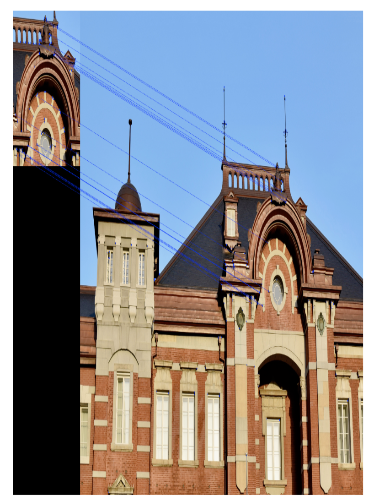

### 3.3.2. Is it similar?

In this application, we would like to see if they are similar
using previously described feature detectors. For that, we use
a similar approach as previously mentioned. The first step is
computing feature keypoints and descriptors for each image.
Using these performs matching between one image and
another. If there are a sufficient number of matches, we can
comfortably say that the two images are similar.

For the prerequisites, we use the same ORB keypoint and
descriptor extractor but added downsampling of the image:

```python
def compute_orb_keypoints(filename):
    """
    Takes in filename to read and computes ORB keypoints
    Returns image, keypoints and descriptors
    """
    img = cv2.imread(filename)
    # downsample image 4x
    img = cv2.pyrDown(img) # downsample 2x
    img = cv2.pyrDown(img) # downsample 4x
    # create orb objectorb = cv2.ORB_create()
    # set parameters
    orb.setScoreType(cv2.FAST_FEATURE_DETECTOR_TYPE_9_16)
    # detect keypoints
    kp = orb.detect(img,None)
    kp, des = orb.compute(img, kp)
    return img, kp, des
```

Using the previously computed keypoints and descriptors,
the matching is done as:

```python
def compute_img_matches(filename1, filename2, thres=10):
    """
    Extracts ORB features from given filenames
    Computes ORB matches and plot them side by side
    """
    img1, kp1, des1 = compute_orb_keypoints(filename1)
    img2, kp2, des2 = compute_orb_keypoints(filename2)
    matches = brute_force_matcher(des1, des2)
    draw_matches(img1, img2, kp1, kp2, matches, thres)

def brute_force_matcher(des1, des2):
    """
    Brute force matcher to match ORB feature descriptors
    """
    # create BFMatcher object
    bf = cv2.BFMatcher(cv2.NORM_HAMMING2, crossCheck=True)
    # Match descriptors.
    matches = bf.match(des1,des2)
    # Sort them in the order of their distance.
    matches = sorted(matches, key = lambda x:x.distance)
    return matchesdef draw_matches(img1, img2, kp1, kp2, matches, thres=10):
    """
    Utility function to draw lines connecting matches between two
    """
    draw_params = dict(matchColor = (0,255,0),
    singlePointColor = (255,0,0),
    flags = 0)
    # Draw first thres matches.
    img3 = cv2.drawMatches(img1,kp1,img2,kp2,matches[:thres],None)
    plot_img(img3)
    
def main():
    # read an image
    filename2 = '../figures/building_7.JPG'
    filename1 = '../figures/building_crop.jpg'
    compute_img_matches(filename1, filename2, thres=20)

if __name__ == '__main__':
    main()
```

The results of an example are as shown in the following
figure, where inputs are same objects with different
viewpoints. The correct matches are shown as with
connecting lines:

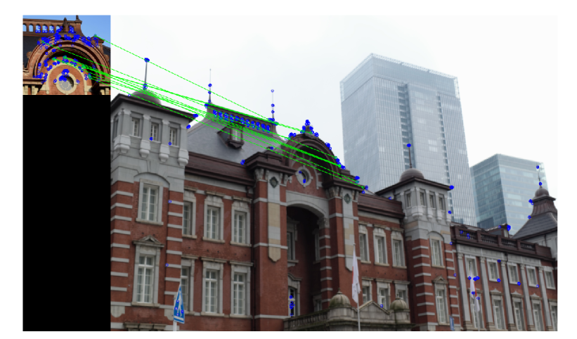

In this section, we saw two similar approaches for image
matching using ORB keypoints and a Brute-Force matcher.
The matching can be further enhanced by using more faster
algorithms like approximate neighborhood matches. The
effect of faster matching is mostly seen in the cases where a
large number of features keypoints are extracted.


