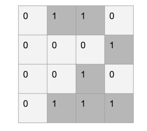

# Practical Computer Vision

# Lesson 1 - Introduction to Computer Vision 

## 1.1. Understading the human visual system

Before we jump into OpenCV functionalities, we need to understand why those functions were built in the first place. It's important to understand how the human visual system works so that you can develop the right algorithms.

The goal of computer vision algorithms is to understand the content of images and videos. Humans seem to do it effortlessly! So, how do we get machines to do it with the same accuracy?

Let's consider the following diagram:


The human eye captures all the information that comes along the way, such as color, shape, brightness, and so on. In the preceding image, the human eye captures all the information about the two main objects and stores it in a certain way. Once we understand how our system works, we can take advantage of it to achieve what we want.

For example, here are a few things we need to know:

- Our visual system is more sensitive to low-frequency content than high-frequency content. Low-frequency content refers to planar regions where pixel values don't change rapidly, and high-frequency content refers to regions with corners and edges where pixel values fluctuate a lot. We can easily see if there are blotches on a planar surface, but it's difficult to spot something like that on a highly-textured surface.

- The human eye is more sensitive to changes in brightness than to changes in color.

- Our visual system is sensitive to motion. We can quickly recognize if something is moving in our field of vision, even though we are not directly looking at it.

- We tend to make a mental note of salient points in our field of vision. Let's say you look at a white table with four black legs and a red dot at one of the corners of the table surface. When you look at this table, you'll immediately make a mental note that the surface and legs have opposing colors and that there is a red dot on one of the corners. Our brain is really smart that way! We do this automatically so that we can immediately recognize an object if we encounter it again.

To get an idea of our field of view, let's look at the top view of a human, and the angles at which we see various things:


<b> How do humans understand image content? </b>

If you look around, you will see a lot of objects. You encounter many different objects every day, and you recognize them almost instantaneously without any effort. When you see a chair, you don't wait for a few minutes before realizing that it is in fact a chair. You just know that it's a chair right away.

Computers, on the other hand, find it very difficult to do this task. Researchers have been working for many years to find out why computers are not as good as we are at this.

To get an answer to that question, we need to understand how humans do it. The visual data processing happens in the ventral visual stream. This ventral visual stream refers to the pathway in our visual system that is associated with object recognition. It is basically a hierarchy of areas in our brain that helps us recognize objects.

Humans can recognize different objects effortlessly, and can cluster similar objects together. We can do this because we have developed some sort of invariance toward objects of the same class. When we look at an object, our brain extracts the salient points in such a way that factors such as orientation, size, perspective, and illumination don't matter.

A chair that is double the normal size and rotated by 45 degrees is still a chair. We can recognize it easily because of the way we process it. Machines cannot do that so easily. Humans tend to remember an object based on its shape and important features. Regardless of how the object is placed, we can still recognize it.

In our visual system, we build up these hierarchical invariances with respect to position, scale, and viewpoint that help us to be very robust. If you look deeper into our system, you will see that humans have cells in their visual cortex that can respond to shapes such as curves and lines.

As we move further along our ventral stream, we will see more complex cells that are trained to respond to more complex objects such as trees, gates, and so on. The neurons along our ventral stream tend to show an increase in the size of the receptive field. This is coupled with the fact that the complexity of their preferred stimuli increases as well.

<b> Why is it difficult for machines to understand image content? </b>

We now understand how visual data enters the human visual system, and how our system processes it. The issue is that we still don't fully understand how our brain recognizes and organizes this visual data. In machine learning, we just extract some features from images, and ask the computers to learn them using algorithms. We still have these variations, such as shape, size, perspective, angle, illumination, occlusion, and so on.

For example, the same chair looks very different to a machine when you look at it from the profile view. Humans can easily recognize that it's a chair, regardless of how it's presented to us. So, how do we explain this to our machines?

One way to do this would be to store all the different variations of an object, including sizes, angles, perspectives, and so on. But this process is cumbersome and time-consuming. Also, it's actually not possible to gather data that can encompass every single variation. The machines would consume a huge amount of memory and a lot of time to build a model that can recognize these objects.

Even with all this, if an object is partially occluded, computers still won't recognize it. This is because they think this is a new object. So when we build a computer vision library, we need to build the underlying functional blocks that can be combined in many different ways to formulate complex algorithms.

## 1.2. A Fast Introduction to Computer Vision

Computer vision applications have become quite ubiquitous in our lives. The applications are varied, ranging from apps that play Virtual Reality (VR) or Augmented Reality (AR) games to applications for scanning documents using smartphone cameras. On our smartphones, we have QR code scanning and face detection, and now we even have facial recognition techniques. Online, we can now search using images and find similar looking images. Photo sharing applications can identify people and make an album based on the friends or family found in the photos. Due to improvements in image stabilization techniques, even with shaky hands, we can create stable videos.

With the recent advancements in deep learning techniques, applications like image classification, object detection, tracking, and so on have become more accurate and this has led to the development of more complex autonomous systems, such as drones, self-driving cars, humanoids, and so on. Using deep learning, images can be transformed into more complex details; for example, images can be converted into Van Gogh style paintings.

Such progress in several domains makes a non-expert wonder, how computer vision is capable of inferring this information from images. The motivation lies in human perception and the way we can perform complex analyzes of the environment around us. We can estimate the closeness of, structure and shape of objects, and estimate the textures of a surface too. Even under different lights, we can identify objects and even recognize something if we have seen it before.

Considering these advancements and motivations, one of the basic questions that arises is what is computer vision? In this chapter, we will begin by answering this question and then provide a broader overview of the various sub-domains and applications within computer vision. 

### 1.2.1. What constitutes computer vision?

In order to begin the discussion on computer vision, observe the following image:


Even if we have never done this activity before, we can clearly tell that the image is of people skiing in the snowy mountains on a cloudy day. This information that we perceive is quite complex and can be sub divided into more basic inferences for a computer vision system.

The most basic observation that we can get from an image is of the things or objects in it. In the previous image, the various things that we can see are trees, mountains, snow, sky, people, and so on. Extracting this information is often referred to as image classification, where we would like to label an image with a predefined set of categories. In this case, the labels are the things that we see in the image. 

A wider observation that we can get from the previous image is landscape. We can tell that the image consists of <b> Snow </b>, <b> Mountain </b>, and <b> Sky </b>, as shown in the following image:


Although it is difficult to create exact boundaries for where the Snow, Mountain, and Sky are in the image, we can still identify approximate regions of the image for each of them. This is often termed as segmentation of an image, where we break it up into regions according to object occupancy. 

Making our observation more concrete, we can further identify the exact boundaries of objects in the image, as shown in the following figure:


In the image, we see that people are doing different activities and as such have different shapes; some are sitting, some are standing, some are skiing. Even with this many variations, we can detect objects and can create bounding boxes around them. Only a few bounding boxes are shown in the image for understanding—we can observe much more than these. 

While, in the image, we show rectangular bounding boxes around some objects, we are not categorizing what object is in the box. The next step would be to say the box contains a person. This combined observation of detecting and categorizing the box is often referred to as object detection. 

Extending our observation of people and surroundings, we can say that different people in the image have different heights, even though some are nearer and others are farther from the camera. This is due to our intuitive understanding of image formation and the relations of objects. We know that a tree is usually much taller than a person, even if the trees in the image are shorter than the people nearer to the camera. Extracting the information about geometry in the image is another sub-field of computer vision, often referred to as image reconstruction. 

### 1.2.2. Computer vision is everywhere

- <b> Image classification: </b> In the past few years, categorizing images based on the objects within has gained popularity. This is due to advances in algorithms as well as the availability of large datasets. Deep learning algorithms for image classification have significantly improved the accuracy while being trained on datasets like ImageNet. We will study this dataset further in the next chapter. The trained model is often further used to improve other recognition algorithms like object detection, as well as image categorization in online applications. In this book, we will see how to create a simple algorithm to classify images using deep learning models. 

- <b> Object detection: </b> Not just self-driving cars, but robotics, automated retail stores, traffic detection, smartphone camera apps, image filters and many more applications use object detection. These also benefit from deep learning and vision techniques as well as the availability of large, annotated datasets. We saw an introduction to object detection in the previous section that produces bounding boxes around objects and also categorize what object is inside the box. 

- <b> Object tracking: </b> Following robots, surveillance cameras and people interaction are few of the several applications of object tracking. This consists of defining the location and keeps track of corresponding objects across a sequence of images.

- <b> Image geometry: </b> This is often referred to as computing the depth of objects from the camera. There are several applications in this domain too. Smartphones apps are now capable of computing three-dimensional structures from the video created onboard. Using the three-dimensional reconstructed digital models, further extensions like AR or VR application are developed to interface the image world with the real world. 

- <b> Image segmentation: </b> This is creating cluster regions in images, such that one cluster has similar properties. The usual approach is to cluster image pixels belonging to the same object. Recent applications have grown in self-driving cars and healthcare analysis using image regions. 

- <b> Image generation: </b> These have a greater impact in the artistic domain, merging different image styles or generating completely new ones. Now, we can mix and merge Van Gogh's painting style with smartphone camera images to create images that appear as if they were painted in a similar style to Van Gogh's.

### 1.2.3. Image color conversions

An image is made up pixels and is usually visualized
according to the value stored. There is also an additional
property that makes different kinds of image. Each of the
value stored in a pixel is linked to a fixed representation. For
example, a pixel value of ten can represent gray intensity
value ten or blue color intensity value 10 and so on. It is
therefore important to understand different color types and
their conversion. In this section, we will see color types and
conversions using OpenCV :

- <b> Grayscale: </b> This is a simple one channel image with
values ranging from 0 to 255 that represent the
intensity of pixels.


- <b> HSV and HLS: </b> These are another representation of
color representing H is hue, S is saturation, V is
value, and L is lightness. These are motivated by thehuman perception system.


- <b> LAB color space: </b> Denoted L for lightness, A for
green-red colors, and B for blue-yellow colors, this
consists of all perceivable colors. This is used to
convert between one type of color space (for
example, RGB) to others (such as CMYK) becauseof its device independence properties. On devices
where the format is different to that of the image that
is sent, the incoming image color space is first
converted to LAB and then to the corresponding
space available on the device.


## Lesson 2 - Image Filtering and Transformations in OpenCV

### 2.1. Introduction to filters

Filters are operations on an image to modify them so that
they are usable for other computer vision tasks or to give us
required information. These perform various functions such
as removing noise from an image, extracting edges in an
image, blurring an image, removing unwanted objects etc.
We will see their implementations and understand the results.

Filtering techniques are necessary because there are several
factors that may lead to noise in an image or undesired
information in an image. Taking a picture in sunlight,
induces lots of bright and dark areas in the image or an
improper environment like night time, the image captured by
a camera may contain a lot of noise. Also, in cases of
unwanted objects or colors in an image, these are also
considered noise.

An example of salt and pepper noise looks like the
following:


In several applications, noise plays an important role in
improving a system's capabilities, especially when we will
use Deep Learning based models in the upcoming chapters.
It is quite crucial for several applications, to know how
robust the application is against noise becomes very
important. As an example, we would want the model
designed for applications like image classification to work
with noisy images as well, hence noise is deliberately added
in the images to test the application precision.

### 2.2. Linear filters

To begin with, the simplest kind of filter is a point operator,
where each pixel value is multiplied by a scalar value. This
operation can be written as follows:

$g(i, j) = K x f(i, j)$

Here:

- The input image is $F$ and the value of pixel at $(i,j)$ is
denoted as $f(i,j)$
- The output image is $G$ and the value of pixel at $(i,j)$ is
denoted as $g(i,j)$
- $K$ is scalar constant

Such an operation on an image is termed a linear filter.
There are many more kinds of linear filters which you will be
reading about further in this section. In addition to
multiplication by a scalar value, each pixel can also be increased or decreased by a constant value. So overall point
operation can be written as follows:

$g(i, j) = K x f(i, j) + L$

This operation can be applied both to grayscale images and
RGB images. For RGB images, each channel will be
modified with this operation separately. The following is the
result of varying both K and L. The first image is input on the
left. In the second image, K=0.5 and L=0.0 , while in the third
image, K is set to 1.0 and L is 10 . For the final image on the
right, K=0.7 and L=25 . As you can see, varying K changes the
brightness of the image and varying L changes the contrast of
the image:


### 2.3. 2D linear filters

While the preceding filter is a point-based filter, image pixels
have information around the pixel as well. In the previous
image of the flower, the pixel values in the petal are all
yellow. If we choose a pixel of the petal and move around,
the values will be quite close. This gives some more
information about the image. To extract this information in
filtering, there are several neighborhood filters.

In neighborhood filters, there is a kernel matrix which
captures local region information around a pixel. To explain
these filters, let's start with an input image, as follows:



This is a simple binary image of the number 2. To get certain
information from this image, we can directly use all the pixel
values. But instead, to simplify, we can apply filters on this.
We define a matrix smaller than the given image which operates in the neighborhood of a target pixel. This matrix is
termed kernel; an example is given as follows:


The operation is defined first by superimposing the kernel
matrix on the original image, then taking the product of the
corresponding pixels and returning a summation of all the
products. In the following figure, the lower 3 x 3 area in the
original image is superimposed with the given kernel matrix
and the corresponding pixel values from the kernel and
image are multiplied. The resulting image is shown on the
right and is the summation of all the previous pixel products:


This operation is repeated by sliding the kernel along image
rows and then image columns.

```python
# design a kernel matrix, here is uniform 5x5
kernel = np.ones((5,5),np.float32)/25
# apply on the input image, here grayscale
dst = cv2.filter2D(gray,-1,kernel)
```

However, as you can see previously, the corner pixel will
have a drastic impact and results in a smaller image because
the kernel, while overlapping, will be outside the image
region. This causes a black region, or holes, along with the
boundary of an image. To rectify this, there are some
common techniques used:

- Padding the corners with constant values maybe 0 or
255, by default OpenCV will use this.

- Mirroring the pixel along the edge to the external
area

- Creating a pattern of pixels around the image

The choice of these will depend on the task at hand. In
common cases, padding will be able to generate satisfactory
results.

The effect of the kernel is most crucial as changing these
values changes the output significantly. We will first see
simple kernel-based filters and also see their effects on the
output when changing the size.

### 2.4. Box filters

This filter averages out the pixel value as the kernel matrix is
denoted as follows:


Applying this filter results in blurring the image. The results
are as shown as follows:


In frequency domain analysis of the image, this filter is a low
pass filter. The frequency domain analysis is done using
Fourier transformation of the image, which is beyond the
scope of this introduction. We can see on changing the kernel
size, the image gets more and more blurred:


As we increase the size of the kernel, we can observe that
resulting image gets more blurred. This is due to averaging
out of peak values in the small neighborhood where the
kernel is applied. The result for applying kernel of size 20 x
20 can be seen in the following image:


However, if we use a very small filter of size (3, 3) there is
negligible effect on the output, due to the fact that the kernel
size is quite small compared to the photo size. In most
applications, kernel size is heuristically set according to
image size:


