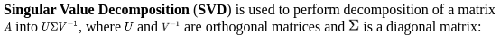

# Practical Computer Vision

# Lesson 1 - Introduction to Computer Vision 

## 1.1. Understading the human visual system

Before we jump into OpenCV functionalities, we need to understand why those functions were built in the first place. It's important to understand how the human visual system works so that you can develop the right algorithms.

The goal of computer vision algorithms is to understand the content of images and videos. Humans seem to do it effortlessly! So, how do we get machines to do it with the same accuracy?

Let's consider the following diagram:


The human eye captures all the information that comes along the way, such as color, shape, brightness, and so on. In the preceding image, the human eye captures all the information about the two main objects and stores it in a certain way. Once we understand how our system works, we can take advantage of it to achieve what we want.

For example, here are a few things we need to know:

- Our visual system is more sensitive to low-frequency content than high-frequency content. Low-frequency content refers to planar regions where pixel values don't change rapidly, and high-frequency content refers to regions with corners and edges where pixel values fluctuate a lot. We can easily see if there are blotches on a planar surface, but it's difficult to spot something like that on a highly-textured surface.

- The human eye is more sensitive to changes in brightness than to changes in color.

- Our visual system is sensitive to motion. We can quickly recognize if something is moving in our field of vision, even though we are not directly looking at it.

- We tend to make a mental note of salient points in our field of vision. Let's say you look at a white table with four black legs and a red dot at one of the corners of the table surface. When you look at this table, you'll immediately make a mental note that the surface and legs have opposing colors and that there is a red dot on one of the corners. Our brain is really smart that way! We do this automatically so that we can immediately recognize an object if we encounter it again.

To get an idea of our field of view, let's look at the top view of a human, and the angles at which we see various things:


<b> How do humans understand image content? </b>

If you look around, you will see a lot of objects. You encounter many different objects every day, and you recognize them almost instantaneously without any effort. When you see a chair, you don't wait for a few minutes before realizing that it is in fact a chair. You just know that it's a chair right away.

Computers, on the other hand, find it very difficult to do this task. Researchers have been working for many years to find out why computers are not as good as we are at this.

To get an answer to that question, we need to understand how humans do it. The visual data processing happens in the ventral visual stream. This ventral visual stream refers to the pathway in our visual system that is associated with object recognition. It is basically a hierarchy of areas in our brain that helps us recognize objects.

Humans can recognize different objects effortlessly, and can cluster similar objects together. We can do this because we have developed some sort of invariance toward objects of the same class. When we look at an object, our brain extracts the salient points in such a way that factors such as orientation, size, perspective, and illumination don't matter.

A chair that is double the normal size and rotated by 45 degrees is still a chair. We can recognize it easily because of the way we process it. Machines cannot do that so easily. Humans tend to remember an object based on its shape and important features. Regardless of how the object is placed, we can still recognize it.

In our visual system, we build up these hierarchical invariances with respect to position, scale, and viewpoint that help us to be very robust. If you look deeper into our system, you will see that humans have cells in their visual cortex that can respond to shapes such as curves and lines.

As we move further along our ventral stream, we will see more complex cells that are trained to respond to more complex objects such as trees, gates, and so on. The neurons along our ventral stream tend to show an increase in the size of the receptive field. This is coupled with the fact that the complexity of their preferred stimuli increases as well.

<b> Why is it difficult for machines to understand image content? </b>

We now understand how visual data enters the human visual system, and how our system processes it. The issue is that we still don't fully understand how our brain recognizes and organizes this visual data. In machine learning, we just extract some features from images, and ask the computers to learn them using algorithms. We still have these variations, such as shape, size, perspective, angle, illumination, occlusion, and so on.

For example, the same chair looks very different to a machine when you look at it from the profile view. Humans can easily recognize that it's a chair, regardless of how it's presented to us. So, how do we explain this to our machines?

One way to do this would be to store all the different variations of an object, including sizes, angles, perspectives, and so on. But this process is cumbersome and time-consuming. Also, it's actually not possible to gather data that can encompass every single variation. The machines would consume a huge amount of memory and a lot of time to build a model that can recognize these objects.

Even with all this, if an object is partially occluded, computers still won't recognize it. This is because they think this is a new object. So when we build a computer vision library, we need to build the underlying functional blocks that can be combined in many different ways to formulate complex algorithms.

## 1.2. A Fast Introduction to Computer Vision

Computer vision applications have become quite ubiquitous in our lives. The applications are varied, ranging from apps that play Virtual Reality (VR) or Augmented Reality (AR) games to applications for scanning documents using smartphone cameras. On our smartphones, we have QR code scanning and face detection, and now we even have facial recognition techniques. Online, we can now search using images and find similar looking images. Photo sharing applications can identify people and make an album based on the friends or family found in the photos. Due to improvements in image stabilization techniques, even with shaky hands, we can create stable videos.

With the recent advancements in deep learning techniques, applications like image classification, object detection, tracking, and so on have become more accurate and this has led to the development of more complex autonomous systems, such as drones, self-driving cars, humanoids, and so on. Using deep learning, images can be transformed into more complex details; for example, images can be converted into Van Gogh style paintings.

Such progress in several domains makes a non-expert wonder, how computer vision is capable of inferring this information from images. The motivation lies in human perception and the way we can perform complex analyzes of the environment around us. We can estimate the closeness of, structure and shape of objects, and estimate the textures of a surface too. Even under different lights, we can identify objects and even recognize something if we have seen it before.

Considering these advancements and motivations, one of the basic questions that arises is what is computer vision? In this chapter, we will begin by answering this question and then provide a broader overview of the various sub-domains and applications within computer vision. 

### 1.2.1. What constitutes computer vision?

In order to begin the discussion on computer vision, observe the following image:


Even if we have never done this activity before, we can clearly tell that the image is of people skiing in the snowy mountains on a cloudy day. This information that we perceive is quite complex and can be sub divided into more basic inferences for a computer vision system.

The most basic observation that we can get from an image is of the things or objects in it. In the previous image, the various things that we can see are trees, mountains, snow, sky, people, and so on. Extracting this information is often referred to as image classification, where we would like to label an image with a predefined set of categories. In this case, the labels are the things that we see in the image. 

A wider observation that we can get from the previous image is landscape. We can tell that the image consists of <b> Snow </b>, <b> Mountain </b>, and <b> Sky </b>, as shown in the following image:


Although it is difficult to create exact boundaries for where the Snow, Mountain, and Sky are in the image, we can still identify approximate regions of the image for each of them. This is often termed as segmentation of an image, where we break it up into regions according to object occupancy. 

Making our observation more concrete, we can further identify the exact boundaries of objects in the image, as shown in the following figure:


In the image, we see that people are doing different activities and as such have different shapes; some are sitting, some are standing, some are skiing. Even with this many variations, we can detect objects and can create bounding boxes around them. Only a few bounding boxes are shown in the image for understanding—we can observe much more than these. 

While, in the image, we show rectangular bounding boxes around some objects, we are not categorizing what object is in the box. The next step would be to say the box contains a person. This combined observation of detecting and categorizing the box is often referred to as object detection. 

Extending our observation of people and surroundings, we can say that different people in the image have different heights, even though some are nearer and others are farther from the camera. This is due to our intuitive understanding of image formation and the relations of objects. We know that a tree is usually much taller than a person, even if the trees in the image are shorter than the people nearer to the camera. Extracting the information about geometry in the image is another sub-field of computer vision, often referred to as image reconstruction. 

### 1.2.2. Computer vision is everywhere

- <b> Image classification: </b> In the past few years, categorizing images based on the objects within has gained popularity. This is due to advances in algorithms as well as the availability of large datasets. Deep learning algorithms for image classification have significantly improved the accuracy while being trained on datasets like ImageNet. We will study this dataset further in the next chapter. The trained model is often further used to improve other recognition algorithms like object detection, as well as image categorization in online applications. In this book, we will see how to create a simple algorithm to classify images using deep learning models. 

- <b> Object detection: </b> Not just self-driving cars, but robotics, automated retail stores, traffic detection, smartphone camera apps, image filters and many more applications use object detection. These also benefit from deep learning and vision techniques as well as the availability of large, annotated datasets. We saw an introduction to object detection in the previous section that produces bounding boxes around objects and also categorize what object is inside the box. 

- <b> Object tracking: </b> Following robots, surveillance cameras and people interaction are few of the several applications of object tracking. This consists of defining the location and keeps track of corresponding objects across a sequence of images.

- <b> Image geometry: </b> This is often referred to as computing the depth of objects from the camera. There are several applications in this domain too. Smartphones apps are now capable of computing three-dimensional structures from the video created onboard. Using the three-dimensional reconstructed digital models, further extensions like AR or VR application are developed to interface the image world with the real world. 

- <b> Image segmentation: </b> This is creating cluster regions in images, such that one cluster has similar properties. The usual approach is to cluster image pixels belonging to the same object. Recent applications have grown in self-driving cars and healthcare analysis using image regions. 

- <b> Image generation: </b> These have a greater impact in the artistic domain, merging different image styles or generating completely new ones. Now, we can mix and merge Van Gogh's painting style with smartphone camera images to create images that appear as if they were painted in a similar style to Van Gogh's.

### 1.2.3. Image color conversions

An image is made up pixels and is usually visualized
according to the value stored. There is also an additional
property that makes different kinds of image. Each of the
value stored in a pixel is linked to a fixed representation. For
example, a pixel value of ten can represent gray intensity
value ten or blue color intensity value 10 and so on. It is
therefore important to understand different color types and
their conversion. In this section, we will see color types and
conversions using OpenCV :

- <b> Grayscale: </b> This is a simple one channel image with
values ranging from 0 to 255 that represent the
intensity of pixels.


- <b> HSV and HLS: </b> These are another representation of
color representing H is hue, S is saturation, V is
value, and L is lightness. These are motivated by thehuman perception system.


- <b> LAB color space: </b> Denoted L for lightness, A for
green-red colors, and B for blue-yellow colors, this
consists of all perceivable colors. This is used to
convert between one type of color space (for
example, RGB) to others (such as CMYK) becauseof its device independence properties. On devices
where the format is different to that of the image that
is sent, the incoming image color space is first
converted to LAB and then to the corresponding
space available on the device.


## Lesson 2 - Image Filtering and Transformations in OpenCV

## 2.1. Introduction to filters

Filters are operations on an image to modify them so that
they are usable for other computer vision tasks or to give us
required information. These perform various functions such
as removing noise from an image, extracting edges in an
image, blurring an image, removing unwanted objects etc.
We will see their implementations and understand the results.

Filtering techniques are necessary because there are several
factors that may lead to noise in an image or undesired
information in an image. Taking a picture in sunlight,
induces lots of bright and dark areas in the image or an
improper environment like night time, the image captured by
a camera may contain a lot of noise. Also, in cases of
unwanted objects or colors in an image, these are also
considered noise.

An example of salt and pepper noise looks like the
following:


In several applications, noise plays an important role in
improving a system's capabilities, especially when we will
use Deep Learning based models in the upcoming chapters.
It is quite crucial for several applications, to know how
robust the application is against noise becomes very
important. As an example, we would want the model
designed for applications like image classification to work
with noisy images as well, hence noise is deliberately added
in the images to test the application precision.

### 2.1.1. Linear filters

To begin with, the simplest kind of filter is a point operator,
where each pixel value is multiplied by a scalar value. This
operation can be written as follows:

$g(i, j) = K x f(i, j)$

Here:

- The input image is $F$ and the value of pixel at $(i,j)$ is
denoted as $f(i,j)$
- The output image is $G$ and the value of pixel at $(i,j)$ is
denoted as $g(i,j)$
- $K$ is scalar constant

Such an operation on an image is termed a linear filter.
There are many more kinds of linear filters which you will be
reading about further in this section. In addition to
multiplication by a scalar value, each pixel can also be increased or decreased by a constant value. So overall point
operation can be written as follows:

$g(i, j) = K x f(i, j) + L$

This operation can be applied both to grayscale images and
RGB images. For RGB images, each channel will be
modified with this operation separately. The following is the
result of varying both K and L. The first image is input on the
left. In the second image, K=0.5 and L=0.0 , while in the third
image, K is set to 1.0 and L is 10 . For the final image on the
right, K=0.7 and L=25 . As you can see, varying K changes the
brightness of the image and varying L changes the contrast of
the image:


### 2.1.2. 2D linear filters

While the preceding filter is a point-based filter, image pixels
have information around the pixel as well. In the previous
image of the flower, the pixel values in the petal are all
yellow. If we choose a pixel of the petal and move around,
the values will be quite close. This gives some more
information about the image. To extract this information in
filtering, there are several neighborhood filters.

In neighborhood filters, there is a kernel matrix which
captures local region information around a pixel. To explain
these filters, let's start with an input image, as follows:


This is a simple binary image of the number 2. To get certain
information from this image, we can directly use all the pixel
values. But instead, to simplify, we can apply filters on this.
We define a matrix smaller than the given image which operates in the neighborhood of a target pixel. This matrix is
termed kernel; an example is given as follows:


The operation is defined first by superimposing the kernel
matrix on the original image, then taking the product of the
corresponding pixels and returning a summation of all the
products. In the following figure, the lower 3 x 3 area in the
original image is superimposed with the given kernel matrix
and the corresponding pixel values from the kernel and
image are multiplied. The resulting image is shown on the
right and is the summation of all the previous pixel products:


This operation is repeated by sliding the kernel along image
rows and then image columns.

```python
# design a kernel matrix, here is uniform 5x5
kernel = np.ones((5,5),np.float32)/25
# apply on the input image, here grayscale
dst = cv2.filter2D(gray,-1,kernel)
```

However, as you can see previously, the corner pixel will
have a drastic impact and results in a smaller image because
the kernel, while overlapping, will be outside the image
region. This causes a black region, or holes, along with the
boundary of an image. To rectify this, there are some
common techniques used:

- Padding the corners with constant values maybe 0 or
255, by default OpenCV will use this.

- Mirroring the pixel along the edge to the external
area

- Creating a pattern of pixels around the image

The choice of these will depend on the task at hand. In
common cases, padding will be able to generate satisfactory
results.

The effect of the kernel is most crucial as changing these
values changes the output significantly. We will first see
simple kernel-based filters and also see their effects on the
output when changing the size.

### 2.1.3. Box filters

This filter averages out the pixel value as the kernel matrix is
denoted as follows:


Applying this filter results in blurring the image. The results
are as shown as follows:


In frequency domain analysis of the image, this filter is a low
pass filter. The frequency domain analysis is done using
Fourier transformation of the image, which is beyond the
scope of this introduction. We can see on changing the kernel
size, the image gets more and more blurred:


As we increase the size of the kernel, we can observe that
resulting image gets more blurred. This is due to averaging
out of peak values in the small neighborhood where the
kernel is applied. The result for applying kernel of size 20 x
20 can be seen in the following image:


However, if we use a very small filter of size (3, 3) there is
negligible effect on the output, due to the fact that the kernel
size is quite small compared to the photo size. In most
applications, kernel size is heuristically set according to
image size:


### 2.1.4. Properties of linear filters

Several computer vision applications are composed of step
by step transformations of an input photo to output. This is
easily done due to several properties associated with a
common type of filters, that is, linear filters:

- The linear filters are commutative such that we can
perform multiplication operations on filters in any
order and the result still remains the same:

$a * b = b * a$

- They are associative in nature, which means the order
of applying the filter does not effect the outcome:

$(a * b) * c = a * (b * c)$

- Even in cases of summing two filters, we can
perform the first summation and then apply the filter,
or we can also individually apply the filter and then sum the results. The overall outcome still remains the
same:

$ b = (k + l) * a $

- Applying a scaling factor to one filter and
multiplying to another filter is equivalent to first
multiplying both filters and then applying scaling
factor.

These properties play a significant role later, when we look
at computer vision tasks such as object detection,
segmentation, and so on. A suitable combination of these
filters enhances the quality of information extraction and as a
result, improves the accuracy.

### 2.1.5. Non-linear filters

While in many cases linear filters are sufficient to get the
required results, in several other use cases performance can
be significantly increased with the use of non-linear filters.
As the name suggests, these filters are composed of more
complex operations, have some kind of non-linearity, and as
a result these filters do not follow some or all of the
properties of linear filters.

We will understand these filters with implementations.

### 2.1.6. Smoothing a photo

Applying a box filter with hard edges doesn't result in a
smooth blur on the output photo.

To improve this, the filter can be made smoother around the
edges. One of the popular such filters is a Gaussian filter.
This is a non-linear filter which enhances the effect of the
center pixel and gradually reduces the effects as the pixel
gets farther from the center. Mathematically, a Gaussian
function is given as:


where $\mu$ is the mean and $\sigma$ is the variance

An example kernel matrix for this kind of filter in a two-
dimensional discrete domain is given as follows:


This two-dimensional array is used in normalized form and
effect of this filter also depends on its width by changing the
kernel width has varying effects on the output as discussed in
further section. Applying Gaussian kernel as filter removes
high-frequency components which results in removing strong
edges and hence a blurred photo:


### 2.1.7. Histogram equalization

The basic point operations, to change the brightness and
contrast, help in improving photo quality but require manual
tuning. Using histogram equalization technique, these can be
found algorithmically and create a better-looking photo.
Intuitively, this method tries to set the brightest pixels to
white and the darker pixels to black. The remaining pixel
values are similarly rescaled. This rescaling is performed by
transforming original intensity distribution to capture all
intensity distribution. An example of this equalization is as
following:


The preceding image is an example of histogram
equalization. On the right is the output and, as you can see,
the contrast is increased significantly. The input histogram is
shown in the bottom figure on the left and it can be observed
that not all the colors are observed in the image. After
applying equalization, resulting histogram plot is as shown
on the right bottom figure. To visualize the results of
equalization in the image, the input and results are stacked
together in following figure:


### 2.1.8. Median filter

This filter uses the same technique of neighborhood filtering;
the key technique in this is the use of a median value. As
such, the filter is non-linear. It is quite useful in removing
sharp noise such as salt and pepper.

Instead of using a product or sum of neighborhood pixel
values, this filter computes a median value of the region.
This results in the removal of random peak values in the
region, which can be due to noise like salt and pepper noise.
This is further shown in the following figure with different
kernel size used to create output.

In this image first input is added with channel wise random
noise as:

```python
# read the image
flower = cv2.imread('../figures/flower.png')
# initialize noise image with zeros
noise = np.zeros(flower.shape[:2])
# fill the image with random numbers in given range
cv2.randu(noise, 0, 256)

# add noise to existing image, apply channel wise
noise_factor = 0.1
noisy_flower = np.zeros(flower.shape)
for i in range(flower.shape[2]):
    noisy_flower[:,:,i] = flower[:,:,i] + np.array(noise_factor*n)
# convert data type for use
noisy_flower = np.asarray(noisy_flower, dtype=np.uint8)
```

The created noisy image is used for median filtering as:

```python
# apply median filter with different kernel sizes

# apply median filter of kernel size 5
kernel_5 = 5
median_5 = cv2.medianBlur(noisy_flower,kernel_5)
# apply median filter of kernel size 3
kernel_3 = 3
median_3 = cv2.medianBlur(noisy_flower,kernel_3)
```

In the following photo, you can see the resulting photo after
varying the kernel size (indicated in brackets). The rightmost
photo is the smoothest of them all:


The most common application for median blur is in
smartphone application which filters input image and adds
additional artifacts to add artistic effects.

### 2.1.9. Image gradients

These are more edge detectors or sharp changes in a
photograph. Image gradients widely used in object detection
and segmentation tasks. In this section, we will look at how
to compute image gradients. First, the image derivative is
applying the kernel matrix which computes the change in a
direction.

The Sobel filter is one such filter and kernel in the x direction
is given as follows:


The kernel in the y direction is given as follows:


This is applied in a similar fashion to the linear box filter by
computing values on a superimposed kernel with the photo.
The filter is then shifted along the image to compute allvalues. Following is some example results, where X and Y
denote the direction of the Sobel kernel:


This is also termed as an image derivative with respect to
given direction(here X or Y). The lighter resulting
photographs (middle and right) are positive gradients, while
the darker regions denote negative and gray is zero.

While Sobel filters correspond to first order derivatives of a
photo, the Laplacian filter gives a second-order derivative of
a photo. The Laplacian filter is also applied in a similar way
to Sobel:


Code example:

```python
# sobel
x_sobel = cv2.Sobel(img,cv2.CV_64F,1,0,ksize=5)
y_sobel = cv2.Sobel(img,cv2.CV_64F,0,1,ksize=5)
# laplacian
lapl = cv2.Laplacian(img,cv2.CV_64F, ksize=5)
# gaussian blur
blur = cv2.GaussianBlur(img,(5,5),0)
# laplacian of gaussian
log = cv2.Laplacian(blur,cv2.CV_64F, ksize=5)
```

## 2.2. Image transformations

Transformation operations on an image are usually referred
to as geometric transformations, applied on a photo. There
are several other kinds of transformations as well but in this
section we will refer to geometric transformations. These
consist of, but are not limited to, shifting an image, rotating
an image along an axis, or projecting it onto different planes.

At the core of transformation is a matrix multiplication of
our image. We will look at different components of this
matrix and the resulting image.

### 2.2.1. Translation

Displacement of an image in any direction can be done by
creating a transformation matrix and applying the
transformation to our image. The transformation matrix for
translation only is given as:


where $t_x$ is translation in $x$ direction and $t_y$ in $y$ direction in
image reference. On choosing different values of translation
matrix, results are shown as follows:


In the previous figure, output is images are larger than the
input image to show the effects of translation otherwise only
visible region of images which are inside the original image
size will be shown.

Code for creating this translation is given as follows, here
change the values of tx and ty to generate different
translations:

### 2.2.2. Rotation

Similar to translation, rotating an image is also possible by
creating a transformation matrix. Instead of creating
translation matrix, in OpenCV , given a rotation angle θ, a
rotation matrix is created of the form:


where:


An example of applying result is as follows:


Similarly, transformations also can be done by combining
both rotation and translation with scaling and as a result, the
angle between the lines will be preserved.

### 2.2.3. Affine transformation

With an Affine transform, only parallel lines will be
preserved in the output. An example output image is as
follows:


### 2.2.4. Image pyramids

Pyramids refer to rescaling a photograph either increasing
the resolution or decreasing it. These are often used to
increase the computation efficiency of computer vision
algorithms such as image matching in a huge database. In
such cases, image matching is computed on a downsampled
image and later on the search is iteratively refined for a
higher resolution of the image.

The downsampling and upsampling often depend on the
pixel selection process. One of the simplest processes is
selecting alternative rows and column pixel values to create a
downsampled version of the photo as follows:


However, if we try to upsample from the rightmost picture in
the previous figure, the results look as follows:


It can easily be seen that the rightmost picture above is not
the same as the original one that we started with. This is due
to the fact that we lose information during downsampling
and hence the image cannot be recreated in the same way as the original one. In OpenCV , there is also blurring of input
image before downsampling or upsampling. This also further
makes it harder to keep the resolution intact.

## Lesson 3 - What is a Feature?

In the previous lesson, our main focus was filtering an
image and applying different transformations on it. These are
good techniques to analyze images but are not sufficient for
the majority of computer vision tasks. For example, if we
were to make a product detector for a shopping store,
computing only edges may not be enough to say whether the
image is of an orange or an apple. On the other hand, if a
person is given the same task, it is very intuitive to
differentiate between an orange and an apple. This is because
of the fact that human perception combines several
features, such as texture, color, surface, shape, reflections,
and so on, to distinguish between one object with another.
This motivates to look for more details that relates to
complex features of objects. These complex features can then
be used in high level image vision tasks like image
recognition, search, and so on. There are, however, cases
where someone just walks straight into a glass wall, which is
due not being able to find enough features to say whether it
is free space or glass.

In this lesson, we will first begin with an explanation
features and its importance in computer vision. Later in the
chapter, we will different types of features extractors like
Harris Corner Detector, FAST keypoint detectors, ORB
features detectors. The visualization of the keypoints using
each of them are also described using OpenCV. Lastly, the
effectiveness of ORB features is shown with two similar
applications. We will also see a brief discussion on black box
features.

### 3.1. Features use cases

Following are some of the generic applications that are
popular in computer vision:

- We have two images and we would like to quantify
whether these images match each other. Assuming a
comparison metric, we say that the image matches
when our comparison metric value is greater than a
threshold.

- In another example, we have a large database of
images, and for a new image, we want to perform an
operation similar to matching. Instead of
recomputing everything for every image, we can
store a smaller, easier to search and robust enough to
match, representation of images. This is often
referred to as a feature vector of the image. Once a
new image comes, we extract similar representation
for the new image and search for the nearest match
among the previously generated database. This
representation is usually formulated in terms of
features.

- Also, in the case of finding an object, we have a
small image of an object or a region called
a template. The goal is to check whether an image
has this template. This would require matching key
points from the template against the given sample
image. If the match value is greater than a threshold,
we can say the sample image has a region similar to
the given template. To further enhance our finding,
we can also show where in the sample image lies our
template image.

Similarly, a computer vision system needs to learn several
features that describes an object such that it is quite easy to
distinguish from other objects.

When we design software to do image matching or object
detection in images, the basic pipeline for detection is
formulated from a machine learning perspective. This means
that we take a set of images, extract significant information,
learn our model and use the learned model on new images to
detect similar objects. In this section, we will explore more
on this.

In general, an image matching procedure looks as follows:

- The first step is to extract robust features from a
given image. This involves searching through the
whole image for possible features and then
thresholding them. There are several techniques for
the selection of features such as SIFT, SURF,
FAST, BRIEF, ORB detectors, and so on.
The feature extracted, in some cases, needs to be
converted into a more descriptive form such that it is
learnt by the model or can be stored for re-reading.

- In the case of feature matching, we are given a
sample image and we would like to see whether this
matches a reference image. After feature detection
and extraction, as shown previously, a distance
metric is formed to compute the distance between
features of a sample with respect to the features of
reference. If this distance is less than the threshold,
we can say the two images are similar.

- For feature tracking, we omit previously explained
feature matching steps. Instead of globally matching
features, the focus is more on neighborhood
matching. This is used in cases such as image
stabilization, object tracking, or motion detection.

### 3.2. Why are features important?

Features play a major role in creating good quality computer
vision systems. One of the first features we can think of
is pixels. In order to create a comparison tool, we use an
average of squared distance between the pixel values of two
images. These, however, are not robust because rarely will
you see two images that are exactly the same. There is
always some camera movement and illumination changes
between images, and computing a difference between pixel
values will be giving out large values even when the images
are quite similar.

There are, however, other kinds of features that take into
account local and global properties of an image. The local
properties are referred to as image statistics around the
neighborhood of the image, while global refers to
considering overall image statistics. Since both local, and
global properties of an image provide significant information
about an image, computing features that can capture these
will make them more robust and accurate in applications.

The most basic form of feature detector is point features. In
applications such as panorama creation on our smartphones,
each image is stitched with the corresponding previous
image. This stitching of image requires correct orientation of
an image overlapped at pixel level accuracy. Computing
corresponding pixels between two images requires pixel
matching.

### 3.3. Feature detectors

### 3.2.1. Harris Corner Detection

We start feature point detection using the Harris Corner
Detection technique. In this, we begin with choosing a
matrix, termed a window, which is small in size as compared
to the image size.

The basic idea is to first overlay chosen window on the input
image and observe only the overlayed region from the input
image. This window is later shifted over the image and the
new overlayed region is observed. In this process, there arise
three different cases:

- If there is a flat surface, then we won't be able to see
any change in the window region irrespective of the
direction of movement of the window. This is
because there is no edge or corner in the window
region.

- In our second case, the window is overlayed on edge
in the image and shifted. If the window moves along
the direction of the edge, we will not be able to see
any changes in the window. While, if the window ismoved in any other direction, we can easily observe changes in the window region.

- Lastly, if the window is overlayed on a corner in the
image and is shifted, where the corner is an
intersection of two edges, in most of the cases, we
will be able to observe the changes in the window
region.

Harris Corner Detection uses this property in terms of a score
function. Mathematically, it is given as:


where $w$ is a window, $u$ and $v$ are the shift and $I$ is image
pixel value. The output $E$ is the objective function and
maximizing this with respect to $u$ and $v$ results in corner
pixels in the image $I$.

The Harris Corner Detection score value will show whether
there is an edge, corner, or flat surface. An example of Harris
Corners of different kinds of images is shown in the
following figure:


In the previous figure, the upper row has input images, while
the bottom row has detected corners. These corners are
shown with small gray pixels values corresponding to the
location in the input image.

```python
# load image and convert to grayscale
img = cv2.imread('../figures/flower.png')
gray = cv2.cvtColor(img, cv2.COLOR_BGR2GRAY)

# harris corner parameters
block_size = 4 # Covariance matrix size
kernel_size = 3 # neighbourhood kernel
k = 0.01 # parameter for harris corner score

# compute harris corner
corners = cv2.cornerHarris(gray, block_size, kernel_size, k)

# create corner image
display_corner = np.ones(gray.shape[:2])
display_corner = 255*display_corner# apply thresholding to the corner score
thres = 0.01 # more than 1% of max value
display_corner[corners>thres*corners.max()] = 10 #display pixel value

# set up display
plt.figure(figsize=(12,8))
plt.imshow(display_corner, cmap='gray')
plt.axis('off')
```

We can generate different number of corners for an image by
changing the parameters such as covariance matrix block
size, neighbourhood kernel size and Harris score parameter.

### 3.2.2. FAST keypoint detector

Many features detectors are not useful for real-time
applications such as a robot with a camera is moving on the
streets. Any delay caused may decrease the functionality of
the robot or complete system failure. Features detection is
not the only part of the robot system but if this effects the
runtime, it can cause significant overhead on other tasks to
make it work real time.

<b> FAST (Features from Accelerated Segment Test) </b>, was
introduced by Edward Rosten and Tom Drummond in
2006. The algorithm uses pixel neighborhood to compute key
points in an image. The algorithm for FAST feature detection
is as follows:

1. An interesting point candidate pixel $(i,j)$ is selected
with an intensity $I (i,j)$:


2. In a circle of 16 pixels, given a threshold $t$, estimate n
adjoining points which are brighter than pixel $(i,j)$
intensity by a threshold $t$ or darker than $(i,j)$ pixel
intensity by a threshold $t$. This will become $n$ pixels
which are either less than $(I(i,j) + t)$ or greater than
$(I(i,j) - t)$. This n was chosen as 12.

3. In a high-speed test, only four pixels (as shown in the
figure) at 1, 9, 5, and 13 are looked at. The intensity
value of at least three pixels of these decides whether
the center pixel p is a corner. If these values are
either greater than the $(I(i,j) + t)$ or less than $(I(i,j) -
t)$ then the center pixel is considered a corner.

In OpenCV , the steps to compute FAST features are as
follows:

1. Initialize detector using cv2.FastFeatureDetector_create()

2. Setup threshold parameters for filtering detections

3. Setup flag if non-maximal suppression to be used for
clearing neighbourhood regions of repeated
detections

4. Detect keypoints and plot them on the input image

In the following figure, there are plots of FAST corners (in
small circles) on the input image with varying threshold
values. Depending on the image, a different choice of
thresholds produce different number of key feature points:


```python
def compute_fast_det(filename, is_nms=True, thresh = 10):
    """
    Reads image from filename and computes FAST keypoints.Returns image with keypoints
    filename: input filename
    is_nms: flag to use Non-maximal suppression
    thresh: Thresholding value
    """
    img = cv2.imread(filename)
    # Initiate FAST object with default values
    fast = cv2.FastFeatureDetector_create()
    # find and draw the keypoints
    if not is_nms:
    fast.setNonmaxSuppression(0)
    fast.setThreshold(thresh)
    kp = fast.detect(img,None)
    cv2.drawKeypoints(img, kp, img, color=(255,0,0))
    return img
```


This shows that choice of parameters is quite crucial for
different images. Though a common threshold value may not
work for all image, a good approximation can be used
depending on the similarity of images.

### 3.2.3. ORB feature detector

Using previously described corner detectors are fast to
compute, however in matching two images, it is difficult to
select which two image corners are matched for
corresponding pixels. An additional information that
describes properties a corner is required. A combination of
detected keypoints, such as corners, and corresponding
descriptors makes comparing images more efficient and
robust.

ORB features detection features were described by Ethan
Rublee et al. in 2011 and have since been one of the popular
features in various applications. This combines two
algorithms: FAST feature detector with an orientation
component and BRIEF Descriptors, hence the name
<b> Oriented FAST and Rotated BRIEF (ORB) </b>. The major
advantage of using ORB features is the speed of detections
while maintaining robust detections. This makes them useful
for several real-time applications like robotics vision system,
smartphone apps, and so on.

In this chapter we have already seen FAST feature detectors,
we will further continue describing BRIEF descriptor and
finally build on ORB detector.

<b> FAST feature limitations </b>

FAST Features as described in the previous section computes
corner in the image using neighborhood pixels. By creating a
comparison test along the circular region around a pixel,
features are computed rapidly. FAST features are quite
efficient for real-time applications; these do not produce
rotation information of the features. This causes a limitation
if we are looking for orientation invariant features.

In ORB, FAST features are used with orientation
information as well. Using a circular radius of 9 pixels, a
vector between computed intensity centroid and center of the
corner is used to describe orientation at the given corner.
This intensity centroid for a given patch is computed as
follows :

- For an image I and a patch window, compute
moments using:


- Using previous moments, intensity centroid of given
patch is given as:


Since, we already know the center O of the patch, a vector
joining $\vec{oc}$
is the orientation of the patch. In further sections,
we will see an overall implementation of ORB feature
detectors which uses this method.

<b> BRIEF Descriptors and their limitations </b>

The popular feature descriptors like SIFT or SURF outputs
large vectors of dimensions 128 and 64 respectively. In
applications such as image search, it is quite likely that the
features are stored and searched for features rather than the
original image. This becomes computationally complex and
memory may be inefficient if the number of images reaches a
few hundred thousand. In such cases, simple dimensionality
reduction is an added step and may reduce overall efficiency.
The descriptor proposed by Michael Calonder and their co-
authors. in <i> BRIEF: Binary Robust Independent Elementary
Features </i> resolves issues by consuming less memory.

BRIEF computes differences of intensities in a small patch of
an image and represents it as a binary string. This not only
makes it faster but also the descriptor preserves good
accuracy. However, there is no feature detector in BRIEF but
combining it with FAST detectors makes it efficient.

<b> ORB features using OpenCV </b>

The following code uses ORB features implementation in
OpenCV.

It is a three-step process, which is described as follows:

- First create an ORB object and update parameter
values:

```python
orb = cv2.ORB_create()

# set parameters
orb.setScoreType(cv2.FAST_FEATURE_DETECTOR_TYPE_9_16)
```

- Detect keypoints from previously created ORB
object:

```python
# detect keypoints
kp = orb.detect(img,None)
```

- Lastly, compute descriptors for each keypoints
detected:

```python
# for detected keypoints compute descriptors.
kp, des = orb.compute(img, kp)
```

The overall code for ORB keypoints detections and
descriptor extractor is given as:

```python
import numpy as np
import matplotlib.pyplot as plt
import cv2

# With jupyter notebook uncomment below line
# %matplotlib inline
# This plots figures inside the notebook
def compute_orb_keypoints(filename):
    """
    Reads image from filename and computes ORB keypoints
    Returns image, keypoints and descriptors.
    """
    # load image
    img = cv2.imread(filename)
    # create orb object
    orb = cv2.ORB_create()
    # set parameters
    # FAST feature type
    orb.setScoreType(cv2.FAST_FEATURE_DETECTOR_TYPE_9_16)
    # detect keypoints
    kp = orb.detect(img,None)# for detected keypoints compute descriptors.
    kp, des = orb.compute(img, kp)
    return img, kp, des
```

An example of generated keypoints is as shown in the
following figure (in circles):


As you can see in the following figure, different images
produce different feature points for various shapes of objects:


In this section, we saw formulation of ORB features that not
only combines robust features, but also provides descriptors
for easier comparison to other features. This is a strong
formulation of feature detector, however explicitly designing
a feature detector for different task will require efficient
choice of parameters such as patch size for FAST detector,
BRIEF descriptor parameters etc. For a non-expert, setting
these parameters may be quite cumbersome task. In
following section, we will begin with discussion on black
box features and its importance in creating computer vision
systems.

### 3.2.3 Black box features

The features we discussed previously are highly dependent
on an image to image basis. Some of the challenges observed
in detecting features are:

- In case of illumination changes, such as nighttime
image or daylight images there would be a significant
difference in pixel intensity values as well as
neighborhood regions

- As object orientation changes, keypoint descriptor
changes significantly. In order to match
corresponding features, a proper choice of descriptor
parameters is required

Due to these challenges, several parameters used here need
to be tuned by experts.

In recent years, a lot has been happening with neural
networks in the field of computer vision. The popularity of
them has risen due to higher accuracy and less hand-tuned
parameters. We can call them black box features—though theterm black refers only to the way they are designed. In a
majority of these model deployments, the parameters are
learned through training and require the least supervision of
parameters setting. The black box modeling feature detection
helps in getting better features by learning over a dataset of
images. This dataset consists of possible different variations
of images, as a result the learnt detector can extract better
features even in wide variation of image types.

## 3.3. Application

### 3.3.1. Find your object in an image

The most common application for using features is given an
object, find the best possible match for it in the image. This
is often referred to as template matching, where the object
at hand is a usually small window called a template and goal
is to compute the best-matched features from this template to
a target image. There exist several solutions to this, but for
the sake of understanding, we will use ORB features.

Using ORB features, we can do feature matching in a brute
force way as follows:

- Compute features in each image (template and
target).

- For each feature in a template, compare all the
features in the target detected previously. The
criterion is set using a matching score.

- If the feature pair passes the criterion, then they are
considered a match.

- Draw matches to visualize.

As a pre-requisite, we will follow previously shown codes
for extracting features as:

```python
def compute_orb_keypoints(filename):
    """
    Takes in filename to read and computes ORB keypoints
    Returns image, keypoints and descriptors
    """
    img = cv2.imread(filename)
    # create orb object
    orb = cv2.ORB_create()
    # set parameters
    orb.setScoreType(cv2.FAST_FEATURE_DETECTOR_TYPE_9_16)
    # detect keypoints
    kp = orb.detect(img,None)
    # using keypoints, compute descriptor
    kp, des = orb.compute(img, kp)
    return img, kp, des
```

Once we have keypoints and descriptors from each of the
images, we can use them to compare and match.

Matching keypoints between two images is a two-step
process:

- Create desired kind of matcher specifying the
distance metric to be used. Here we will use Brute-
Force Matching with Hamming distance:

```python
bf = cv2.BFMatcher(cv2.NORM_HAMMING, crossCheck=True)
```
- Using descriptors for keypoints from each image,
perform matching as:

```python
matches = bf.match(des1,des2)
```

In the following code, we will show overall Brute-Force
method of matching keypoints from one image to another
using corresponding descriptors only:

```python
def brute_force_matcher(des1, des2):
    """
    Brute force matcher to match ORB feature descriptors
    des1, des2: descriptors computed using ORB method for 2 image
    returns matches
    """
    # create BFMatcher object
    bf = cv2.BFMatcher(cv2.NORM_HAMMING2, crossCheck=True)
    # Match descriptors.
    matches = bf.match(des1,des2)
    # Sort them in the order of their distance.
    matches = sorted(matches, key = lambda x:x.distance)return matches
    return matches
```
In the following figure, the features from the template are
matched to the original image. To show the effectiveness of
matching, only the best matches are shown:


### 3.3.2. Is it similar?

In this application, we would like to see if they are similar
using previously described feature detectors. For that, we use
a similar approach as previously mentioned. The first step is
computing feature keypoints and descriptors for each image.
Using these performs matching between one image and
another. If there are a sufficient number of matches, we can
comfortably say that the two images are similar.

For the prerequisites, we use the same ORB keypoint and
descriptor extractor but added downsampling of the image:

```python
def compute_orb_keypoints(filename):
    """
    Takes in filename to read and computes ORB keypoints
    Returns image, keypoints and descriptors
    """
    img = cv2.imread(filename)
    # downsample image 4x
    img = cv2.pyrDown(img) # downsample 2x
    img = cv2.pyrDown(img) # downsample 4x
    # create orb objectorb = cv2.ORB_create()
    # set parameters
    orb.setScoreType(cv2.FAST_FEATURE_DETECTOR_TYPE_9_16)
    # detect keypoints
    kp = orb.detect(img,None)
    kp, des = orb.compute(img, kp)
    return img, kp, des
```

Using the previously computed keypoints and descriptors,
the matching is done as:

```python
def compute_img_matches(filename1, filename2, thres=10):
    """
    Extracts ORB features from given filenames
    Computes ORB matches and plot them side by side
    """
    img1, kp1, des1 = compute_orb_keypoints(filename1)
    img2, kp2, des2 = compute_orb_keypoints(filename2)
    matches = brute_force_matcher(des1, des2)
    draw_matches(img1, img2, kp1, kp2, matches, thres)

def brute_force_matcher(des1, des2):
    """
    Brute force matcher to match ORB feature descriptors
    """
    # create BFMatcher object
    bf = cv2.BFMatcher(cv2.NORM_HAMMING2, crossCheck=True)
    # Match descriptors.
    matches = bf.match(des1,des2)
    # Sort them in the order of their distance.
    matches = sorted(matches, key = lambda x:x.distance)
    return matchesdef draw_matches(img1, img2, kp1, kp2, matches, thres=10):
    """
    Utility function to draw lines connecting matches between two
    """
    draw_params = dict(matchColor = (0,255,0),
    singlePointColor = (255,0,0),
    flags = 0)
    # Draw first thres matches.
    img3 = cv2.drawMatches(img1,kp1,img2,kp2,matches[:thres],None)
    plot_img(img3)
    
def main():
    # read an image
    filename2 = '../figures/building_7.JPG'
    filename1 = '../figures/building_crop.jpg'
    compute_img_matches(filename1, filename2, thres=20)

if __name__ == '__main__':
    main()
```

The results of an example are as shown in the following
figure, where inputs are same objects with different
viewpoints. The correct matches are shown as with
connecting lines:


In this section, we saw two similar approaches for image
matching using ORB keypoints and a Brute-Force matcher.
The matching can be further enhanced by using more faster
algorithms like approximate neighborhood matches. The
effect of faster matching is mostly seen in the cases where a
large number of features keypoints are extracted.

## Lesson 4 - Convolutional Neural Networks

### 4.1. A simple neural network

A simple neural net consists of a node which takes in an input or a list of inputs and performs a transformation. An example is shown in the following figure:


Mathematically, it takes the inputs $x$ and applies a transformation $W$ to get the output $y$:

$y = W^T x$


The input $x$ can be a vector or multi-dimensional array. Based on the transformation matrix $W$ we get the output y to be a vector or multi-dimensional array. This structure is further modified by also including the non-linear transformation $F$:

$y = F(W^T x)$

Now, output y is not linearly dependent on input $x$, and as a result, the change in $x$ does not proportionally change $y$. More often, these non-linear transformations consist of clipping all negative values after applying the transformation matrix $W$ to the inputs $x$. A neuron consists of this complete operation. 

These networks are stacked in layered structures, as shown in the following figure:


These networks are also termed <b> feedforward networks </b>, as there are no loops and input flows through the network in one direction, like in a <b> Directed Acyclic Graph (DAG) </b>. In these networks, the parameters are termed as weights, which perform a transformation on the inputs.

Using machine learning approaches to learn these weights, we can get an optimal network that performs the desired operation with good accuracy. For this, the requirement is to have a dataset of labeled inputs; for example, for a given input $x$ we already know the output value $y$. During the learning of the weights of neural networks, also termed as <b> training </b>, for this dataset the input is passed through the network layer by layer. At each layer, the input from the previous layer is transformed according to the layer's properties. The final output is our prediction for y and we can measure how far our prediction of y is from the actual value. Once we have this measure, termed as a <b> loss </b>, we can then use it to update the weights using a derivative-based approach called <b> gradient descent </b>. Each weight is updated according to the change in the loss with respect to weights.

[Example 1](./Lesson-4/04_nn1.py)

On running the previous code, we can see the values of loss decreasing and settling down. The parameters here are learning rate and initial w values. A good choice for these values may cause the loss to decrease faster and settle early; however, a bad choice will lead to no decrease in loss, or sometimes an increase in loss over several iterations.

### 4.2. Revisting the convolution operation

Extending our discussion on filters from Lesson 3, the convolution operation is taking a dot product of a shifted kernel matrix with a given input image. This process is explained in the following figure:


As shown in the previous figure, a kernel is a small two-dimensional array that computes dot product with the input image (on the left) to create a block of the output image (on the right).

In convolution, the output image is generated by taking a dot product between an Input image and a <b> Kernel </b> matrix. This is then shifted along the image and after each shift, corresponding values of the output are generated using a dot product:


As we saw in the previous lesson, we can perform a convolution operation using OpenCV as follows: 

```python
kernel = np.ones((5,5),np.float32)/25 
dst = cv2.filter2D(img,-1,kernel)
```

Here, we assume a kernel with equal values whose sum is 1 and is used to perform convolution on a grayscale image. In Chapter 3, Image Filtering and Transformations in OpenCV, this was termed as smoothing operation because if we have a noisy grayscale image, the output will look smoother.

In this case, to perform a smoothing operation we already know the kernel values. If we know the kernels for extracting more complex features, we can do better inference from images. However, manually setting the values is unfeasible when we have to perform tasks like image classification and object detection. In such cases, models such as CNNs extract good features and perform better than other previous methods.

### 4.3. Convolutional neural networks

Convolutional Neural Networks, also known as <b> ConvNets </b>, use this convolution property in a neural network to compute better features, which can then be used to classify images or detect objects. As shown in the previous section, convolution consists of kernels which compute an output by sliding and taking a dot product with the input image. In a simple neural network, the neurons of a layer are connected to all the neurons of the next layer, but CNNs consist of convolution layers which have the property of the receptive field. Only a small portion of a previous layer's neurons are connected to the neurons of the current layer. As a result, small region features are computed through every layer as shown in the following figure:


As we have seen in a simple neural network, the neuron takes an input from one or more of previous neurons' output to perform a non-linear transformation. In CNNs, this is further combined with the convolution approach. We assume a set of kernels with varied values called weights. Each of these kernels is convolved with an input to create a response matrix. There is then a non-linear transformation called activation for each of the values in the convolved output. The output from each of the kernels after activation is stacked to create the output of our operation such that for $K$ kernels the output is of $K x H_o x W_o$ size, with $H_o$ and $W_o$ as the height and width of our output. This makes one layer of CNN.

The output from the previous layer is then used again as the input for the next layer with another set of kernels $K_2$, and a new response is computed by first convolving each of the kernels and then taking the non-linear transformation of the response. 

In general, CNNs are composed of the following types of layers:

- Convolutional layers
- Fully connected layers
- Activation layers
- Pooling layers

Each of these layers will be explained in the following sections. In recent developments, some more components have been added to CNNs, but the preceding components still remain important.

### 4.3.1. The convolutional layer

A key component of a CNN is the convolution layer, which performs a dot product of a kernel matrix with part of an image and generates an output. This is followed by shifting and repeating the same operation over a complete image and is termed <b> convolution </b>. The region of the input which is taken for the dot product is called the <b> receptive field </b> of the convolution layer. In each convolution layer, there is a set of kernels and they are collectively termed <b> filters </b>. 

The input for a convolution layer is an n-dimensional array, meaning the input is an image of the form <i> Width x Height x Depth </i>. For example, if we have a grayscale image of the size 32 x 32, width and height, then the input is 32 x 32 x 1 where depth is the number of color channels in this case, and is represented by the third dimension. Similarly, for a colored image of size 512, the input is 512 x 512 x 3. All the kernels in filters also have the same depth as the input. 

The parameters for the layer are the number of filters, filter size, strides, and padding value. Of these, filter values are the only learnable parameters. Strides refer to the amount of shift in pixels for a kernel. With a stride of 1, the kernel is moved left by 1 pixel and the dot product is taken with the corresponding input region. With a stride of 2, the kernel is moved by 2 pixels and the same operation takes place. On each input, at the boundary, the kernel can only overlap a certain region inside the image. Boundaries are therefore padded with zeros for the kernel to capture the complete image region. The padding value sets the way to pad the image boundary.

The size of the output depends on these parameter values. We can use Keras to write CNN and perform operations on images. An example of writing one convolution layer is:

```python
y = Conv2D(32, kernel_size = (3, 3), activation='relu', padding='same')(x)
```

Let's create an example model to see the properties of convolution layer:

```python
from keras.layers import Conv2D, Input
from keras.models import Model

def print_model():
    """
    Creates a sample model and prints output shape
    Use this to analyse convolution parameters
    """
    # create input with given shape 
    x = Input(shape=(512,512,3))

    # create a convolution layer
    y = Conv2D(filters=32, 
               kernel_size=(5,5), 
               strides=1, padding="same",
               use_bias=False)(x)
    
    # create model 
    model = Model(inputs=x, outputs=y)

    # prints our model created
    model.summary()

print_model()
```

On executing this code, we can see our model and output after each layer as:


Here, we have set the input to be of the shape 512 x 512 x 3, and for convolution, we use 32 filters with the size 5 x 5. The stride values we have set to 1, and using the same padding for the edges, we make sure a kernel captures all of the images. We will not use bias for this example. The output after convolution is of the shape (None, 512, 512, 32) of the shape (samples, width, height, filters). For the discussion, we will ignore the sample's value. The width and height of the output is 512 with the depth as 32. The number of filters we used to set the output's depth value. The total number of parameters for this layer is 5 x 5 x 3 x 32 (kernel_size * number of filters) which is 2400.

Let's try another run. Now, we set strides to 2 in the previous code. On execution, we get the output as:


As we can see, the convolution output shape (width, height) is reduced to half of the input size. This is due to the stride option that we have chosen. Using strides 2, it will skip one pixel, making the output half of the input. Let's increase the stride to 4. The output will be:


Here, we can see that the output shape (width and height) is reduced to one-fourth of the input.

If we set our strides to 1, and padding to valid, the output is:


Now, even if we set strides to 1, the output shape (width and height) is reduced to 508. This is due to the lack of a padding set, and the kernel cannot be applied to the edges of the input. 

We can compute the output shape as $(I -K + 2P)/S + 1$, where I is input size, $K$ is kernel size, $P$ is padding used and $S$ is stride value. If we use the same padding, the $P$ value is $(k-1)/2$. Otherwise, if we use the valid padding then $P$ value is zero. 

Here, we have set another parameter $use_bias=False$. On setting this as true, it will add a constant value to each kernel and for a convolution layer, the bias parameter is the same as the number of filters used. So, if we set use_bias to True, with strides 1 and the same padding, we get:


The total number of parameters is increased by 32, which is the number of filters used in this layer. We have seen how to design the convolution layer and what happens when we use different parameters for the convolution layer.

The crucial thing is, what are the kernel values in the filters that will give the desired output? To have good performance, we would like to get the output to consist of high-quality features from the input. Setting values for the filters manually is not feasible as the number of filters grows quite large and the combinations of these values are practically infinite. We learn the filter values using optimization techniques which use a dataset of inputs and targets and tries to predict as close to the targets as possible. The optimization then updates the weights after each iteration. 

### 4.3.2. The activation layer

As we saw in the case of the simple neural network, the weighted output is passed through a non-linear transformation. This non-linear layer is often referred to as the activation layer. Some common types of activation are:


The most common choice of activation function is Rectified Linear Unit (ReLU) and this performs well in the majority of cases. In our previous code we can add an activation layer as follows:

```python
from keras.layers import Conv2D, Input, Activation
from keras.models import Model

def print_model():
    """
    Creates a sample model and prints output shape
    Use this to analyse convolution parameters
    """
    # create input with given shape 
    x = Input(shape=(512,512,3))

    # create a convolution layer
    conv = Conv2D(filters=32, 
               kernel_size=(5,5), 
               strides=1, padding="same",
               use_bias=True)(x)
    
    # add activation layer
    y = Activation('relu')(conv)
    
    # create model 
    model = Model(inputs=x, outputs=y)

    # prints our model created
    model.summary()

print_model()  
```

The output of executing the code is as follows:


As we can see from our formulation of activation functions, it does not contain any trainable parameters. In Keras, the activation layer can also be added to the convolution layer as follows:

```python
conv = Conv2D(filters=32, 
               kernel_size=(5,5), 
               strides=1, padding="same",
               use_bias=True,
               activation='relu')(x)
```

### 4.3.3. The pooling layer

Pooling takes in a region of inputs and either a max or an average value of that region is produced as output. In effect, it reduces the size of an input by sampling in the local region. This layer is inserted between 2 to 3 convolution layers to reduce the resolution of the output, thereby reducing the requirement for parameters. A visual representation of the pooling operation is as follows:


In the previous figure, the input is a two-dimensional array of 2 x 2 size and after pooling operation the output is of size 1 x 1. This can be generated by taking average of the values in the previous array or the maximum value. 

To show how the output shape changes after this operation, we can use the following code: 

```python
from keras.layers import Conv2D, Input, MaxPooling2D
from keras.models import Model

def print_model():
    """
    Creates a sample model and prints output shape
    Use this to analyse Pooling parameters
    """
    # create input with given shape 
    x = Input(shape=(512,512,3))

    # create a convolution layer
    conv = Conv2D(filters=32, 
               kernel_size=(5,5), activation="relu", 
               strides=1, padding="same",
               use_bias=True)(x)

    pool = MaxPooling2D(pool_size=(2,2))(conv)
    
    # create model 
    model = Model(inputs=x, outputs=pool)

    # prints our model created
    model.summary()

print_model()
```

In the previous code, we used a convolution layer and added a pooling operation to it. When we execute it, the expected output is:


Here, we set the pooling parameter to (2,2), representing the width and height of the pooling operation. The depth for pooling will be set according to the depth of the input to the pooling layer. The resulting output is of half the shape in terms of width and height; however, there is no change in depth size. 

### 4.3.4. The fully connected layer

This is a simple neural network layer where each neuron in the current layer is connected to all the neurons in the previous layer. This is often referred to as Dense or Linear in various deep learning libraries. In Keras, this can be implemented as follows:

```python
from keras.layers import Dense, Input
from keras.models import Model

def print_model():
    """
    Creates a sample model and prints output shape
    Use this to analyse dense/Fully Connected parameters
    """
    # create input with given shape 
    x = Input(shape=(512,))

    # create a fully connected layer layer
    y = Dense(32)(x)
    
    # create model 
    model = Model(inputs=x, outputs=y)

    # prints our model created
    model.summary()

print_model()
```

As we execute this code, we can see the output shapes, as well as the number of trainable parameters, as follows:  


The total parameters for this layer are given by $(I_s * O_s) + O_s$ where $I_s$ is input shape and $O_s$ is output shape. In our example, we used an input of shape 512 and an output of shape 32 and get a total of 16416 parameters with bias. This is quite large compared to a similar convolution layer block, therefore in recent models, there has been a trend towards using more convolution blocks rather than fully connected blocks. Nonetheless, this layer still plays a major role in designing simple convolution neural net blocks. 

### 4.3.5. Batch normalization

This is applied to normalize the output from the input layer with mean 0 and variance 1 as:


This layer also has learnable parameters (which are optional in most of the deep learning libraries) to squash output in a given range:


Here γ and β are learnable parameters. Batch Normalization improves training by faster convergence as well as acting as a kind of regularization. However, since there are learnable parameters, the 
effect of normalization is different in training and testing.  

### 4.3.6. Dropout

One of the important layers that helps prevent overfitting is Dropout. It randomly drops, with some probability, the neurons from the previous layer to be used as input to the next layer. This acts like we are training an ensemble of neural networks.  

In the following section, we will see how to implement a model in Keras and perform the learning of parameters, which we skipped in this section.  

[Example Fashion-MNIST](./Lesson-4/04_nn_mnist.py)

### 4.4. Popular CNN architectures

### 4.4.1. VGGNet


### 4.4.2. Inception Net


### 4.4.3. ResNet

<b> Residual Block </b>


### 4.4.4. Transfer learning

In the previous section we saw three different model types, but in deep learning models, we are not limited to these. Every year there are better performing model architectures being published. However, the performance of these models totally depends on training data and their performance is due to the millions of images they are trained on. Getting such large datasets and training them for task specific purposes is not cost effective, as well as being time consuming. Nonetheless, the models can be used in various domains by doing a special type of training called transfer learning.

In transfer learning, we fix a part of a model from the input to a given layer (also known as freezing a model), such that the pretrained weights will help in computing rich features from the image. The remaining part is trained on task specific datasets. As a result, the remaining part of the model learns better features even with small datasets. The choice of how much of a model to freeze depends on available datasets and repeated experimentation.

## Lesson 5 - Object Detection

### 5.1. Introduction to object detection

To begin with object detection, we will first see an overview of image recognition as detection is one part of it. In the following figure, an overview of object recognition is described using an image from Pascal VOC dataset. The input is passes through a model which then produces information in four different styles:


The model in the previous image performs generic image recognition where we can predict the following  information:

- A class name for the object in the image
- Object center pixel location
- A bounding box surrounding the object as output
- In instance image where each pixel is classified into a class. The classes are for object as well as background

When we say object detection, we are usually referring to the first and third type of image recognition. Our goal is to estimate class names as well as bounding box surrounding target objects. Before we begin our discussion on object detection techniques, in the next section we shall see why detecting objects is a difficult computer vision task. 

### 5.2. Challenges in object detection

In the past, several approaches for object detection were proposed. However, these either perform well in a controlled environment or look for special objects in images like a human face. Even in the case of faces, the approaches suffer from issues like low light conditions, a highly occluded face or tiny face size compared to the image size. 

Following are several challenges that are faced by an object detector in real-world applications: 

- <b> Occlusion: </b> Objects like dogs or cats can be hidden behind one another, as a result, the features that can be extracted from them are not strong enough to say that they are an object. 

- <b> Viewpoint changes: </b> In cases of different viewpoints of an object, the shape may change drastically and hence the features of the object will also change drastically. This causes a detector which is trained to see a given object from one viewpoint to fail on seeing it from other viewpoints. For example, in the case of person detection, if the detector is looking for a head, hands, and legs combination to find a person, will fail if we put the camera overhead to take vertical downward facing images. The only thing that the detector will see are heads and hence the results are drastically reduced.

- <b> Variation in sizes: </b> The same object can be far from a camera or near. As a result, the size of objects varies. The detector is therefore required to be size invariant as well as rotation invariant. 

- <b> Non-rigid objects: </b> If the shape of the object splits into parts or there is a fluid object, it becomes even more challenging to describe them using features. 

- <b> Motion-blur: </b> If we are detecting a moving body like a car, there might be cases where the camera captured image is blurred. This is another challenge for the object detectors, to provide a correct estimation, and making a detector robust is crucial when deployed in moving robots like self-driving cars or drones.

### 5.3. Object detection techniques

Object detection is the problem of two steps. First, it should localize an object or multiple objects inside an image. Secondly, it gives out a predicted class for each of the localized objects. There have been several object detection methods that use a sliding window-based approach. One of the popular detection techniques is face detection approach, developed by Viola and Jones[1]. The paper exploited the fact that the human face has strong descriptive features such as regions near eyes which are darker than near the mouth. So there may be a significant difference between the rectangle area surrounding the eyes with respect to the rectangular area near the nose. Using this as one of the several pre-defined patterns of rectangle pairs, their method computed area difference between rectangles in each pattern.

Detecting faces is a two-step process:

- First is to create a classifier with parameters for specific object detection. In our case, it is face detection:

```python
face_cascade = cv2.CascadeClassifier('haarcascades/haarcascade_frontalface_default.xml')
```

- In second step, for each image, it face detection is done using previously loaded classifier parameters:

```python
faces = face_cascade.detectMultiScale(imgae)
```

OpenCV code:

```python
import numpy as np
import cv2

# create cascaded classifier with pre-learned weights
# For other objects, change the file here
face_cascade = cv2.CascadeClassifier('haarcascades/haarcascade_frontalface_default.xml')

cap = cv2.VideoCapture(0)

while(True):
    ret, frame = cap.read()
    if not ret:
        print("No frame captured")
    
    # frame = cv2.resize(frame, (640, 480))
    gray = cv2.cvtColor(frame, cv2.COLOR_BGR2GRAY)

    # detect face
    faces = face_cascade.detectMultiScale(gray)

    # plot results
    for (x,y,w,h) in faces:
        cv2.rectangle(frame,(x,y),(x+w,y+h),(255,0,0),2)

    cv2.imshow('img',frame)
    if cv2.waitKey(1) & 0xFF == ord('q'):
        break

cap.release()
cv2.destroyAllWindows()
```

### 5.4. Deep learning-based object detection

With recent advancements in CNNs and their performance in image classification, it was becoming intuitive to use the similar model style for object detection. This has been proven right, as in the last few years there are better object detectors proposed every year which increases overall accuracy on standard benchmarks. Some of the styles of detectors are already in use in smartphones, robot self-driving cars, and so on. 

A generic CNN outputs class probabilities, as in the case of image recognition. But in order to detect objects, these must be modified to output both the class probability as well as bounding box rectangle coordinates and shape. Early CNN-based object detection, computes possible windows from an input image and then computes features using a CNN model for each window. This output of the CNN feature extractor will then tell us if the chosen window is the target object or not. This is slow due to a large computation of each window through the CNN feature extractor. Intuitively, we would like to extract features from images and use those features for object detection. This not only enhances speed for detection but also filters unwanted noise in the image. 

There have been several methods proposed to tackle such issues of speed and accuracy in object detection. These are in general divided into two major categories: 

- <b> Two-stage detectors: </b> Here, the overall process is divided into two major steps, hence the name two-stage detectors. The most popular among these is Faster R-CNN. In the next section, we will see a detailed explanation of this method.

- <b> One-stage detectors: </b> While two-stage detectors increased accuracy for detection, they were still hard to train and they were slower for several real-time operations. One-stage detectors rectified these issues by making a network in single architecture which predicts faster. One of the popular models of this style is <b> Single Shot Multibox Detector (SSD) </b>.

### 5.4.1. Two-stage detectors

As CNN show their performance in general image classification, researchers used the same CNNs to do better object detection. The initial approaches using deep learning for object detection can be described as two-stage detectors and one of the popular ones is Faster R-CNN by [Shaoqing Ren, Kaiming He, Ross Girshick, and Jian Sun 2015](https://arxiv.org/pdf/1506.01497.pdf).

The method is divided into two stages:

1. In the first stage, the features are extracted from an image and <b> Region of Interests (ROI) </b> are proposed. ROIs consists of a possible box where an object might be in the image. 

2. The second stage uses features and ROIs to compute final bounding boxes and class probabilities for each of the boxes. These together constitute the final output. 

An overview of Faster-RCNN is as shown in the following figure. An input image is used to extract features and a region proposals. These extracted features and proposals are used together to compute predicted bounding boxes and class probabilities for each box: 


As shown in the previous figure, overall method is considered two-stage because during training the model will first learn to produce ROIs using a sub-model called <b> Region Proposal Network (RPN) </b>. It will then learn to produce correct class probabilities and bounding box locations using ROIs and features. An overview of RPN is as shown in the following figure . RPN layer uses feature layer as input creates a proposal for bounding boxes and corresponding probabilities:


The bounding box locations are usually normalized values for the top left coordinate of the box with width and height values, though this can change depending on the way the model is learnt. During prediction, the model outputs a set of class probabilities, class categories as well as the bounding box location in (x, y, w, h) format. This set is again passed through a threshold to filter out the bounding boxes with confidence scores less than the threshold.

The major advantage of using this style of the detector is that it gives better accuracy than one-stage detectors. These usually achieve state-of-the-art detection accuracy. However, they suffer from slower speeds during predictions. If for an application prediction, time plays a crucial role, then it is advised to either provide these networks with a high-performance system or use one-stage detectors. On the other hand, if the requirement is to get the best accuracy, it is highly recommended to use such a method for object detection. An example output of object detection is as shown in the following figure with the bounding box around detected objects. Each box has a label showing predicted class name and confidence for the box:


The detection in the previous screenshot uses Faster RCNN model and even for small objects, like a person on the right bottom, the model detects with a good confidence score. Overall detected objects are bus, car and person. The model doesn't detect other objects, such as trees, pole, traffic light, and so on because it has not been trained to detect those objects. 

### 5.4.2. One-stage detectors

In the previous section, we saw that two-stage detectors suffer from the issue of slower prediction time and harder training by splitting the network into two. In recently proposed networks like <b> Single Shot Multibox Detectors (SSD) </b>, the prediction time is reduced by removing the intermediate stage and the training is always end-to-end. These networks have shown effectiveness by running on smartphones as well as low-end computation units:


An abstract view of the network is shown in the preceding figure. The overall output of the network is same as two-stage, the class probability for the object and bounding box coordinates of the form <b> (x, y, w, h) </b>, where (x,y) is the top-left corner of the rectangle and (w, h) are the width and height of the box respectively. In order to use multiple resolutions, the model not only uses the final layer of feature extraction but also several intermediate feature layers. An abstract view is shown in the following screenshot:


To further increase the speed for detection, the model also uses a technique called <b> non-maximal suppression </b>. This will suppress all the <b> Bounding Box </b> which do not have a maximum score in a given region and for a given category. As a result, the total output boxes from the <b> MultiBox Layer </b> are reduced significantly and thus we have only high scored detections per class in an image.

## Lesson 6 - Segmentation and Tracking

### 6.1. Segmentation

Segmentation is often referred to as the clustering of pixels of a similar category. An example is as shown in the following screenshot. Here, we see that inputs are on the left and the segmentation results are on the right. The colors of an object are according to pre-defined object categories. These examples are taken from the Pascal VOC dataset: 


In the top picture on the left, there are several small aeroplanes in the background and, therefore, we see small pixels colored accordingly in the corresponding image on the right. In the bottom-left picture, there are two pets laying together, therefore, their segmented image on the right has different colors for the pixels belonging to the cat and dog respectively. In this figure, the boundary is differently colored for convenience and does not imply a different category.

In traditional segmentation techniques, the key property used is image intensity levels. First, different smaller regions of similar intensity values are found, and later they are merged into larger regions. To get the best performance, an initial point is chosen by the user for algorithms. Recent approaches using deep learning have shown better performance without the need for initialization. In further sections, we will see an extension of previously seen CNNs for image segmentation.

Before starting our discussion on segmentation methods, let's look at the challenges. 

### 6.1.1. Challenges in segmentation

The challenges in a segmentation task are greater than the previous object detection task, as the complexity of detection is increased:

- <b> Noisy boundaries: </b> Grouping pixels that belong to a category may not be as accurate due to the fuzzy edges of an object. As a result, objects from different categories are clustered together. 

- <b> Cluttered scene: </b> With several objects in the image frame, it becomes harder to classify pixels correctly. With more clutter, the chances of false positive classification also increase. 

### 6.1.2. CNNs for segmentation

Deep learning based segmentation approaches have recently grown, both in terms of accuracy as well as effectiveness, in more complex domains. One of the popular models using CNN for segmentation is a <b> fully convolutional network (FCN) </b> , which we will explore in this section. This method has the advantage of training an end-to-end CNN to perform pixel-wise semantic segmentation. The output is an image with each pixel classified as either background or into one of the predefined categories of objects. The overall architecture is shown in the following screenshot: 


As the layers are stacked hierarchically, the output from each layer gets downsampled yet is feature rich. In the last layer, as shown in the figure, the downsampled output is upsampled using a deconvolutional layer, resulting in the final output being the same size as that of the input. 

The deconvolutional layer is used to transform the input feature to the upsampled feature, however, the name is a bit misleading, as the operation is not exactly the inverse of convolution. This acts as transposed convolution, where the input is convolved after a transpose, as compared to a regular convolution operation.

In the previous model, the upsampling of the feature layer was done with a single layer. This can, however, be extended over to a hierarchical structure, as follows:


In the preceding screenshot, the feature extractor is kept the same, while upsampling is updated with more deconvolutional layers where each of these layers upsamples features from the previous layer and generates an overall richer prediction.

### 6.2. Tracking

Tracking is the problem of estimating the position of an object over consecutive image sequences. This is also further divided into single object tracking and multiple object tracking, however, both single and multi-object tracking require slightly different approaches. In this section, we will see the methods for multi-object tracking, as well as single-object tracking. 

The methods for image-based tracking are used in several applications, such as action recognition, self-driving cars, security and surveillance, augmented reality apps, motion capture systems, and video compression techniques. In Augmented Reality (AR) apps, for example, if we want to draw a virtual three-dimensional object on a planar surface, we would want to keep track of the planar surface for a feasible output.

In surveillance or traffic monitoring, tracking vehicles and keeping records of number plates helps to manage traffic and keeps security in check. Also, in video compression applications, if we already know that a single object is the only thing changing in frames, we can perform better compression by using only those pixels that change, thereby optimizing video transmission and receiving. 

### 6.2.1. Challenges in tracking

It is always crucial to know which challenges we need to take care of before building apps. As a standard computer vision method, a lot of the challenges here are common:

- <b> Object occlusion: </b> If the target object is hidden behind other objects in a sequence of images, then it becomes not only hard to detect the object but also to update future images if it becomes visible again. 

- <b> Fast movement: </b> Cameras, such as on smartphones, often suffers from jittery movement. This causes a blurring effect and, sometimes, the complete absence of an object from the frame. Therefore, sudden changes in the motion of cameras also lead to problems in tracking applications.

- <b> Change of shape: </b> If we are targeting non-rigid objects, changes in shape or the complete deformation of an object will often lead to being unable to detect the object and also tracking failure.

- <b> False positives: </b> In a scene with multiple similar objects, it is hard to match which object is targeted in subsequent images. The tracker may lose the current object in terms of detection and start tracking a similar object. 

These challenges can make our applications crash suddenly or give a completely incorrect estimate of an object's location.

### 6.2.2. Tracking methods

An intuitive method for tracking is to use the object detection method from the previous chapter and compute detection in each frame. This will result in a bounding box detection for every frame, but we would also like to know if a particular object stays in the image sequence and for how many frames, that is, to keep track of K-frames for the object in the scene. We would also need a matching strategy to say that the object found in the previous image is the same as the one in the current image frame. 

Continuing with this intuition, we add a predictor for the bounding box motion. We assume a state for the bounding box, which consists of coordinates for the box center as well as its velocities. This state changes as we see more boxes in the sequence.

Given the current state of the box, we can predict a possible region for where it will be in the next frame by assuming some noise in our measurement. The object detector can search for an object similar to the previous object in the next possible region. The location of the newly found object box and the previous box state will help us to update the new state of the box. This will be used for the next frame. As a result, iterating this process over all of the frames will result in not only the tracking of the object bounding box but keeping a location check on particular objects over the whole sequence. This method of tracking is also termed as <b> tracking by detection </b>. 

In tracking by detection, each frame uses an object detector to find possible instances of objects and matches those detections with corresponding objects in the previous frame. 

On the other hand, if no object detector is to be used, we can initialize the target object and track it by matching it and finding a similar object in each frame. 

### 6.2.2.1. MOSSE tracker

This is proposed by for fast object tracking using correlation filter methods. Correlation filter-based tracking comprises the following steps:

1. Assuming a template of a target object T and an input image I, we first take the <b> Fast Fourier Transform (FFT) </b> of both the template (T) and the image (I).

2. A convolution operation is performed between template T and image I. 

3. The result from step 2 is inverted to the spatial domain using <b> Inverse Fast Fourier Transform (IFFT) </b>. The position of the template object in the image I is the max value of the IFFT response we get. 

This correlation filter-based technique has limitations in the choice of T. As a single template image match may not observe all the variations of an object, such as rotation in the image sequence, Bolme, and its co-authors[1] proposed a more robust tracker-based correlation filter, termed as <b> Minimum Output Sum of Squared Error (MOSSE) </b> filter. In this method, the template T for matching is first learned by minimizing a sum of squared error as:


Here, i is the training samples and the resulting learned template is T*.

We will look at the key parts of the following code:

```python
 def correlate(self, img):
        """
        Correlation of input image with the kernel
        """

        # get response in fourier domain
        C = cv2.mulSpectrums(cv2.dft(img, flags=cv2.DFT_COMPLEX_OUTPUT), 
                            self.H, 0, conjB=True)

        # compute inverse to get image domain output
        resp = cv2.idft(C, flags=cv2.DFT_SCALE | cv2.DFT_REAL_OUTPUT)
       
        # max location of the response
        h, w = resp.shape
        _, mval, _, (mx, my) = cv2.minMaxLoc(resp)
        side_resp = resp.copy()
        cv2.rectangle(side_resp, (mx-5, my-5), (mx+5, my+5), 0, -1)
        smean, sstd = side_resp.mean(), side_resp.std()
        psr = (mval-smean) / (sstd+eps)

        # displacement of max location from center is displacement for  
        tracker
        return resp, (mx-w//2, my-h//2), psr
```

The update function gets a frame from video or image sequence iteratively and updates the state of the tracker:

```python
def update(self, frame, rate = 0.125):
        # compute current state and window size
        (x, y), (w, h) = self.pos, self.size
        
        # compute and update rectangular area from new frame
        self.last_img = img = cv2.getRectSubPix(frame, (w, h), (x, y))
        
        # pre-process it by normalization
        img = self.preprocess(img)
        
        # apply correlation and compute displacement
        self.last_resp, (dx, dy), self.psr = self.correlate(img)
        
  
        self.good = self.psr > 8.0
        if not self.good:
            return

        # update pos
        self.pos = x+dx, y+dy
        self.last_img = img = cv2.getRectSubPix(frame, (w, h), self.pos)
        img = self.preprocess(img)

        
        A = cv2.dft(img, flags=cv2.DFT_COMPLEX_OUTPUT)
        H1 = cv2.mulSpectrums(self.G, A, 0, conjB=True)
        H2 = cv2.mulSpectrums( A, A, 0, conjB=True)
        
        self.H1 = self.H1 * (1.0-rate) + H1 * rate
        self.H2 = self.H2 * (1.0-rate) + H2 * rate
        self.update_kernel()
```

A major advantage of using the MOSSE filter is that it is quite fast for real-time tracking systems. The overall algorithm is simple to implement and can be used in the hardware without special image processing libraries, such as embedded platforms. There have been several modifications to this filter and, as such, readers are requested to explore more about these filters.

### 6.2.2.2. Deep SORT

Previously, we looked at one of the simplest trackers. In this section, we will use richer features from CNNs to perform tracking. <b> Deep SORT </b> is a recent algorithm for tracking that extends <b> Simple Online and Real-time Tracking </b> and has shown remarkable results in the <b> Multiple Object Tracking (MOT) </b> problem.

In the problem setting of MOT, each frame has more than one object to track. A generic method to solve this has two steps:

- <b> Detection: </b> First, all the objects are detected in the frame. There can be single or multiple detections. 

- <b> Association: </b> Once we have detections for the frame, a matching is performed for similar detections with respect to the previous frame. The matched frames are followed through the sequence to get the tracking for an object. 

In Deep SORT, this generic method is further divided into three steps:

1. To compute detections, a popular CNN-based object detection method is used. In the paper[2], Faster-RCNN is used to perform the initial detection per frame. As explained in the previous section, this method is two-stage object detection, which performs well for object detection, even in cases of object transformations and occlusions.

2. The intermediate step before data association consists of an estimation model. This uses the state of each track as a vector of eight quantities, that is, box center (x, y), box scale (s), box aspect ratio (a), and their derivatives with time as velocities. The Kalman filter is used to model these states as a dynamical system. If there is no detection of a tracking object for a threshold of consecutive frames, it is considered to be out of frame or lost. For a newly detected box, the new track is started. 

3. In the final step, given the predicted states from Kalman filtering using the previous information and the newly detected box in the current frame, an association is made for the new detection with old object tracks in the previous frame. This is computed using Hungarian algorithm on bipartite graph matching. This is made even more robust by setting the weights of the matching with distance formulation. 

This is further explained in the following diagram. The tracker uses a vector of states to store the historical information for previous detections. If a new frame comes, we can either use pre-stores bounding box detections or compute them using object detection methods. Finally, using current observation of bounding box detections and previous states, the current tracking is estimated:


[Deep SORT](https://github.com/nwojke/deep_sort.git)

## Lesson 7 - 3D Computer Vision

### 7.1. 3D Computer Vision applications

While deep learning can extract good features for high-level applications, there are areas that require pixel level matching to compute geometric information from an image. Some of the applications that use this information are:

- <b> Drones: </b> In commercial robots like drones, the image sequence is used to compute the motion of the camera mounted on them. This helps them to make robust motion estimations and, in addition to other Inertial Measurement Units (IMU) such as gyroscopes, accelerometers, and so on, the overall motion is estimated more accurately. 

- <b> Image editing applications: </b> Smartphones and professional applications for image editing include tools like panorama creation, image stitching, and so on. These apps compute orientation from common pixels across image samples and align the images in one target orientation. The resulting image looks as if it has been stitched by joining the end of one image to another.  

- <b> Satellites or space vehicles: </b> In the remote operation of satellites or robots, it is hard and erroneous to obtain orientation after a significant motion. If the robot moves along a path on the moon, it might get lost due to an error in its local GPS systems or inertial measurement units. In order to build more robust systems, an image-based orientation of the camera is also computed and fused other sensor data to obtain more robust motion estimates. 

- <b> Augmented Reality: </b> With the boom in smartphones and apps and the availability of better hardware, several computer vision algorithms that use geometry information can now run in real time. Augmented Reality (AR) apps and games use geometrical properties from a sequence of images. These further combine this information with other sensor data to create a seamless AR experience and we can see a virtual object as if it is a real object placed on the table. Tracking planar objects and computing the relative positions of objects and the camera is crucial in these applications. 

### 7.1. Image information

The basic camera model is a pinhole camera, though the real-world cameras that we use are far more complex models. A pinhole camera is made up of a very small slit on a plane that allows the formation of an image as depicted in the following figure:


This camera converts a point in the physical world, often termed the real world, to a pixel on an image plane. The conversion follows the transformation of the three-dimensional coordinate to two-dimensional coordinates. Here in the image plane, the coordinates are denoted as where  $P_i = (x_i, y_i)$ , $P_i$ is any point on an image. In the physical world, the same point is denoted by $P_w = (x, y, z)$ , where $P_w$ is any point in the physical world with a global reference frame. 

$P_i(x', y')$ and $Pw(x, y, z)$ can be related as, for an ideal pin hole camera:
$
\begin{equation}
x' = f \frac{x}{z}
\end{equation}
$
$
\begin{equation}
y' = f \frac{y}{z} 
\end{equation}
$

Here, $f$ is focal length of the camera. 

For further discussion on geometry of image formation, it is necessary to introduce the homogeneous coordinate system. The physical world coordinate system is referred to as Euclidean coordinate system. In the image plane, a point P' with (x, y) coordinates is represented in homogeneous coordinate system as (x, y, 1). Similarly a point Pw with (x, y, z) in world coordinates can be represented in homogeneous coordinate system as (x, y, z, 1) .

To convert back from homogeneous to Euclidean, we need to divide by the last coordinate value. To convert a point on an image plane in homogeneous system as (x,y, w) to Euclidean system as (x/w, y/w) . Similarly, for a 3D point in a homogeneous system given by (x, y, z, w), the Euclidean coordinates are given by (x/w, y/w, z/ w). In this book, the use of homogeneous coordinate systems will be explicitly mentioned; otherwise we will see equations in the Euclidean coordinate system.

Image formation comes from transforming physical world coordinates to image plane coordinates but losing information about an extra dimension. This means that when we construct an image we are losing depth information for each pixel. As a result, converting back from image pixel coordinates to real-world coordinates is not possible. As shown in the following figure, for a point $P_I$ in the figure there can be an infinite number of points lying along the line. Points $P_1$, $P_2$, and $P_3$ have the same image pixel location, and therefore estimations of depth (distance from camera) are lost during image formation:  


Let us observe a point world from two images. If we know the optical center of a camera that constructs an image and the point location of two images, we can get much more information. The following figure explains <b> Epipolar Geometry </b> using two images:


In the previous figure, the camera centers $O_1$ and $O_2$ are connected to point $P_w$ in the world, and the plane forming the line $P_w$, $O_1$, $O_2$ is the epipolar plane. The points where the camera's center line O1O2  intersects with the image are epipoles for the image. These may or may not lie on the image. In cases where both the image planes are parallel, the epipoles will lie at infinity. Here, we can define an epipolar constraint, as if we know the transformation between camera center $O_1$ and $O_2$ as translation T and rotation R, we can compute the location of point $P_1$ in <b> Image 1 </b> to the corresponding location in <b> Image 2 </b>. Mathematically, this is written as follows: 


Inversely, if know the location of corresponding points in two images, we would like to compute the rotation matrix R and translation matrix T between the two camera centers. Here, if the two cameras are different, the camera centers can be at the different distance from the image plane and, therefore, we would require camera intrinsic parameters too. Mathematically, this is written as follows:


Here, F is called the <b> fundamental matrix </b> and K is our camera <b> intrinsic matrix </b> for each camera. Computing F, we can know the correct transformation between the two camera poses and can convert any point on one image plane to another. 

## 7.2. Aligning images 

Image alignment is a problem for computing a transformation matrix so that on applying that transformation to an input image, it can be converted to the target image plane. As a result, the resulting images look like they are stitched together and form a continuous larger image.

Panorama is one such example of aligning images, where we collect images of a scene with changing camera angles and the resulting image is a combination of images aligned. A resulting image is as shown, as follows: 


In the preceding figure, an example of panorama creation is shown. Using a camera, we collect multiple images for the same scene by adding overlapping regions. As the camera is moved, often, the pose changes significantly, so therefore for different poses of the camera a transformation matrix is computed. 

Let's get started with a basic method to compute this transformation matrix. The following code works inside Jupyter notebook too. In the following block of code, we define a function to compute oriented BRIEF (ORB) keypoints. There is a descriptor for each keypoint also:


```python
import numpy as np 
import matplotlib.pyplot as plt 
import cv2 
print(cv2.__version__)
import glob
# With jupyter notebook uncomment below line 
# %matplotlib inline 
# This plots figures inside the notebook


def compute_orb_keypoints(filename):
    """
    Reads image from filename and computes ORB keypoints
    Returns image, keypoints and descriptors. 
    """
    # load image
    img = cv2.imread(filename)
    
    # create orb object
    orb = cv2.ORB_create()
    
    # set method for extraction orb points 
    orb.setScoreType(cv2.FAST_FEATURE_DETECTOR_TYPE_9_16)
    orb.setWTA_K(3)
    
    # detect keypoints
    kp = orb.detect(img,None)

    # for detected keypoints compute descriptors. 
    kp, des = orb.compute(img, kp)
    
    return img,kp, des
```

Once we have feature keypoints, we match them using a brute force matcher, as follows:

```python
def brute_force_matcher(des1, des2):
    """
    Brute force matcher to match ORB feature descriptors
    """
    # create BFMatcher object
    bf = cv2.BFMatcher(cv2.NORM_HAMMING2, crossCheck=True)
    # Match descriptors.
    matches = bf.match(des1,des2)

    # Sort them in the order of their distance.
    matches = sorted(matches, key = lambda x:x.distance)

    return matches
```

This is our main function for computing the fundamental matrix:

```python
def compute_fundamental_matrix(filename1, filename2):
    """
    Takes in filenames of two input images 
    Return Fundamental matrix computes 
    using 8 point algorithm
    """
    # compute ORB keypoints and descriptor for each image
    img1, kp1, des1 = compute_orb_keypoints(filename1)
    img2, kp2, des2 = compute_orb_keypoints(filename2)
    
    # compute keypoint matches using descriptor
    matches = brute_force_matcher(des1, des2)
    
    # extract points
    pts1 = []
    pts2 = []
    for i,(m) in enumerate(matches):
        if m.distance < 20:
            #print(m.distance)
            pts2.append(kp2[m.trainIdx].pt)
            pts1.append(kp1[m.queryIdx].pt)
    pts1 = np.asarray(pts1)
    pts2 = np.asarray(pts2)
    
    # Compute fundamental matrix
    F, mask = cv2.findFundamentalMat(pts1,pts2,cv2.FM_8POINT)
    return F


# read list of images form dir in sorted order
# change here to path to dataset 
image_dir = '/Users/mac/Documents/dinoRing/'  
file_list = sorted(glob.glob(image_dir+'*.png'))

#compute F matrix between two images
print(compute_fundamental_matrix(file_list[0], file_list[2]))
```

### 7.3. Visual Odometry

Odometry is the process of incrementally estimating the position of a robot or device. In the case of a wheeled robot, it uses wheel motion or inertial measurement using tools such as gyroscopes or accelerometers to estimate the robot's position by summing over wheel rotations. Using visual odometry (VO), we can estimate the odometry of cameras using only image sequences by continuously estimating camera motion. 

A major use of VO is in autonomous robots like drones, where gyroscopes and accelerometers are not robust enough for motion estimation. However, there are several assumptions and challenges in using VO:

- Firstly, objects in the scene for the camera should be static. While the camera captures a sequence of the image, the only moving object should be the camera itself.

- Moreover, during the estimation of VO, if there are significant illumination changes, like light source appearance, drastic changes to pixel values might occur in subsequent images. As a result, VO suffers from large errors or complete dysfunction. The same case applies to dark environments; due to the lack of illumination, VO is not able to estimate robust motion.

The process of VO is described as follows:

1. Initialize the starting position as the origin, for the frame of reference. All the subsequent motion estimation is done with respect to this frame. 

2. As an image arrives, compute features and match corresponding features with previous frames to get a transformation matrix. 

3. Use the historical transformation matrix between all subsequent frames to compute the trajectory of the camera.  

This process is shown in the following figure:


Here, $I_i$ is the ith image received from the camera and $T_{ij}$ is the transformation matrix computed using feature matching between $i$ and $j$ images. The trajectory of camera motion is shown with stars, where $P_i$ is the estimated pose of the camera at the ith image. This can be a two-dimensional pose with $(x, y)$ angle as well as a three-dimensional pose. Each $P_j$ is computed as applying the transformation $T_{ij}$ on $P_i$.

Other than the assumption mentioned earlier, there are a few limitations to VO estimation: 

- As more images are observed from the sequence, the errors in trajectory estimation are accumulated. This results in an overall drift in the computed track of camera motion. 

- In cases of sudden motion in camera,  the image feature match between the corresponding two images will be significantly erroneous. As a result, the estimated transformation between the frames will also have huge errors and, therefore, the overall trajectory of camera motion gets highly distorted.  

### 7.4. Visual SLAM

SLAM refers to Simultaneous Localization and Mapping and is one of the most common problems in robot navigation. Since a mobile robot does not have hardcoded information about the environment around itself, it uses sensors onboard to construct a representation of the region. The robot tries to estimate its position with respect to objects around it like trees, building, and so on. This is, therefore, a chicken-egg problem, where the robot first tries to localize itself using objects around it and then uses its obtained location to map objects around it; hence the term Simultaneous  Localization and Mapping. There are several methods for solving the SLAM problem. In this section, we will discuss special types of SLAM using a single RGB camera. 

Visual SLAM methods extend visual odometry by computing a more robust camera trajectory as well as constructing a robust representation of the environment. An overview of Visual SLAM in action is shown in the following figure:


This is an overview of a generic SLAM method composed of an undirected graph. Each node of the graph is composed of a keyframe which represents unique information about the world and also contains the camera pose (x,y, angle) for the location. In between, keyframes are frames that overlap significantly with the keyframes scene, however, they help in computing robust estimates of pose for the next frame. Here, a camera starts the process by initializing a keyframe at the origin. As the camera moves along a trajectory, the SLAM system updates the graph by adding keyframes or frames based on criteria. If the camera returns back to a previously seen area, it links up with the old frame, creating a cyclic structure in the graph. This is often called <b> loop closure </b> and helps correct the overall graph structure. The edges connecting nodes to another in the graph are usually weighted with a  transformation matrix between the pose of the two nodes. Overall, the graph structure is corrected by improving the position of keyframes. This is done by minimizing overall error. Once a graph is constructed, it can be saved and used for localizing a camera by matching to the nearest keyframe.  

n this section, we will see a popular robust method, ORB SLAM, using monocular cameras. This method constructs a graph structure similar to that which was shown previously to keep track of camera pose and works on RGB image frames from a simple camera. The steps involved can be summarized as:

1. <b> Input: </b> In the case of the monocular camera, the input is a single captured frame.

2. <b> Initialization: </b> Once the process starts, a map is initialized with the origin, and the first node of a keyframe graph is constructed.

3. There are three threads that run in parallel for the system:

- <b> Tracking: </b> For each incoming frame, ORB features are extracted for matching. These features are matched with previously seen frames and are then used to compute the relative pose of the current frame. This also decides if the current frame is to be kept as a keyframe or used as a normal frame. 

- <b> Local mapping: </b> If a new keyframe is determined from tracking, the overall map is updated with the insertion of a new node in the graph. While a new connection between neighbourhood keyframes is formed, redundant connections are removed.

- <b> Loop closure: </b> If there is a previously seen keyframe that matches the current keyframe, a loop is formed. This gives extra information about drift caused by the trajectory of the camera pose and as a result, all node poses in the graph map is corrected by an optimization algorithm.

## Lesson 8 - Mathematics for Computer Vision - Appendix

### 8.1. Vector

- <b> Denote </b>

In a 2D palne, vectors are denoted as a point $p = (x, y)$

In this case, the magnitude of $p$ is denote as $||p||$ and is given by the following:


- <b> Multiplication </b>

Inner product—this is also known as dot product and is the sum of element-wise products of two vectors:


Outer product—this takes in two vectors and computes a matrix


- <b> vector norm </b>


- <b> Orthogonality </b>

Two vectors are said to be orthogonal if their inner product is zero. From the geometric point of view, if the two vectors are perpendicular, they are said to be orthogonal to each other.

## 8.2. Matrix

Two-dimensional arrays are referred to as matrices and, in computer vision, these play a significant role. An image in the digital world is represented as a matrix; hence, the operations that we will study here are applicable to images as well.

Matrix  is denoted as follows:


Here, the shape of the matrix is m x n  with m rows and n columns. If m = n, the matrix is termed as a square matrix.

- <b> Addition </b>

In order to perform the addition of two matrices A and B, both of them should be of the same shape. The addition operation is an element-wise addition done to create a matrix C of the same shape as A and B. 

- <b> Subtraction </b>

Similar to addition, subtracting matrix B from matrix A requires both of them to be of the same shape. The resulting matrix C will be of the same shape as A and B.

- <b> Multiplication </b>

Let there be two matrices: A with size m x n  and B with size q x p. The assumption here is that n == q . Now, the two matrices of sizes m x n and n x p are compatible for matrix multiplication. The multiplication is given as follows:

$C = AB$

Here, each element in $C$ is given as follows:


Since matrix multiplication depends on the order of multiplication, reversing the order may result in a different matrix or an invalid multiplication due to size mismatch.

- <b> Transpose </b>

When we interchange columns and rows of a matrix with each other, the resulting matrix is termed as the transpose of the matrix and is denoted as $A^T$ , for an original matrix A.

- 
<b> Identity matrix </b>

This is a special kind of matrix with diagonal elements as 1 and all other elements as zero.

An interesting property of the identity matrix is that it doesn't modify target matrix after multiplication, that is $C = AI$  or  $C = IA$ will result in $C = I$.

- <b> Diagonal matrix </b>

Extending the definition of an identity matrix, in a diagonal matrix, the entries of a matrix along the main diagonal are non-zero and the rest of the values are zero. 

- <b> Symmetric matrix </b>

 In a symmetric matrix, the elements follow a property: $a_{i, j} = a_{j, i}$ . This element wise property for a given symmetric matrix $A$, can also be defined in terms of a transpose as $A^T = A$.

 $ A+ A^T $ is a symmetric matrix.

An important property arises from this; we can break any square matrix into a summation of symmetric and anti-symmetric matrix, as follows:

$ A = 0.5 * (A + A_T) + 0.5 * (A - A_T)$

- <b> Trace of a matrix </b>

The trace of a matrix is the sum of all its diagonal elements.

- <b> Determinant of a matrix </b>

Geometrically, the absolute value of a determinant of a matrix is the volume enclosed by taking each row as a vector. 

- <b> Norm of a matrix </b>

Continuing the norm formulation from the previous section on vectors, in a matrix, the most common type of norm is the Frobenius norm:


- <b> Inverse of a matrix </b>

An inverse of a matrix, denoted as $A^{-1}$ , has an interesting property; $AA^{-1} = I = A^{-1} A$ . The inverse is unique for each matrix; however, not all matrices have inverse matrices.

- <b> Orthogonality </b>

Another property associated with a square matrix is orthogonality, where $A^T A = I$ or $AA^T = I$. This is alose leads to $A^T = A^{-1}$

- <b> Computing eigen values and eigen vectors </b>

The eigenvalue $λ$  of a square matrix A has the property such that any transformation on it with eigen vector $x$ is equal to the scalar multiplication of $\lambda$ with $A$ :


To compute eigenvalues and eigen vectors of $A$ , we need to solve the characteristic equation, as follows:


Here, $I$ is an identity matrix of the same size as $A.

- <b> Hessian matrix </b>

A first-order gradient matrix of A is formed by computing partial gradients on each element of A:


Similarly, the second-order gradient of A for a function $f$ is given as follows:


- <b> Singular Value Decomposition (SVD) </b>



## Lesson 9 - Introduction to probability theory - Appendix


### 9.1. What are random variables?

Random variables are used to define the possibilities of an event in terms of real numbers. The values it can represent are random and, by applying certain assumptions, we can restrict it to given range. To get started with random variables, we need to either compute a function that approximates its behavior or assume and prove our hypothesis function through experimentation. These functions are of two types:

- In the discrete domain, random variables' values are discrete. Then the function used to model probabilities is termed as <b> Probability Mass Function (PMF) </b>. For example, let $x$ be a discrete random variable; its PMF is given by $P(x=k)$ , where $k$ is one of the $K$ different values of random variable $x$.

- In the continuous domain, the function to model random variable's is termed as <b> Probability Density Function (PDF) </b>, which takes in continuous domain values of a random variable $x$ to produce probabilities $p(x)$.

### 9.2. Expectation and variance

- <b> Expectation </b>

For a discrete random variable $x$, the expectation of a function $f$ is given as follows:


Here $P(x)$ is the probability mass function.

For a continuous random variable $x$ , the expectation of a function $f$ is given as follows:


- <b> Variance </b>

To measure the quality of concentration of a random variable $x$, we use variance. Mathematically, it is defined as follows:


This expression can also be converted into:


### 9.3. Probability distribution

- <b> Bernoulli distribution </b>


- <b> Binomial distribution </b>


- <b> Poisson distribution </b>


- <b> Uniform distribution </b>


- <b> Gaussian distribution </b>


Here, the parameters are $\mu$ and $\sigma$ , which are also termed as mean and variance. A special case arises when $\mu$ is 0 and $\sigma$ is 1.0; it is termed as normal distribution.

- <b> Joint distribution </b>

Joint distribution is used for two random variables, if we would like to find the effective probabilities if the two events associated with them happen together. Let $x$ and $y$ be the two random variables; their joint distribution function is given by $p(x, y)$.

- <b> Marginal distribution </b>

In the case of joint distribution, we want to know the probability density function of one event assuming we can observe all the other events. We term this marginal distribution and it is given as follows:


- <b> Conditional distribution </b>


- <b> Bayes theorem </b>

An important theorem used implicitly in many computer vision applications is Bayes theorem, which extends conditional probabilities as follows in the case of a continuous random variable:


Here, we have:


