# Modern Computer Vision with Pytorch

[Book](https://www.packtpub.com/product/modern-computer-vision-with-pytorch/9781839213472?utm_source=github&utm_medium=repository&utm_campaign=9781839213472)

## 01-Artificial Neural Networks

<b> Basic Algorithm Implementation </b>

[Feedforward propagation](01-ANN/Feed_forward_propagation.ipynb)

[Gradient descent](01-ANN/Gradient_descent.ipynb)

[Chain rule](01-ANN/Chain_rule.ipynb)

[Learning rate](01-ANN/Learning_rate.ipynb)

[Back propagation](01-ANN/Back_propagation.ipynb)

## 02-Pytorch Basics

<b> Pytorch Basics </b>

[Initializing a tensor](02-Pytorch_Basics/Initializing_a_tensor.ipynb)

[Operations on tensors](02-Pytorch_Basics/Operations_on_tensors.ipynb)

[Autograd](02-Pytorch_Basics/Autograd.ipynb)

[Tensor vs Numpy ndarrays](02-Pytorch_Basics/Numpy_Vs_Torch_object_computation_speed_comparison.ipynb)

<b> Building a neural network using Pytorch </b>

[Buiding a neural network](02-Pytorch_Basics/Building_a_neural_network_using_PyTorch_on_a_toy_dataset.ipynb)

[Batch size Example](02-Pytorch_Basics/Specifying_batch_size_while_training_a_model.ipynb)

[Implementing custom loss function](02-Pytorch_Basics/Implementing_custom_loss_function.ipynb)

[Fetching the values of intermediate layers](02-Pytorch_Basics/Fetching_the_values_of_intermediate_layers.ipynb)

[Sequential method to build a neural network](02-Pytorch_Basics/Sequential_method_to_build_a_neural_network.ipynb)

[Saving and loading a PyTorch model](02-Pytorch_Basics/save_and_load_pytorch_model.ipynb)

<b> Building a Deep Neural Network with PyTorch </b>

[Converting images into structured arrays and scalars - Grayscale](02-Pytorch/Inspecting_grayscale_images.ipynb)

[Converting images into structured arrays and scalars - Color](02-Pytorch/Inspecting_color_images.ipynb)

[Preparing data](02-Pytorch/Preparing_data.ipynb)

[Traning a neural network](Steps_to_build_a_neural_network_on_FashionMNIST.ipynb)

[Scaling a dataset to improve model accuracy](02-Pytorch/Scaling_the_dataset.ipynb)

[The impact of the batch size](02-Pytorch/Varying_batch_size.ipynb)

[The impact of the loss optimizer](02-Pytorch/Varying_loss_optimizer.ipynb)

[The impact of the learning rate on scaled dataset](02-Pytorch/Varying_learning_rate_on_scaled_data.ipynb)

[The impact of the learning rate on non scaled dataset](02-Pytorch/Varying_learning_rate_on_non_scaled_data.ipynb)

[Learning rate annealing](02-Pytorch/Learning_rate_annealing.ipynb)

[The impact of building a deeper neural network](02-Pytorch/Impact_of_building_a_deeper_neural_network.ipynb)

[The impact of batch normalization](02-Pytorch/Batch_normalization.ipynb)

[The impact of dropout](02-Pytorch/Impact_of_dropout.ipynb)

[The impact of regularization](02-Pytorch/Impact_of_regularization.ipynb)

## 03-Convolutional Neural Networks

[Issues with image translation](03-CNN/Issues_with_image_translation.ipynb)

[Build simple CNN model](03-CNN/CNN_working_details.ipynb)

[CNN and FashionMNIST](03-CNN/CNN_on_FashionMNIST.ipynb)

[Image augmentation](03-CNN/Image_augmentation.ipynb)

[Image augmentation and batch](03-CNN/Time_comparison_of_augmentation_scenario.ipynb)

[Data augmentation for image translation](03-CNN/Data_augmentation_with_CNN.ipynb)

[Visualizing the filters](03-CNN/Visualizing_the_filters_learning.ipynb)

[Cat vs Dog Agiannnnnnn](03-CNN/Cats_vs_Dogs.ipynb)

## 04-Transfer Learning for Image Classification

<b> High-level flow of transfer learning </b>

1. Normalize the input images, normalized by the <b> same mean and standard deviation </b> that was used during the training of the pre-trained model.

2. Fetch the pre-trained model's architecture. Fetch the weights for this architecture that arose as a result of being trained on a large dataset.

3. Discard the last few layers of the pre-trained model.

4. Connect the truncated pre-trained model to a freshly initialized layer (or layers) where weights are randomly initialized. Ensure that the output of the last layer has as many neurons as the classes/outputs we would want to predict

5. Ensure that the weights of the pre-trained model are not trainable (in other words, frozen/not updated during backpropagation), but that the weights of the newly initialized layer and the weights connecting it to the outpu layer are trainable.

We do not train the weights of the pre-trained model, as we assume those weights are already well learned for the task, and hence leverage the learning from a large model. In summary, we only learn the newly initialized layers for our small dataset.

6. Update the trainable parameters over increasing epochs to fit a model.

<b> VGG16 Architecture </b>

[VGG16 Architecture](04-Transfer_Learning/VGG_architecture.ipynb)

[Transfer learning with VGG16](04-Transfer_Learning/Implementing_VGG16_for_image_classification.ipynb)

<b> ResNet Architecture </b>

[ResNet Architecture](04-Transfer_Learning/ResNet_block_architecture.ipynb)

[Transfer learning with ResNet](04-Transfer_Learning/Implementing_ResNet18_for_image_classification.ipynb)

<b> Example </b>

[Facial keypoint detection](04-Transfer_Learning/Facial_keypoints_detection.ipynb)

[2D and 3D facial keypoint detection](04-Transfer_Learning/2D_and_3D_facial_keypoints.ipynb)

[Age and gender prediction](04-Transfer_Learning/age_gender_prediction.ipynb)

[Torch snippets example](04-Transfer_Learning/Torch_snippets.ipynb)

## 05-Practical Aspects of Image Classification

<b> Generating CAMs </b>

[Generating CAMs](05-Practical-Aspects-of-Image-Classification/Generating_CAMs.ipynb)

<b> The impact of data augmentation and batch normalization </b>

[Code](05-Practical-Aspects-of-Image-Classification/Road_sign_detection.ipynb)

## 06-Object Detection

<b> Region proposal </b>

<i>Region proposal is a technique that helps in identifying islands of regions where the pixels are similar to one another. </i>

[Selective search](06-Object_Detection/selective_Search.ipynb)

[Intersection over Union](06-Object_Detection/Intersection_over_Union.ipynb)

[nms and mAP](06-Object_Detection/nms_and_mAP.ipynb)

<b> R-CNN </b>

[R-CNN](06-Object_Detection/Training_RCNN.ipynb)

[Fast R-CNN-based custom object detectors](06-Object_Detection/Training_Fast_RCNN.ipynb)

[Components of modern object detection algorithms](06-Object_Detection/Components_of_modern_object_detection_algorithms.ipynb)

[Faster R-CNN](06-Object_Detection/Training_Faster_RCNN.ipynb)

[Yolo](06-Object_Detection/Training_YOLO.ipynb)

[SSD](06-Object_Detection/Training_SSD.ipynb)

## 07-Image Segmentation

<b> U-Net Note </b>

- Unet Architecture

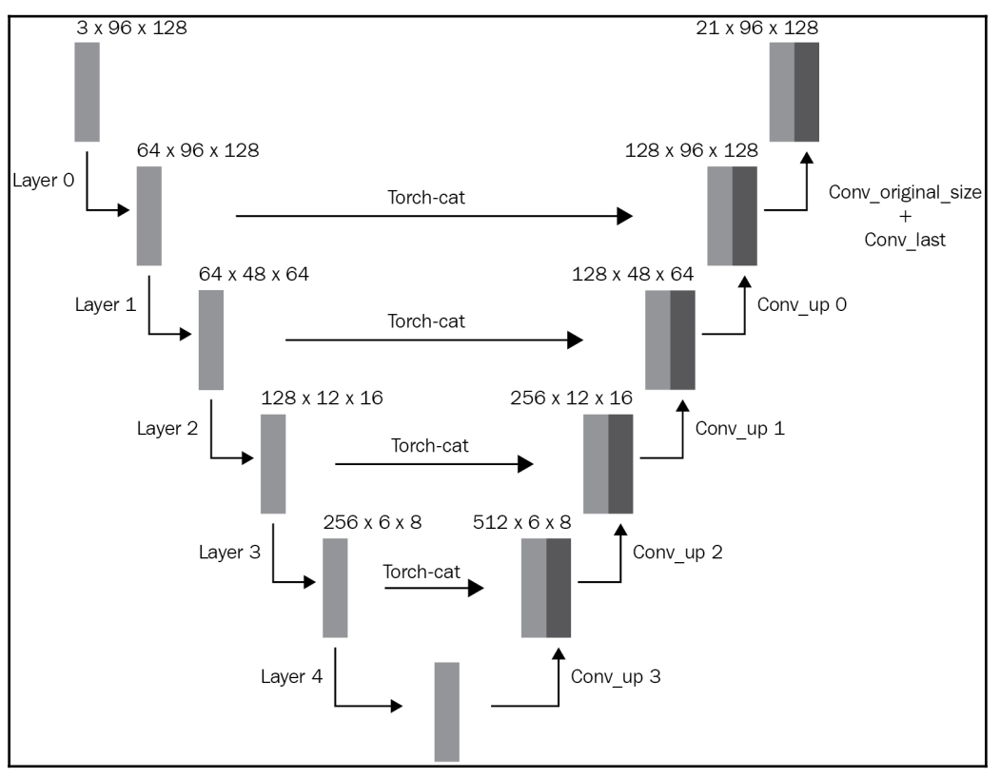

- Performing upscaling

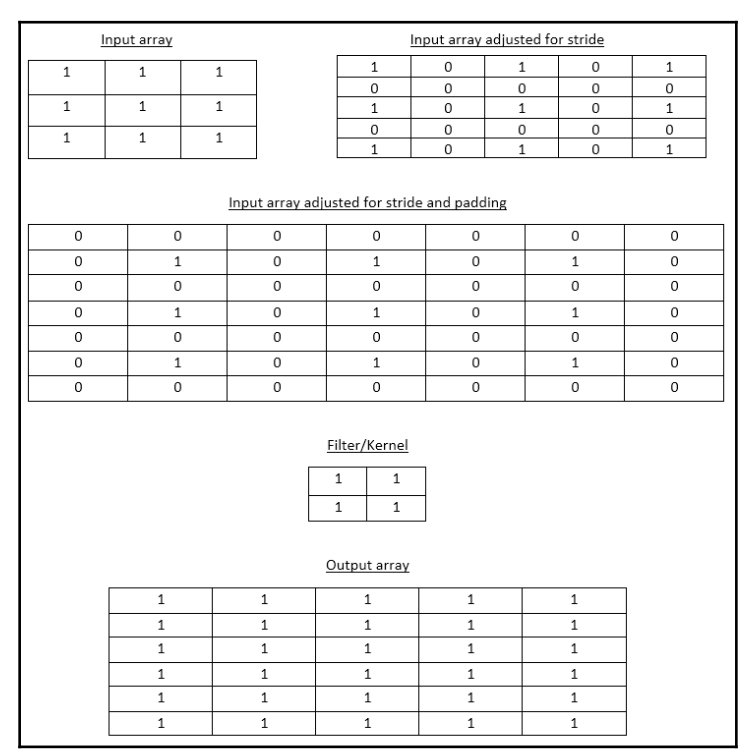

In the preceding example, we took an input array of shape 3 x 3 (Input array), applied a stride of 2 where we distributed the input values to accommodate the stride (Input array adjusted for stride), padded the array with zeros (Input array adjusted for stride and padding), and convolved the padded input with a filter (Filter/Kernel) to fetch the output array.

[Code](07-Image-Segmentation/Senmantic_Segmentation_with_U_Net.ipynb)

<b> Mask R-CNN </b>

- Mask R-CNN architecture

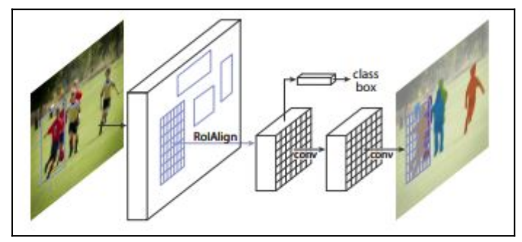

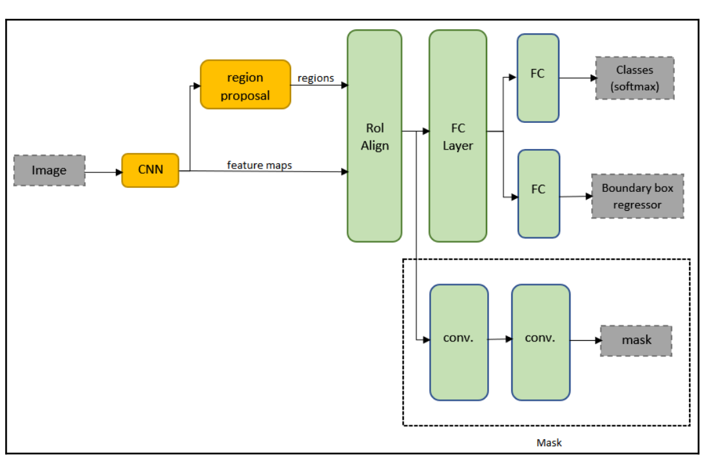

- RoI Align

To understand how RoI Align works, let's go through a simple example. Here, we are trying to convert the following region (which is represented in dashed lines) into a 2 x 2 shape:

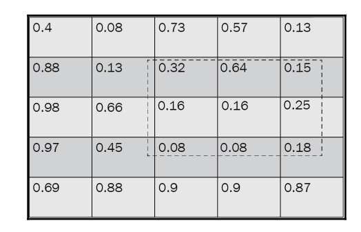

 - Step 1: First, divide the region into an equal 2 x 2 shape:

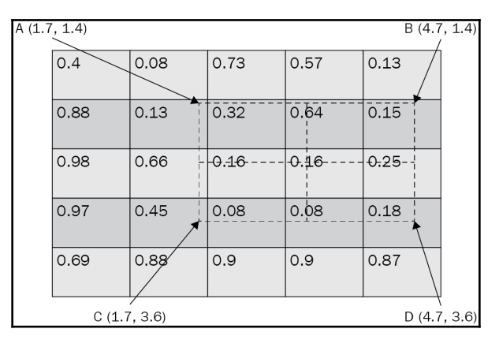

 - Step 2: Define four points that are equally spaced within each of the 2 x 2 cells:

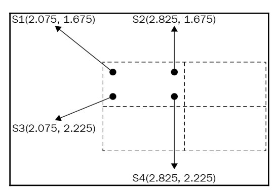

 - Step 3: Calculate the weighted average value of each point based on its distance to the nearest known value:

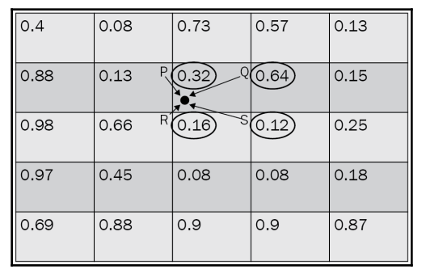

 - Step 4: Repeat the preceding interpolation step for all four points in a cell:

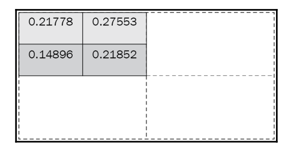

 - Step 5: Perform average pooling across all four points within a cell:

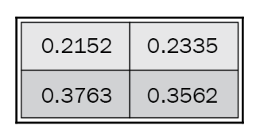

- Mask head

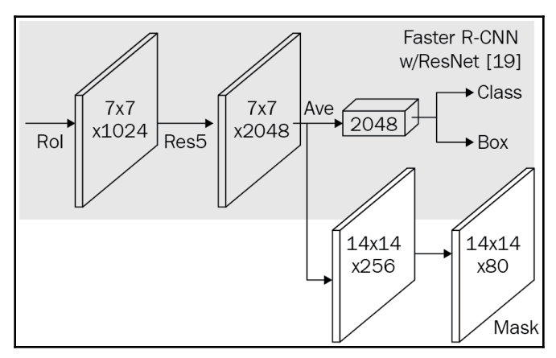

[Code](07-Image-Segmentation/Instance_Segmentation.ipynb)

[Code - Multi-instance of multi class segmentation](07-Image-Segmentation/Multiple_instances_of_multiple_classes.ipynb)
