# Multiple View Geometry

These notes are my lecture notes on the Computer Vision II - Multiple View Geometry course held in the summer term 2021 by Prof. Daniel Cremers/Prof. Florian Bernard. The notes are based on the [course slides](https://cvg.cit.tum.de/teaching/online/mvg) . Images are taken from the course slides and related research papers which are referenced in the notes.

# Lecture 1 - Linear Algebra basics and Matrix groups

<i>
Chapter 1 - Mathematical Background Linear Algebra

Lectures 1, 2
</i>

## 1. Linear Algebra Basics
Easy: vector spaces, linear independence, basis, vector space dimension, basis transform, inner product, norm, metric, Hilbert space. linear transformations, matrix ring $\mathcal{M}(m, n)$, groups

* *Kronecker product*: $$A \otimes B = \begin{pmatrix}
a_{11}b & \dots & a_{1n}B \\
 \vdots & \ddots & \vdots \\
a_{m1}B & \dots & a_{mn}B
 \end{pmatrix}$$
* *Stack* $A^{s}$ of matrix $A$: stack the $n$ column vectors to a $mn$-dim. vector
	* For example, $u^\top A v = (v \otimes u)^\top A^s$

### Matrix groups
An arbitrary group $G$ has a *matrix representation* if there is an injective group homomorphism into some $GL(n)$. 

##### Important Matrix groups
* *General linear group*: $GL(n)$ are all invertible square matrices of size $n$
* *Special linear group*: $SL(n) = \{A \in GL(n) \mid \det(A) = 1\}$
* *Affine group*: $$A(n) = \bigg\{\begin{pmatrix}A & b \\ 0 & 1\end{pmatrix} \mid A \in GL(n)\bigg\}$$
	* Affine transformations $L: \mathbb{R}^n \to \mathbb{R}^n$ are of the form $L(x) = Ax + b$
	* $A(n)$ represents affine transformations in homogeneous coordinates
* *Orthogonal group*: set of all orthogonal matrices, i.e. $O(n) = \{R \in GL(n) \mid R^\top R = I \}$
	* orthogonal matrices have determinant $\pm 1$
* *Special orthogonal group*: $SO(n) = O(n) \cap SL(n)$ is the subgroup of $O(n)$ with positive determinant
	* $SO(3)$ are the 3-dim. **rotation matrices**
* *Euclidean group*: $$E(n) = \bigg\{\begin{pmatrix}R & T \\ 0 & 1\end{pmatrix} \mid R \in O(n)\bigg\}$$
	* Affine transformations $L(x) = Rx+T$ where $R$ is orthogonal
* *Special Euclidean group*: $SE(n)$ is the subgroup of $E(n)$ where $R \in SO(n)$
	* $SE(3)$ are the 3-dim. **rigid-body motions**

##### Relationships between groups
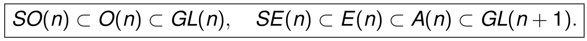


### Kernel and Rank
Easy: definitions of range/span, null/ker, rank.

The kernel of $A$ is given by the subspace of vectors which are orthogonal to all rows of $A$. In MATLAB:
```MATLAB
Z = null(A)
```

##### Rank equations
Assume $A \in \mathbb{R}^{m \times n}$. Then:
* $\text{rank}(A) = n - \text{dim}(\text{ker}(A))$
* $\text{rank}(A) \leq \min(m, n)$
*  $\text{rank}(A)$ is the highest order of a non-zero minor of $A$
	*  minor of order $k$ is the determinant of a $k\times k$ submatrix of $A$
*  *Sylvester's inequality*: If $B \in \mathbb{R}^{n \times k}$, then
$$\text{rank}(A) + \text{rank}(B) - n \leq \text{rank}(AB) \leq \min(\text{rank}(A), \text{rank}(B))$$
This inequality describes that if $A$ is $a$ dimensions away from its full rank and $B$ is $b$ dimensions away, $AB$  can be between $a+b$ and $\max(a, b)$ dimensions away from its full rank.
* Multiplying with invertible matrices does not change the rank

In MATLAB:
```MATLAB
d = rank(A)
```

## 2. Eigendecomposition, (skew-)symmetric matrices and SVD


### Eigenvectors and Eigenvalues

The *spectrum* of a matrix $\sigma(A)$ is the set of its (right) eigenvalues.

In MATLAB:
```MATLAB
% Then A*V = V*D, D diagonal
[V, D] = eig(A);
```
For a real square matrix $A$, it holds:
* for each eigenvalue, there also is a corresponding left eigenvector: $\sigma(A) = \sigma(A^\top)$.
* eigenvectors to different eigenvalues are lin. indep.
* $\det(A)$ is the product of all eigenvalues including multiplicities, since $\sigma(A)$ are the roots of the characteristic polynomial $\det(\lambda I - A)$.
* Similar matrices have the same spectrum: $\sigma(PAP^{-1}) = \sigma(A)$
* Conjugates of eigenvalues are eigenvalues: $\sigma(A) = \overline{\sigma(A)}$ (remember: $A$ is real).

### Symmetric matrices
Easy: symmetric, PSD ($\succeq 0$), PD ($\succ 0$)
For a real symmetric matrix $S$, it holds:
* $S$ only has real eigenvalues
* eigenvectors to different eigenvalues are orthogonal
* there exist $n$ orthonormal eigenvectors of $S$ that form a basis of $\mathbb{R}^n$. If $V = (v_1, \dots, v_n) \in O(n)$ contains these eigenvectors and $\Lambda = \text{diag}(\lambda_1, \dots, \lambda_n)$ the eigenvalues, we have $S = V \Lambda V^\top$.
* If $S$ is PSD, then $\max_{|x|=1}\langle x, Sx \rangle$ is the largest eigenvalue and $\min_{|x|=1}\langle x, Sx \rangle$ is the smallest eigenvalue.


### Matrix norms
Let $A \in \mathbb{R}^{m \times n}$.
* *induced 2-norm* (operator norm):
$$||A||_2 = \max_{||x||_2 = 1}||Ax||_2 = \max_{||x||_2 = 1} \sqrt{\langle x, A^\top A x\rangle}$$

* *Frobenius norm*:
$$||A||_f = \sqrt{\sum_{i,j} a_{ij}^2} = \sqrt{\text{trace}(A^\top A)}$$

Diagonalizing $A^\top A$, we obtain:
$$||A||_2 = \sigma_1, \quad||A||_f = \sqrt{\sigma_1^2+\dots+\sigma_n^2}$$

### Skew-symmetric matrices
A real square matrix $A$ is *skew-symmetric* (*schiefsymmetrisch*), if $A^\top = -A$. Then it holds:
* All eigenvalues are imaginary: $\sigma(A) \subseteq i\mathbb{R}$
* $A$ can be written as $A = V \Lambda V^\top$, where $V \in O(n)$ and $\Lambda = \text{diag}(A_1,\dots,A_m,0,\dots,0)$ is a  block-diagonal matrix with blocks of the form $A_i = [0 ~ a_i; -a_i~ 0]$
	* Corollary: skew-symmetric matrices have even rank.

##### Hat operator
Important skew-symmetric matrix: Given $u \in \mathbb{R}^3$, define
$$\widehat{u} = \begin{pmatrix}
0 & -u_3 & u_2 \\ u_3 & 0 & -u_1 \\ -u_2 & u_1 & 0
 \end{pmatrix}$$
The hat operator models the cross product: $\widehat{u}v = u \times v$ for any $v \in \mathbb{R}^3$. The one-dim. kernel of $\widehat{u}$ is $\text{ker}(\widehat{u}) = \text{span}(u)$.

### Singular-Value Decomposition (SVD)
Generalization of eigenvalues/-vectors to non-square matrices. SVD computation numerically well-conditioned.

Let $A \in \mathbb{R}^{m \times n}$, $m \geq n$, $\text{rank}(A) = p$. Then there exist $U, V, \Sigma$ s.t. $U$ and $V$ have *orthonormal columns* and $\Sigma = \text{diag}(\sigma_1, \dots, \sigma_p)$, $\sigma_1 \geq \dots \geq \sigma_p$, and
$$A = U \Sigma V^\top.$$

This generalizes the eigendecomposition (which decomposes $A = V \Lambda V^\top$ with diagonal $\Lambda$ and orthogonal $V$).

In MATLAB:
```MATLAB
% Then A = U * S * V'
[U, S, V] = svd(A)
% Here, S is smaller and has only non-zero sing. val.
[U, S, V] = svd(A, 'econ')
```

##### Proof of SVD
Assume we have $A \in \mathbb{R}^{m \times n}$, $m \geq n$ and $\text{rank}(A) = p$. Then $A^\top A \in \mathbb{R}^{n \times n}$ is symmetric + PSD.

$A^\top A$ has $n$ non-negative eigenvalues, which we call $\sigma_1^2 \geq \dots \geq \sigma_n^2$, and orthonormal eigenvectors $v_1, \dots, v_n$. The $\sigma_i$ (squareroots of eigenvalues) will become our singular values. The first $p$ vectors $v_i$ will become the columns of $V$.

One can show: $\text{ker}(A^\top A) = \ker(A)$ and $\text{range}(A^\top A) = \text{range}(A^\top)$. Therefore the first $p$ eigenvectors $v_1, \dots, v_p$ span $\text{range}(A^\top)$ and the remaining $v_{p+1}, \dots, v_n$ span $\text{ker}(A)$.

Define $u_i = \tfrac{1}{\sigma_i} A v_i$ for $i \leq p$: These $u_i$ will become the columns of $U$. They are orthonormal, because using that the $v_i$ are eigvalues of $A^\top A$, we get:
$$\langle u_i, u_j \rangle = \tfrac{1}{\sigma_i \sigma_j} \langle v_i, A^\top A v_j \rangle = \delta_{ij}$$

By definition, $A v_i = \sigma_i u_i$ for $i \leq p$, and therefore $$A \tilde{V} := A (v_1, \dots, v_n) = (u_1, \dots, u_p, 0, \dots, 0) \text{diag}(\sigma_1, \dots, \sigma_p, 0, \dots, 0) = \tilde{U} \tilde{\Sigma}$$
Now get $\tilde{V}$ to the right side by multiplying with its transposed, and delete the unnecessary columns/diagonal entries in the three matrices to obtain
$$A = U \Sigma V^\top. \qquad \square$$

Note: the proof on the slides actually completes $u_1, \dots, u_p$ with vectors $u_{p+1}, \dots, u_m$ to form a basis (instead of zero). This does not matter for the proof, but maybe for the next section.

##### Geometric Interpretation of SVD
Let $A$ be a square matrix. If $Ax = y$, with the SVD we get
$$U^\top y = \Sigma V^\top x.$$
Interpretation: $U^\top y$ are the coordinates of $y$ wrt. the basis represented by $U$, and similarly $V^\top x$ are the coordinates of $x$ wrt. the basis represented by $V$. The coordinates are related, as one can be obtained from the other simply by scaling by $\Sigma$.

Further interpretation: *$A$ maps the unit sphere into an ellipsoid with semi-axes $\sigma_i u_i$*.

### Moore-Penrose pseudoinverse
The Moore-Penrose pseudoinverse generalizes the inverse of a matrix. If $A$ has the SVD $A = U \Sigma V^\top$, the pseudoinverse is defined as

$$A^\dagger = V \Sigma^{-1} U^\top $$

Comment: here I assume a *compact SVD*, i.e. $\Sigma$ is already shrinked s.t. all singular values are non-zero.

In MATLAB:

```MATLAB
X = pinv(A)
```

##### Properties of the pseudoinverse
It holds that
$$A A^\dagger A = A, ~~A^\dagger A A^\dagger = A^\dagger$$

A linear system $Ax = b$, $A \in \mathbb{R}^{m \times n}$ can have multiple or no solutions. Among the minimizers of $|Ax - b|^2$, the one with smallest norm is given by
$$A^\dagger b.$$


# Lesson 2 - Representing a Moving Scene

## 1. Origins of 3D Reconstruction
3D reconstruction is a classical ill-posed problem, as its solutions are not unique (most extreme example: imagine a photograph was pinned in front of the camera).

Two type of transformations are needed:
* *Perspective projection*: account for image formation process (i.e. specifics of camera)
* *Rigid-body motion*: represent movement of camera between frames

Perspective projection was studied by acient Greeks (Euclids ~400 BC) and in the Renaissance (Brunelleschi & Alberti, 1435). This lead to *projective geometry* (Desargues 1648, Monge in the 18th century).

Multi-view geometry was first treated by Erwin Kruppa in 1913: *Two views of five points are sufficient to determine a) the motion between the views and b) the 3D structure up to finitely many solutions.* The eight-point algorithm was proposed bei Longuet-Higgins in 1981, further work along these lines followed (three views 1987-1995, factorization techniques 1992).

The joint estimation of a) camera motion and b) 3D structure is called *structure and motion* or *visual SLAM*.

## 2. 3D space and rigid body motion

##### Euclidean space terminology
Definitions:
* $\mathbb{E}^3$ is identified with $\mathbb{R}^3$ and consists of points $\mathbf{X} = (X_1, X_2, X_3)^\top$
* *bound vector*: $v = \mathbf{X} - \mathbf{Y} \in \mathbb{R}^3$, taking its endpoints into account
* *free vector*: if we don't take the endpoints into account
* *curve length*: $l(\gamma) = \int_0^1 |\gamma'(s)|\,ds$ for $\gamma: [0, 1] \to \mathbb{R}^3$

##### Skew-symmetric matrices
* $so(3)$ denote the space of *skew-symmetric matrices*
* *cross product*: $u \times v = (u_2 v_3 - u_3 v_2, \,u_3v_1 - u_1v_3, \,u_1v_2 - u_2v_1)^\top$. This vector is orthogonal to both $u$ and $v$.
* The hat operator $\widehat{~}: \mathbb{R}^3 \to so(3)$ models the cross product and defines an isomorphism between 3-dim. vectors and skew-symmetric matrices. Its inverse is denoted $\vee: so(3) \to \mathbb{R}^3$.

##### Rigid-body motions
A *rigid-body motion* is a family $g_t: \mathbb{R}^3 \to \mathbb{R}^3$, $t \in [0, T]$ which preserves norms and cross products:
* $||g_t(v)|| = ||v||, ~\forall v$  (distance between moving points stays the same)
* $g_t(u) \times g_t(v) = g_t(u \times v), ~ \forall u, v$ (orientation stays the same)
In other words: each $g_t$'s rotation part is in $SO(3)$ ($O(3)$ because of the norm preservation, and then $SO(3)$ because the cross product preservation implies a determinant of $1$). So $g_t(x) = Rx + T$ for some $R \in SO(3)$, $T \in \mathbb{R}^3$.

They are also *inner product preserving*, as $\langle u, v \rangle = \tfrac{1}{4}(||u+v||^2 - ||u-v||^2)$ (the *polarization identity*). As a consequence, they are *volume-preserving* because the preserve the *triple product*: $\langle g_t(u), g_t(v) \times g_t(w) \rangle = \langle u, v \times w \rangle$.


##### Exponential coordinate reparametrization of rotations
Motivation: $SO(3)$ is actually only 3-dimensional, not 9-dimensional.

Assume a trajectory $R(t): \mathbb{R} \to SO(3)$. Its derivative $R'(t)$ is connected to $R(t)$ by a linear differential equation, which leads a matrix exponential solution for $R(t)$:

$$R(t) R^\top(t) = I 
 \Rightarrow R'(t)R^\top(T) + R(t)R'^\top(t) = 0
 \Rightarrow R'(t) R^\top(t) = -(R'(t)R^\top(t))^\top
$$
So $R'(t) R^\top(t)$, i.e. of the form $R'(t) R^\top(t) = \widehat{w}(t) \in so(3)$, and therefore $R'(t) = \widehat{w}(t) R(t)$.

Now assume an infinitesimal rotation: If $R(0) = I$ then $R(dt) \approx I + \widehat{w}(0) dt$. This means that an infinitesimal rotation can be approximated by an element of $so(3)$.

### Lie Group SO(3) of Rotations
**Definitions**
* A *Lie group* is a smooth manifold that is also a group, s.t. the group operations $+$ and ${}^{-1}$ are smooth maps.
* An *algebra over a field $K$* is a $K$-vector space that additionally has a multiplication on $V$ (non-commutative in general)
* *Lie bracket*: $[w, v] = wv - vw$

Formulated the above with this terminology:
* $SO(3)$ is a Lie group
* $so(3)$ is a Lie algebra, and tangent space at the identity of the Lie group $SO(3)$

The mapping from a Lie algebra to its associated Lie group is called *exponential map*. Its inverse is called *logarithm*.

##### Exponential map $\exp: so(3) \to SO(3)$
Assume a rotation with **constant $\widehat{w}$**.  The transformation $R(t)$ is then described by the linear differential system of equations
$$
 \begin{cases}
R'(t) = \widehat{w} R(t) \\
R(0) = I
 \end{cases}
$$
This has the solution
$$R(t) = \exp(\hat{w} t) = \sum_{n = 0}^\infty \frac{(\hat{w}t)^n}{n!}$$
This describes a *rotation around the axis $w \in \mathbb{R}^3$, $||w|| = 1$, by an angle $t$*.

So the matrix exponential defines a map $\exp: so(3) \to SO(3)$.

##### Logarithm of SO(3)
The inverse map (actually an inverse map, the inverse is non-unique) is denoted by $\log: SO(3) \to so(3)$.

The vector $w$ s.t. $\hat{w} = \log(R)$ is given by
$$
||w|| = \cos^{-1} \bigg(\tfrac{\text{trace}(R) - 1}{2}\bigg),\quad
 \frac{w}{||w||} = \frac{1}{2 \sin(||w||)} (r_{32} - r_{23}, ~r_{13} - r_{31}, ~r_{21} - r_{12})^\top
$$

The length of $||w||$ corresponds to the rotation angle, and the normalized $\frac{w}{||w||}$ to the rotation axis. The non-uniqueness can be seen from the fact that increasing the angle by multiples of $2\pi$ gives the same $R$.

##### Rodrigues' Formula
For skew-symmetric matrices $\hat{w} \in so(3)$, the matrix exponential can be computed by *Rodrigues formula*:

$$\exp(\hat{w}) = I + \frac{\hat{w}}{||w||} \sin(||w||)
+ \frac{\hat{w}^2}{||w||^2} \big(1 - \cos(||w||)\big)$$

**Proof:** Denote $t = ||w||$ and $v = w/t$. First, prove that $\hat{v}^2 = v v^\top - I$ and $\hat{v}^3 = -\hat{v}$. This allows to write $\hat{v}^n$ in closed form as
$$
 \hat{v}^n = \begin{cases}
(-1)^{k-1} \cdot \hat{v}^2, &n=2k \\
(-1)^{k} \cdot \hat{v}, &n=2k+1
 \end{cases}
$$
Plugging this into the exponential series yields:
$$
 \sum_{n = 0}^\infty \frac{(\hat{v}t)^n}{n!}
= I 
+ \sum_{n \geq 1, n=2k} \frac{(-1)^{k-1} t^n \hat{v}^2}{n!}
+ \sum_{n \geq 1, n=2k+1} \frac{(-1)^{k} t^n \hat{v}}{n!}
= I + \sin(t) \hat{v} + (1 - \cos(t)) \hat{v}^2
$$

## 3. Lie Group SE(3) of Rigid-body Motions
Recall: SE(3) are transformations $x \mapsto Rx + T$, expressed in homog. coordinates as
$$SE(3) = \bigg\{\begin{pmatrix}R & T \\ 0 & 1\end{pmatrix} \;\bigg\lvert\; R \in SO(3)\bigg\}.$$

Consider a continuous family of rigid-body motions
$$g: \mathbb{R} \to SE(3), ~g(t) = \begin{pmatrix}R(t) & T(t) \\ 0 & 1\end{pmatrix}$$

Then the inverse of $g(t)$ is 

$$g^{-1}(t) = \begin{pmatrix}
	R^\top(t) & - R^\top(t) T \\
	0 & 1
 \end{pmatrix}$$

##### Linear differential equation for twists
We want to get a similar representation as differential equation as for $SO(3)$, i.e. write $g'(t) = \widehat{\xi}(t) g(t)$. To achieve this, consider $g'(t) g^{-1}(t)$ and later mulitply with $g(t)$:

$$g'(t) g^{-1}(t) = \begin{pmatrix}
	R'(t) R(t) & T'(t) - R'(t) R^\top T \\
	0 & 0
 \end{pmatrix}$$
As for $SO(3)$, the matrix $R'(t)R^\top$ is skew-symmetric. We call it $\widehat{w}(t)$, further define $v(t) = T'(t) - \widehat{w}(t) T(t)$, and write
$$g'(t) g^{-1}(t)
=: \begin{pmatrix}
	\widehat{w}(t) & T'(t) - \widehat{w}(t) T \\
	0 & 0
 \end{pmatrix} 
=: \begin{pmatrix}
	\widehat{w}(t) & v(t) \\
	0 & 0
 \end{pmatrix}
=: \widehat{\xi}(t) \in \mathbb{R}^{4\times 4}$$

Multiplying with $g(t)$ yields:

$$g'(t) = \widehat{x}(t) g(t)$$

The 4x4 matrix $\widehat{x}(t)$ is called a *twist*. We can view it as tangent along $g(t)$.

##### Lie algebra se(3)
The set of all twists form the tangent space at the identity of $SE(3)$:

$$se(3) = \bigg\{ \widehat{\xi} = 
 \begin{pmatrix} \widehat{w} & \widehat{v} \\ 0 & 0 \end{pmatrix}
 \;\big\lvert\;
 \widehat{w} \in so(3), v \in \mathbb{R}^3
 \bigg\}$$

We define a *hat operator* $\wedge$ and a *vee operator* $\vee$ as before:
$$\begin{pmatrix} v \\ w \end{pmatrix}^{\wedge} = \begin{pmatrix} \widehat{w} & \widehat{v} \\ 0 & 0 \end{pmatrix}  \in \mathbb{R}^{4\times 4} \qquad
 \begin{pmatrix} \widehat{w} & \widehat{v} \\ 0 & 0 \end{pmatrix}^{\vee} = \begin{pmatrix} v \\ w \end{pmatrix} \in \mathbb{R}^6$$

$\widehat{\xi} \in se(3)$ is called a *twist*, $\xi \mathbb{R}^6$ its *twist coordinates*. The vector $v$ represents the *linear velocity*, the vector $w$ the *angular velocity*.

#####  Exponential map $\exp: se(3) \to SE(3)$
Assume the motion has constant twist $\widehat{\xi}$. We get the linear differential equation system
$$
 \begin{cases}
g'(t) = \widehat{\xi} g(t) \\
g(0) = I
 \end{cases}
$$
which has the solution $g(t) = \exp(\hat{\xi}t)$.

So the exponential for $SE(3)$ is defined as

$$\exp: se(3) \to SE(3), \widehat{\xi} \to \exp(\widehat{\xi}),$$
where the $\widehat{\xi} \in se(3)$ are called *exponential coordinates* for $SE(3)$.

One can show that the exponential has the closed-form expression
$$\exp(\widehat{\xi}) = \begin{pmatrix}
	\exp(\widehat{w}) & \tfrac{1}{||w||^2} \big( I - \exp(\widehat{w}) \widehat{w} v + w w^\top v  \big) \\
	0 & 1
 \end{pmatrix}$$
(in case $w \neq 0$; otherwise $\exp(\widehat{\xi}) = [I ~ v; 0 ~ 1]$). Note: this is the analogon to the Rodrigues formula; in turn, this formula requires the Rodrigues formula for computing $\exp(\widehat{w})$.


##### Logarithm of SE(3)
To show that for any element of $SE(3)$ with rotation/translation $R, T$,  we can find a corresponding twist in $se(3)$, we use the above closed-form expression for $\exp(\widehat{\xi})$: Clearly, we can find $w$ as $\log(R)$. Then we need to solve $\tfrac{1}{||w||^2} \big( I - \exp(\widehat{w}) \widehat{w} v + w w^\top v  \big) = T$ for $v$ (not detailed in the lecture), which yields that the desired vector $v$ exists.


### Representing camera motion
Assume a point $\mathbf{X}_0$ in *world-coordinates*: this is mapped by the transformation $g(t)$ to a point $\mathbf{X}(t)$. Note: we follow the convention that points are moved by the transformation rather than the camera itself. In 3d coordinates, we define
$$\mathbf{X}(t) = R(t) \mathbf{X}_0 + T(t)$$
and in homogeneous coordinates:
$$\mathbf{X}(t) = g(t) \mathbf{X}_0.$$
We use the same notation for homogeneous and 3d representations (usually if a $g$ comes into play, we mean homogeneous coordinates).

##### Notation for concatenation
If we have one motion from $t_1$ to $t_2$ and another from $t_2$ to $t_3$, we can write $\mathbf{X}(t_3) = g(t_3, t_1) \mathbf{X}_0 = g(t_3, t_2) g(t_2, t_1) \mathbf{X}_0$.

Also, it holds that $g^{-1}(t_2, t_1) = g(t_1, t_2)$.

##### Rules of velocity transformation
We want to find the velocity of a point:
$$\mathbf{X}'(t) = g'(t) \mathbf{X}_0 = g'(t) g^{-1}(t) \mathbf{X}(t)$$
But $g'(t) g^{-1}(t)$ is simply a twist:
$$\widehat{V}(t) = g'(t) g^{-1}(t) = \begin{pmatrix}
	\widehat{w}(t) & v(t) \\
	0 & 0
 \end{pmatrix} \in se(3)$$

So $\mathbf{X}'(t) = \widehat{V}(t) \mathbf{X}(t)$ in homog. coordinates, or $\mathbf{X}'(t) = \widehat{w}(t) \mathbf{X}(t) + v(t)$. This clarifies why $w$ represents angular velocity and $v$ represents linear velocity.

##### Adjoint map: transfer between frames
Suppose in another frame, the view is displaced relative to our frame by $g_{xy}$, i.e. $\mathbf{Y}(t) = g_{xy} \mathbf{X}(t)$. The velocity in this frame is

$$mathbf{Y}'(t) = g_{xy} mathbf{X}'(t) = g_{xy} \widehat{V}(t) \mathbf{X}(t) = g_{xy} \widehat{V} g^{-1}_{xy} \mathbf{Y}(t)$$

In other words, the relative velocity of points observed from the other frame is represented by the twist $\widehat{V}_y = g_{xy} \widehat{V} g_{xy}^{-1} =: \text{ad}_{g_{xy}}(\widehat{V})$. Here we introduced the *adjoint map*:

$$\text{ad}_g: se(3) \to se(3), \widehat{\xi} \mapsto g \widehat{\xi} g^{-1}.$$


### Euler angles
*Euler angles* are a way to parametrize rotations, and an alternative to exponential parametrization. They are related, however, as we will see.

How to parametrize the space of rotations? We can choose a basis $(\widehat{w}_1, \widehat{w}_2, \widehat{w}_3)$ of $so(3)$ (skew-symm. matrices). Then we can parametrize any rotation in *Lie-Cartan coordinates of the first kind* $\alpha$ wrt. this basis as follows:
$$\alpha: (\alpha_1, \alpha_2, \alpha_3) \mapsto \exp(\alpha_1 \widehat{w}_1 + \alpha_2 \widehat{w}_2  + \alpha_3 \widehat{w}_3)$$

Alternatively, we can paremetrize it in *Lie-Cartan coordinates of the second kind* $\beta$ wrt. the basis:
$$\beta: (\beta_1, \beta_2, \beta_3) \mapsto \exp(\beta_1 \widehat{w}_1) \exp(\beta_2 \widehat{w}_2)\exp(\beta_3 \widehat{w}_3)$$

If we choose $w_1 = (0, 0, 1)^\top, w_2 = (0, 1, 0)^\top, w_3 = (1, 0, 0)^\top$, i.e. rotations around the z/y/x axes, the coordinates $\beta_i$ are called *Euler angles*.

This shows that the Euler angles are just a fairly random way, among infinitely many ways, to parametrize rotations. Advantage of the first-kind Lie-Cartan coordinates: allows to stay in the Lie algebra as long as possible, where the group operation (matrix addition instead of multiplication) is less expensive.

### Summary
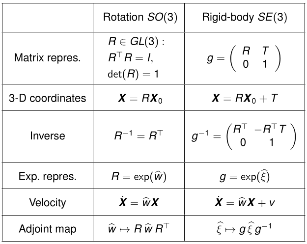

# Lesson 3 - Perspective Projection

Goal of MVG: *invert the image formation process*. One part of the formation process is the *camera motion* (last lecture). The second one is the *projection of points to image coordinates*.

Historic remarks: perspective projection was known already to Euclid, but apparently lost after the fall of the Roman empire. It reemerged in the Renaissance period.

### Mathematics of Perspective Projection
Most idealized model: *Pinhole camera* (camera obscura).

To capture more light: use *lenses* which bundle light (by refraction at the material boundaries). Light which enters the lens in parallel to its optical axis leaves it in the direction of the *focal point* $F_r$. For a symmetric lens, the left/right focal points $F_r$, $F_l$ are at the same distance from the lens. We look at the idealized *thin lens* here: assume the two refraction points (light enters lens/leaves lens) are the same.

**Crucial point**: All the light rays that leave a point $P$ are bundled by the lens to meet at a point $p$ again.

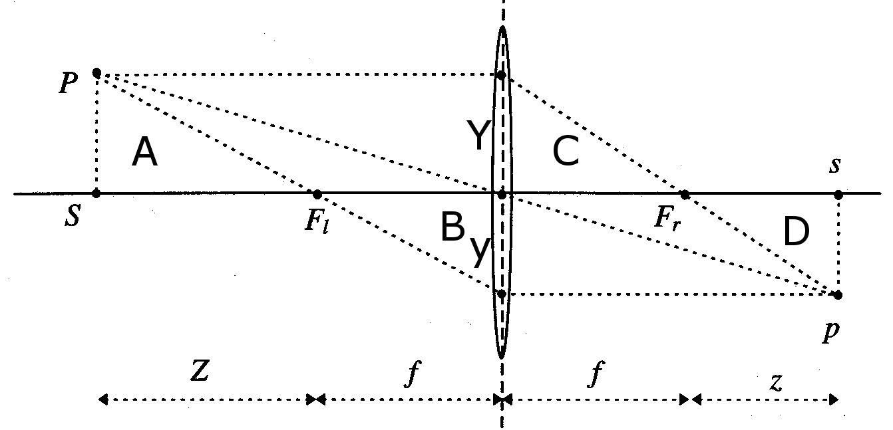


Assumption: $z$ axis is the optical axis. Observe the two *similar triangles* $A, B$ with side lengths $Y$ and $Z$ corresponding to side lengths $y$ and $f$.
- $Y$ is the distance in y direction from the optical axis in the world
- $y$ is the distance in y direction from the optical axis in the projected image
- $Z$ is the distance of the object to the focal point (or its $Z$ coordinate? unsure...)
- $f$ is the *focal length* (distance of the focal point from the lens)
Also, assume that $Y > 0$, $y < 0$ ("positive/negative length") since they point in opposite directions. We get:

$$\frac{Y}{Z} = - \frac{y}{f} \quad\Rightarrow\quad y = -f \frac{Y}{Z}$$

We want to get rid of the minus sign. So we adapt the convention that *the image projection plane is not behind, but in front of the camera*. Then the perspective projection is given by:

$$\pi: \mathbb{R}^3 \to \mathbb{R}^2, \mathbf{X} \mapsto \begin{pmatrix} fX/Z \\ f Y/Z \end{pmatrix}$$

**This transformation is non-linear because you divide by the Z coordinate!**

##### Homogeneous coordinate representation

$$Z\mathbf{x}
= Z \begin{pmatrix} x \\ y \\ 1 \end{pmatrix}
= \begin{pmatrix} f & & & 0 \\ & f & & 0 \\ & & 1 &0 \end{pmatrix} \begin{pmatrix} X \\ Y \\ Z \\ 1 \end{pmatrix}
= \begin{pmatrix} f & & \\ & f & \\ & & 1\end{pmatrix}
 \begin{pmatrix} 1 & & & 0 \\ & 1 & & 0 \\ & & 1 &0 \end{pmatrix}
 \mathbf{X}
= K_f \Pi_0 \mathbf{X}
$$

$\Pi_0$ is the *standard projection matrix*. Assuming you are sufficiently far away s.t. $Z$ is approximately constant accross all points, $Z = \lambda > 0$, we finally get a linear transformation

$$\lambda \mathbf{x} = K_f \Pi_0 \mathbf{X}$$

##### Taking camera motion into account
Assume that $\mathbf{X} = g \mathbf{X_0}$ ($g$ transforms from world to camera coordinates). We get $\lambda \mathbf{x} = K_f \Pi_0 g \mathbf{X_0}$. Finally assume that the focal length is known: we can normalize our units and drop $K_f$ to get

$$\lambda \mathbf{x} = \Pi_0 \mathbf{X} = \Pi_0 g \mathbf{X}_0$$

### Intrinsic Camera Parameters
We have a number of different coordinate systems by now: World coordinates (3D) -> Camera coordinates (3D) -> Image coordinates (2D) -> Pixel coordinates (2D).

The camera coordinates assume that the optical center is in the middle; in pixel coordinates there are only positive coordinates, and the origin is at the bottom or top left. This shift is encoded by an translation by $(o_x, o_y)$.

If pixel coordinates are not equally scaled in x/y direction, we need scaling factors $s_x, s_y$. For non-rectangular pixels, we need a skew factor $s_\theta$ (typically neglected). Then the *pixel coordinates* are given by

$$\lambda \begin{pmatrix} x' \\ y' \\ 1 \end{pmatrix}
= \begin{pmatrix} s_x & s_\theta & o_x \\ 0 & s_y & o_y \\ 0 & 0 & 1 \end{pmatrix} K_f \Pi_0 \mathbf{X}
= K_s K_f \Pi_0 \mathbf{X}
$$

The combination of focal length information and pixel transformation information gives the *intrinsic camera parameter matrix* $K = K_s K_f$. We further simplify by defining $\Pi = K \Pi_0 g$: $\Pi = [KR, KT] \in \mathbb{R}^{3 \times 4}$ is the *general projection matrix*. This yields

$$\lambda \mathbf{x}' = \Pi X_0$$

 and dividing out $\lambda$, where $\pi_i^\top$ is the i-th row of $\Pi$:
 
 $$x' = \frac{\pi_1^\top \mathbf{X_0}}{\pi_3^\top \mathbf{X_0}}, \quad y' = \frac{\pi_2^\top \mathbf{X_0}}{\pi_3^\top \mathbf{X_0}}, z' = 1$$
 
 ##### Summary of intrinsic parameters
 We have

$$K = K_s K_f = \begin{pmatrix} fs_x & fs_\theta & o_x \\ 0 & fs_y & o_y \\ 0 & 0 & 1 \end{pmatrix}$$

and the parameters are 
- $o_x, o_y$: $x$ and $y$ coordinate of *principal point* (point through which optical axis goes) in pixels
- $f s_x = \alpha_x$: size of unit length *in horizontal pixels*
- $f s_y = \alpha_y$: size of unit length *in vertical pixels*
- $\alpha_x / \alpha_y = \sigma$: aspect ratio
- $f s_\theta \approx 0$: skew of the pixel


### Spherical Perspective Projection
Assumption [[#Mathematics of Perspective Projection|in previous section]]: Projection to an image *plane*. Now instead assume a projection onto a *sphere* of radius $r = 1$. The spherical projection is given by 

$$\pi_s: \mathbf{X} \mapsto X / ||X||$$

We have the same projection equation $\lambda \mathbf{x}' = K \Pi_0 g \mathbf{X}_0$, except that now $\lambda = ||X||$. So as above, $\mathbf{x}' \sim \Pi \mathbf{X}_0$. This property actually holds for any imaging surface where the ray between $\mathbf{X}$ and the origin intersects the surface.


### Radial Distortion
With realistic lenses (no thin lens), there is radial distortion (distortion which is bigger the longer the "radius"/distance from the optical center axis is). Extreme example: *Fisheye lenses*.

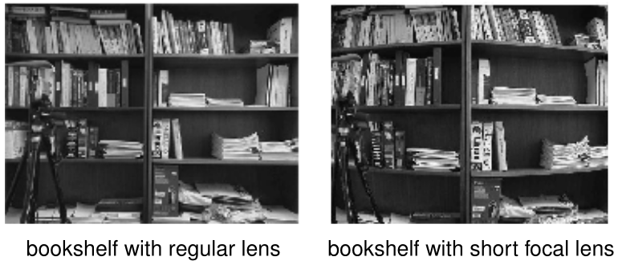

Effective model for distortions ($x_d$, $y_d$ are the distorted coordinates):

$$x = x_d(1 + a_1 r^2 + a_2 r^4), \quad y = y_d (1 + a_1 r^2 + a_2 r^4)$$

This depends on the radius $r = ||(x_d, y_d)||$ and parameters $a_1, a_2$ which can be estimated by calibration.

More general model (for arbitrary center $c$ with four parameters):

$$\mathbf{x} = c + f(r) (\mathbf{x}_d - c), \quad f(r) = 1 + a_1 r + a_2 r^2 + a_3 r^3 + a_4 r^4$$


### Preimages of Points and Lines
The *preimage of a 2D point* is the equivalence class of 3D points that project to that point. Similarly the *preimage of a 2D line* is the set of 3D points that project to a point on the line. We can define preimages for arbitrary geometric regions in the image (but for points/lines they are vector spaces, which is easier).

Some intuition: we can in principle use preimages for multi-view reconstruction: the intersection of point preimages of multiple views gives the 3D target point.

We get the *coimage* of a point/line as the orthogonal complement of its preimage: The coimage is of a point is a plane, and the coimage of a line is a line.

The following relations hold:

$$\text{image} = \text{preimage} \cap \text{image plane}$$
$$\text{preimage} = \text{span}(\text{image})$$
$$\text{preimage} = \text{coimage}^\bot$$
$$\text{coimage} = \text{preimage}^\bot$$

We characterize the preimage of a line $L$ by its normal vector $\ell$ which spans the coimage. In particular, all points $x$ on $L$ are orthogonal to $\ell$: $\ell^\top x = 0$.

The row vectors of $\widehat{\ell}$ span the space of vector orthogonal to $\ell$, so for the preimage it holds that $P = \text{span}(\widehat{\ell})$.

If $x$ is the image of a point $p$, the coimage of $x$ is a plane that is orthogonal to $x$: So it is spanned by the rows of $\widehat{x}$.

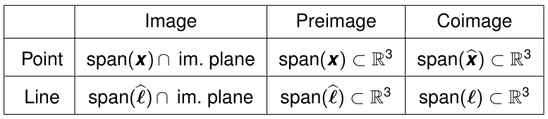


### Projective Geometry
(We don't dig deeper into this, this is just some background info)

We used homogeneous coordinates to map 3D vectors to 4D vectors $[X; Y; Z; 1]$. We can drop the normalization and identify a 3D point with the line $[XW; YW; ZW; W] \in \mathbb{R}^4, W \in \mathbb{R}$ through the origin of 4D-space (only the 3D direction of this line is what matters).

This leads to the definition of *projective coordinates*: The $n$-dimensional projective space $\mathbb{P}^n$ is the set of all one-dimensional subspaces (lines through the origin) of $\mathbb{R}^{n+1}$.

# Lesson 4 - Estimating Point Correspondence

Goal: find point descriptors/characteristic image features to be able to identify keypoints accross several images from different views.

Things to consider:
- small vs. wide baseline case (small vs. large displacements)
	- higher fps makes things easier!
	- small baseline: plausible corresponding points are likely to be close (only search there)
- textured reconstructions can look misleadingly good (egg with face projected looks a lot like a human head)
- non-Lambertian materials (shiny: view point dependence of reflection)
- non-rigid transformations (person bending their head)
- partial occlusions (sunglasses) - a point may not have a correspondence


##### Small Deformation vs. Wide Baseline
- *small deformation case*: classical *optical flow estimation*.
	- Lucas/Kanade method (1981) (find correspondences sparsely)
	- Horn/Schunk method (1981) (find correspondences densely)

- *wide baseline stereo*: Select feature points and find an appropriate pairing of points

Comment: with improving methods, increasingly large deformations can be handled by optical flow estimation (e.g. coarse-to-fine approaches)


### Small Deformations: Optical Flow
The rigid transformation of a point $x_1$ in one image to $x_2$ in the other image is given by

$$x_2 = h(x_1) = \frac{1}{\lambda_2(X)}(R \lambda_1(X) x_1 + T)$$

##### Local approximation models for motion
This can be approximated locally e.g. by a *translational model*

$$h(x) = x + b$$

or an affine model

$$h(x) = Ax + b$$

The 2D affine model can also be written as

$$h(x) = x + u(x) = x + S(x) p = \begin{pmatrix} x  & y & 1 & & & \\ & & & x & y & 1\end{pmatrix}(p_1, p_2, p_3, p_4, p_5, p_6)^\top$$

for some parameters $p_i$ depending on the rotation/translation.

Affine models include much more types of motion (divergent motions, rotations etc.)

##### Optical Flow Estimation
The *optical flow* refers to the part of the motion that can be seen in the image plane (i.e. the projection of the real motion onto the image plane).

- **Lucas-Kanade**: sparse method (estimate motion field at certain points, under the assumption that the motion in a small neighborhood is *constant*)
- **Horn-Schunck**: dense method (estimate motion field at every pixel, under the assumption that the motion in a small neighborhood is *smooth*)

Lucas-Kanade was prefered at the time the methods were published because it is simpler and already was realtime-capable in the 80's. In more recent years, Horn-Schunck is becoming more popular ("now we have GPUs").

### The Lucas-Kanade Method

#### Some Assumptions we make
* *Brightness Constancy Assumption* (also optical flow constraint): every moving point has constant brightness. Formally, $I(x(t), t) = \text{const.} ~\forall t$.
	* This is *almost never* fulfilled. But often approximately
	* the equivalent formulation $$\frac{d}{dt}I(x(t), t) = \nabla I^\top \frac{dx}{dt} + \frac{\partial I}{\partial t} = 0$$is also called the (differential) optical flow constraint
* *Constant Motion in a Neighborhood Assumption*: the velocity of movement is constant in a neighborhood $W(x)$ of a point $x$: $$\nabla I(x', t)^\top v + \frac{\partial I}{\partial t}(x', t) = 0 \quad \forall x' \in W(x)$$

#### Lukas-Kanade (1981) formulation
Since the two assumptions are not exactly fulfilled usually, the method minimizes the least-squares error instead:
$$E(v) = \int_{W(x)} \vert \nabla I(x', t)^\top v + I_t(x', t)\vert^2 dx'$$
Comment: this would be done differently today (not quadratic e.g.). $E$ (cost function) is also called *energy*.

##### Solution
We get $\frac{dE}{dv} = 2Mv + 2q = 0$, where $M = \int_{W(x)} \nabla I \nabla I^\top dx'$ and $q = \int_{W(x)} I_t \nabla I dx'$.
If $M$ is invertible, the solution is $v = - M^{-1} q$.

##### Alternatives
Affine motion: basically, same technique. The cost function becomes

$$E(v) = \int_{W(x)} \vert \nabla I(x', t)^\top S(x') p + I_t(x', t)\vert^2 dx'$$

and is minimized with the same technique as above.

##### Limitations (translational version)
*Aperture problem*: e.g. for constant intensity regions (where $\nabla I(x) = 0, I_t(x) = 0$ for all points). To get a unique solution $b$, the *structure tensor* $M(x)$ must be invertible:

$$M(x) = \int_{W(x)} \begin{pmatrix} I_x^2 & I_x I_y \\ I_x I_y & I_y^2 \end{pmatrix} \,dx'$$

If $M(x)$ is not invertible, but at least non-zero, at least the *normal motion* (motion in direction of the gradient) can be estimated.


#### Simple Feature Tracking with Lucas-Kanade
Assume: given $t$.

- for each $x \in \Omega$ compute the structure tensor $M(x)$
- for the points $x$ where $\det M(x) \geq 0$ (above treshold), compute the local velocity as $$b(x, t) = -M(x)^{-1} \begin{pmatrix} \int I_x I_t dx' \\ \int I_y I_t d x' \end{pmatrix}$$
- update points from $x$ to $x + b(x, t)$ and repeat for time $t + 1$.

Important point: a translation-only model works in small window, but on a larger window, or with a longer movement, we need a better model (e.g. affine).

### Robust Feature Point Extraction
Problem: unreliable to invert $M$ if it has a small determinant. Alternative: Förstner 1984, Harris & Stephens 1988 - *Harris corner detector*.
- use alternative structure tensor to detect good points
	- weight neighborhood by a Gaussian: $$M(x) = G_\sigma \nabla I \nabla I^\top = \int G_\sigma(x - x') \begin{pmatrix} I_x^2 & I_x I_y \\ I_x I_y & I_y^2 \end{pmatrix}(x') \,dx'$$
	- select points for which $\det(M) - \kappa \,\text{trace}(M)^2 > \theta$

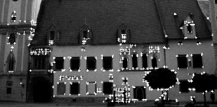

### Wide Baseline Matching
Problem: many points will have no correspondence in the second image. Wide baseline might be needed to counter *drift*, i.e. the accumulation of small errors (compute corredpondences again with larger distance in time).

- One needs to consider an affine model (translational is not good enough for wide baseline).
- To be more robust to illumination changes (typically greater in wide baseline): replace L2 error function by *normalized cross correlation*

##### Normalized Cross Correlation
The NCC for a given candidate transformation $h$ is
$$NCC(h) = \frac{
 \int_{W(x)} (I_1(x') - \bar{I}_1) (I_2(h(x')) - \bar{I}_2) \, dx'}
{
 \sqrt{\int_{W(x)} (I_1(x') - \bar{I}_1)^2 \, dx'  \int_{W(x)} (I_2(x') - \bar{I}_2)^2 \, dx'}}$$

where $\bar{I}_1, \bar{I}_2$ are average intensities of $W(x)$ ($\bar{I}_2$ depends on $h$). Subtracting averages leads to invariance wrt. additive intensity changes. Dividing by the intensity variances of the window leads to invariance to multiplicative changes.

Different interpretation: If we stack the normalized intensity values of a window in one vector, $v_i = \text{vec}(I_i - \bar{I}_i), i =1,2$, then $NCC(h) = \cos \angle (v_1, v_2)$.

##### Normalized Cross Correlation for affine transformation
Affine transformation $h(x) = Ax + d$: Find optimum $\arg\max_{A,d} NCC(A, d)$. Just insert the $h$ in the above formula to get the $NCC$. Efficiently finding optima is a challenge

##### Optical Flow Estimation with Deep Neural Networks
Deep NNs can also be used for correspondence estimation and have become more popular in recent years.

# Lesson 5 - Two-View Geometry

### Assumptions
- two consecutive frames
- given: set of corresponding points
- static scene (no movements during camera motion)
- intrinsic camera parameters are known + fixed
	- e.g. focal lengths, radial distortion, ...

### Problem formulation
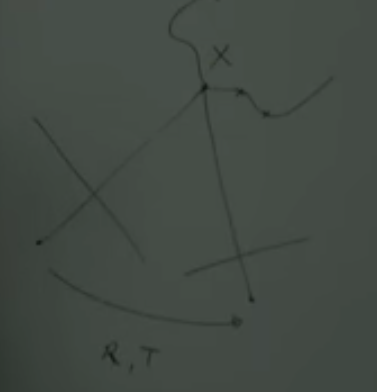

Two problems: estimate 3d coordinates of known points; estimate camera motion. Chicken-egg problem!

Approach:

1. estimate camera motion
2. reconstruct 3d coordinates (by *triangulation*)

### Epipolar Geometry
$o_1, o_2$: Camera centers
$P$ or $X$: 3d point that we know a correspondence of
$x_1, x_2$: projections of $P$ on the two image planes
$e_1, e_2$: *epipoles* (intersections of line $(o_1, o_2)$ with image planes)
$l_1, l_2$: *epipolar lines*: line between $x_i$ and $e_i$.

Also: *epipolar plane* associated with the 3d point $X$ (?)

One property: line $(o_2, x_1)$ passes through $l_2$.

### Parametric formulation / projection error cost function
Minimize *projection error* $E(R, T, X_1, \dots, X_N)$
with 6 params for camera motion $R, T$ and $3N$ (say 300) params for the 3d coordinates.
$$E(R, T, X_1, \dots, X_N) = \sum_j ||x_1^j - \pi(X_j)||^2 + ||x_2^j - \pi(R, T, X_j)||^2$$
(here we are in the 1-st camera coordinate system and rotate to get to the 2-nd camera coordinate system)

Hard to solve! Either
1. stick with this cost function and use some advanced optimization techniques
2. re-formulate problem, get rid of 3d coordinates, effectively a different cost function => epipolar constraint, 8-point alg.

### Epipolar Constraint
Projection $X \mapsto x_1$ is simply a projection with unknown depth $\lambda_1$: $\lambda_1 x_1 = X$.
For the second camera, we get $\lambda_2 x_2 = RX + T$.

Next: $\lambda_2 x_2 = R(\lambda_1 x_1) + T$
Multiplying with $\hat{T}$ (removes $T$) gives $\lambda_2 \hat{T} x_2 = \lambda_1 \hat{T} R x_1$.
The LHS is orthogonal to $x_2$: So projecting onto $x_2$, i.e. scalar product with $x_2$, yields

$$x_2^\top \hat{T} R x_1 = 0. \qquad\text{(Epipolar Constraint)}$$

Goal now: given enough epipolar constraints - one for each corresponding point pair - we'll get an estimation for $R$ and $T$?
$E = \hat{T} R$ is called the *essential matrix*.

##### Geometric interpretation
the constraint states that the vectors $o_1X$, $o_2o_1$, $o_2X$ form a plane; i.e. $o_1X$, $o_2X$ intersect (obvious if phrased like this, but the constraint expresses it in terms of $x_1, x_2, R, T$)

In 2nd-frame coords, $Rx_1 \sim o_1 X$, $T \sim o_2o_1$, $x_2 ~ o_2X$. Then volume = $x_2^\top (T \times R x_1) = 0$.

##### Properties of E
Essential space: $\mathcal{E} = \{ \hat{T} R | R \in SO(3), T \in \mathbb{R}^3 \}$.

**Theorem:** $0 \neq E \in \mathcal{E}$ iff SVD of E = $U \Sigma V^\top$, $\Sigma = \text{diag}(\sigma, \sigma, 0)$, $\sigma > 0$, $U, V \in SO(3)$.

**Theorem:** (Pose recovery from E)
There are 2 relative poses $(R, T)$ corresponding to some $E \in \mathcal{E}$:
$$(\hat{T}_{1,2}, R_{1,2}) = \bigg(U R_Z \big(\pm \tfrac{\pi}{2}\big) \Sigma U^\top, U R_Z\big(\pm \tfrac{\pi}{2}\big)^\top V^\top\bigg)$$

Only one solution is sensible (has positive depth)

### Basic Reconstruction Algorithm (Essential Matrix)
1. Recover essential matrix $E$ from epipolar constraints
2. Extract translation/rotation from $E$

$E$ recovered from several constraints will not be an essential matrix in general. We can either
- project the matrix we recover to $\mathcal{E}$ or
- optimize epipolar constraints in the essential space (more accurate, but more involved - nonlinear constrained opt.)

Using the first approach, this leads to:

### The 8-point algorithm
Write epipolar constraints as scalar product:
$$x_2^\top E x_1 = a^\top E^s = 0$$
where $a = x_1 \otimes x_2$
and for $n$ point pairs:
$$\chi E^s = 0, \chi = (a^1, \dots, a^n)^\top$$

So the flattened matrix $E$ lives in $\ker \chi$. For a unique solution (up to a scaling factor), we need $\text{rank}(\chi) = 8$.  => exactly 8 point pairs.

The scaling factor can never be figured out without additional information ("scale freedom" of images). Possible: just fix translation to be 1.

Important: a degenerate case is if all points lie on a line or on a plane.

Another non-uniqueness: if E is a solution, so is -E; each E produces two solutions.

##### Projection on Essential Space $\mathcal{E}$
Starting with arbitrary $F = U \text{diag}(\lambda_1, \lambda_2, \lambda_3) V^\top$, $\lambda_i$ descending, the essential matrix $E$ with minimum Frobenius distance from $F$ is
$$E = U \text{~diag}(\tfrac{\lambda_1 + \lambda_2}{2}, \tfrac{\lambda_1 + \lambda_2}{2}, 0) V^\top.$$
Even simpler: singular values (1, 1, 0), since scale doesn't matter.

##### 8-Point Algorithm Formulation
1. Approximate $E$
	1. Compute $\chi$
	2. Find $E^s$ that minimizes $||\chi E^s||$: This is the ninth column of $V_\chi$ in the SVD $\chi = U_\chi \Sigma_\chi V_\chi^\top$.
	3. Unstack $E^s$ into $E$.
2. Project $E$ onto $\mathcal{E}$
	1. Compute SVD of $E$
	2. Replace singular values with (1, 1, 0) (projection onto normalized essential space - this is ok since $E$ is only defined up to a scalar)
3. Recover R, T from essential matrix
	1. $R = U R_Z^\top(\pm \tfrac{\pi}{2}) V^\top$
	2. $\hat{T} = U R_Z(\pm \tfrac{\pi}{2}) \Sigma U^\top$

where $R_Z^\top(\pm \tfrac{\pi}{2}) = \begin{pmatrix} & \pm 1 &  \\ \mp 1 & & \\ & & 1 \end{pmatrix}$ 
(watch out: transposed!)

### We actually only need 5 points (Kruppa 1913)
$E$ is actually a five-dimensional space.
Example: with 7 points, $\ker \chi$ is (at least) 2-dim, spanned by $E_1, E_2$. Solve for $E$: find $E = E_1 + \alpha E_2$ s.t. $\det(E) = 0$ ($\det E = 0$ is one of the algebraic properties of $E$).

Kruppa 1913 proved: we only need five points to recover $(R, T)$; even less for degenerate (e.g. planar/circular) motion.


### Selecting solutions
Only one of the four solutions gives positive depth values to all points.

### Limitations / Extensions
If there is no translation, only rotation, $E = 0$. Then nothing can be recovered! Does not happen usually due to noise.

For "infinitesimal" view point changes: *continuous epipolar constraint*. Recovers linear and angular camera velocity instead of $(R, T)$.

Moving objects (independently): $(x_2^\top E_1 x_1) (x_2^T E_2 x_1) = 0$ for two essential matrices $E_1, E_2$ ("each part is either on the car or on the background").
- can be solved with enough points ("polynomial factorization techniques")


### Structure Reconstruction
After recovering R, T, we have for j-th point $X^j$:
$$\lambda_2^j x_2^j = \lambda_1^j R x_1^j + \gamma T$$
Scale params $\lambda_{1,2}^j, \gamma$ are unknown.

Eliminating $\lambda_2^j$ with $\widehat{x_2^j}$:
$$\lambda_1^j \widehat{x_2^j} R x_1^j + \gamma \widehat{x_2^j} T = 0$$

Leads to linear system with $n+1$ variables: $M \vec{\lambda} \approx 0$, $\vec{\lambda} = (\lambda_1^1, ..., \lambda_1^n, \gamma)^T \in \mathbb{R}^{n+1}$

Solve this via least-squares: solve $\min\limits_{||\vec{\lambda}||=1} ||M \vec{\lambda}||^2$. A.k.a find the eigenvector to the smallest eigenvalue.

### Issues with Noisy Inputs
The 8-point algorithm is not robust against noise: small perturbations can lead to large errors in the reconstruction.

Underlying reason: small changes can change eigenvalue structure.

### More robust approaches

##### Bayesian approach
Maximum aposteriori estimate:
$$\arg\max\limits_{x, R, T} P(x, R, T | \tilde{x}) = \arg\max\limits_{x, R, T} P(\tilde{x} | x, R, T) P(x, R, T)$$

Problem: hard to define distributions on $SO(3) \times \mathbb{S}^2$.

##### Constrained optimization
Minimize cost function:
$$\phi(x, R, T) = \sum_{j=1}^n \sum_{i=1}^1 ||\tilde{x}_i^j - x_i^j||^2$$
subject to constraints: $x_2^i{}^\top \hat{T} R x^j_1 = 0$, $x_1^i{}^\top e_3 = 1$, $x_2^j{}^\top e_3 = 1$ 

I.e. find points as close to the estimations as possible that fulfil the epipolar constraints.

##### Bundle Adjustment
An "unconstrained" version, which has the unknown depth params $\lambda_i$,:
$$\sum_{j=1}^n ||\tilde{x}^j_1 - \pi_1(X^j)||^2 + ||\tilde{x}^j_2 - \pi_2(X^j)||^2$$
(not really unconstrained, if $R$ has to be in $SO(3)$; could be made unconstrained via Lie algebra coordinates and applying $\exp$).

But this is essentially just a different parametrization of the above, and can also be expressed by a cost function.

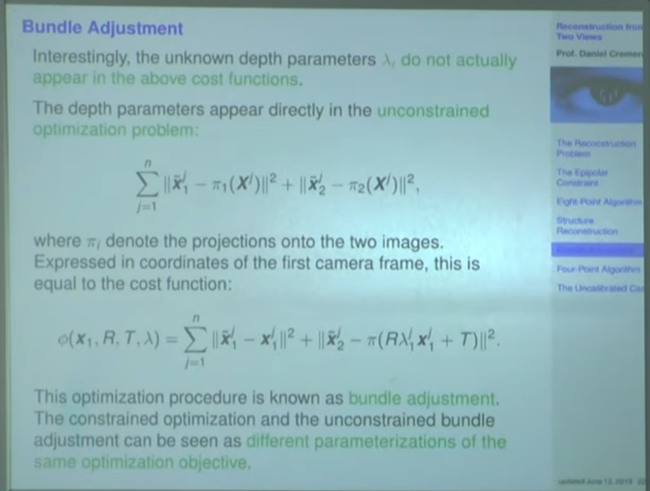

### Degenerate Configurations
i.e. ones where the 8-point alg. provides no unique solution: Here all 8 points lie on a so-called "critical" 2D surface. Can be described by quadratic equations => *quadratic surfaces*. Mostly pathological, except for one case: all points lie on a 2D plane.

Non-degenerate configurations are called *general configurations*.

### Four-Point Algorithm
To handle planes, we use this algorithm instead.

##### Planar Homographies
For a point $X$ on the plane with normal $N \in \mathbb{S}^2$, we have $N^\top X = d$ (d = distance of plane from the origin). Assume this holds for $X_1$ from frame 1; then for $X_2$ from frame 2:
$$X_2 = RX_1 + T = (R + \tfrac{1}{d} T N^\top) X_1 =: H X_1,$$
where $H \in \mathbb{R}^3$ is called *homography matrix*.

With 2D coords $x_1, x_2$: $\lambda x_2 = H \lambda_1 x_1$ (called planar homography). Multiplying with $\widehat{x_2}$ yields:

$$\widehat{x_2} H x_1 = 0 \quad \text{(planar epipolar (or homography) constraint)}$$

With $a := x_1 \otimes \widehat{x_2} \in \mathbb{R}^{9 \times 3}$, we get the equation
$$a^T H^s = 0$$

##### Four-Point Algorithm Formulation
1. Calculate $\chi = (a^1, \dots, a^n)^\top \in \mathbb{R}^{3n \times 9}$
2. Compute solution $H^s$ for equation $\chi H^s = 0$ via SVD
3. From $H = R + \tfrac{1}{d} T N^\top$, extract the motion parameters (more difficult!)
	1. we can obtain: $R$, $N$, and $T/d$. So again: scale ambiguity.

##### Relationships between $H$ and $E$
Numerous relations, in particular $E = \hat{T}H$ and $H^\top E + E^\top H = 0$.

### Reconstruction with Uncalibrated Camera
We cannot assume in general that we know the calibration matrix $K$, i.e. for internet images!

Rewrite the epipolar constraint: Replace $x_1$ with $K^{-1} x_1'$, $x_2$ with $K^{-1} x_2'$. Then => 
$$x_2'^\top F x_1' = 0, ~~F := (K^{-1})^\top E K^{-1} \quad \text{(Epipolar constraint for uncalibrated cameras)}$$

$F$ is called the *fundamental matrix*. It has an SVD $U \text{diag}(\sigma_1, \sigma_2, 0) V^\top$ (in fact, it can be an arbitrary rank 2 matrix; space much larger than $\mathcal{E}$).

##### Uncalibrated Reconstruction and Limitations
8-point algorithm can be extended to estimate $F$ instead of $E$. But a given $F$ can not uniquely (even up to scale) be decomposed into $R, T, K$.

Possible: find *projective reconstructions*, i.e. geometry reconstructions defined up to projective transformations => find *canonical reconstruction* from these. But in reality, one rather calibrates the camera instead.

# Lesson 6 - Reconstruction from Multiple Views

Not just two, but multiple views. Each new view gives 6 new parameters, but many more point measurements -> ratio params / measurements improves.

Different approaches:
- trifocal tensors ("trilinear relations" between three images, generalize Fundamental Matrix)
	- Textbooks: Faugeras and Luong 2001; Hartley and Zisserman 2003
- matrices instead of tensors
	- Textbook: Invitation to 3D vision


### Preimages
- Preimage of a point/line on the image plane: points that get projected to that point/line 
- Preimage of points/lines from multiple views: Intersection of preimages
$$\text{preimage}(x_1,\dots,x_m) = \bigcap_i \text{preimage}(x_i)$$

The preimage of multiple lines should be a line for the reconstruction to be consistent.

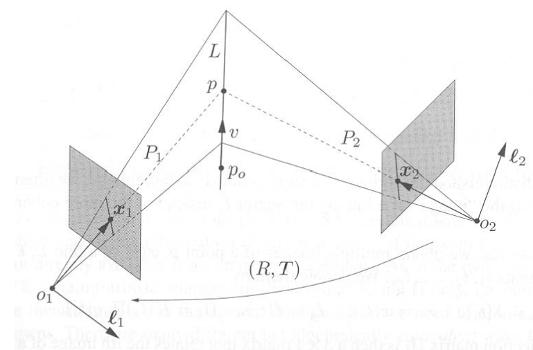

Next denote time-dependent image coordinates by $x(t)$. Parametrize 3D lines in homog. coord. as $L = {X_0 + \mu V}$. $L$'s preimage is a plane $P$ with normal $\ell(t)$, $P = \text{span}(\hat{\ell})$.

The $\ell$ is orthogonal to points $x$ on $L$: $\ell(t) x(t) = \ell(t) K(t) \Pi_0 g(t) X = 0$ (why?)

Then $\lambda_i x_i = \Pi_i X$ (relation i-th image of point p <-> world coordinates $X$) and $\ell_i^\top \Pi_i X_0 = \ell_i^\top \Pi_i V = 0$ (relation i-th coimage of $L$ <-> world coordinates $X_0, V$)


### Modeling Multi-View with Point Features

Assume we have the world point $X$ represented by points $x_1, \dots, x_m$ in the $m$ images, with depths $\lambda_1, \dots, \lambda_m$. This is modeled by

$$\mathcal{I} \vec{\lambda} = \Pi X$$

or in more detail,

$$\mathcal{I} \vec{\lambda} = \begin{pmatrix} x_1 & & & \\ & x_2 & & \\ & & \ddots & \\ & & & x_m \end{pmatrix} \begin{pmatrix}\lambda_1 \\ \lambda_2 \\ \vdots \\ \lambda_m \end{pmatrix} = \begin{pmatrix} \Pi_1 \\ \Pi_2 \\ \vdots \\ \Pi_m \end{pmatrix} X = \Pi X$$

* $\vec{\lambda}$ is the *depth scale vector*
* $\Pi$ (3m x 4 matrix) is the *multiple-view projection matrix*, $\Pi_i = \Pi g_i$, and contains the i-th camera rotation as well as the projection
* $\mathcal{I}$ (3m x m matrix) is the *image matrix* and contains the "2d" (homogenous) coordinates of projections $x_i$

##### The Rank Constraint

Rewrite to obtain:

$$N_p u = 0, \qquad \text{ where } N_p := [\Pi, \mathcal{I}],  u :=[X; -\vec{\lambda}]$$

$N_p$ is a $3m \times (m+4)$ matrix. Since $u$ is in the null space of $N_p$, we get the **rank constraint**:

$$\text{rank}(N_p) \leq m+3$$

There exists a reconstruction iff this rank constraint holds. Compare with epipolar constraint: contraint is on matrix that only includes camera params and 2d coords, but **no 3d coords**.

##### Writing Rank Constraint more compactly
Define $\mathcal{I}^\bot$, where in $\mathcal{I}$, each $x_i$ is substituted by $\widehat{x_i}$ (a 3m x 3m matrix). It annihilates $\mathcal{I}$: $\mathcal{I}^\bot \mathcal{I} = 0$. By multiplying the above $\mathcal{I} \vec{\lambda} = \Pi X$ with it:

$$\mathcal{I}^\bot \Pi X = 0$$

There exists a reconstruction iff $W_p = \mathcal{I}^\bot \Pi$ does not have full rank:

$$\text{rank}(W_p) \leq 3.$$

Note: $W_p$ has the form

$$W_p = [\widehat{x_1} \Pi_1; \dots; \widehat{x_m} \Pi_m]$$

### Modeling Multi-View with Line Features
Intuition: from a line in two views only, we can't say anything about the camera motion, because any two line preimages intersect. We can get results from more views.

Saw already:  $\ell_i^\top \Pi_i X_0 = \ell_i^\top \Pi_i V = 0$ for the coimages $\ell_i$ of a line $L$ with base $X_0$, direction $V$.

Define matrix $W_l = [\ell_1^\top \Pi_1 ; \dots; \ell_m^\top \Pi_m]$ (m x 4 matrix). It maps both $X_0$ and $V$ to 0; these two vectors are linearly independent ($X_0[4] = 1, V[4] = 0$). We get a new rank constraint:

$$\text{rank}(W_l) \leq 2$$


### Rank Constraints: Geometric Interpretation

##### Points case
For points, we had $W_p X = 0$, $W_p = [\widehat{x_1} \Pi_1; \dots; \widehat{x_m} \Pi_m]$ (3m x 4 matrix). There are 2m lin. indep. rows, which can be interpreted as the normals of 2m planes, and $W_p X = 0$ expresses that $X$ is in the intersection of these planes. The $2m$ planes have a unique intersection iff $\text{rank}(W_p) = 3$.

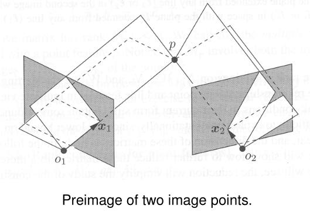

##### Lines case
The constraint is only meaningful (i.e. actually a constraint) if $m > 2$. 


### Multiple-View Matrix of a Point
Goal: further compatify constraints.
We are in coordinate frame of first camera; i.e. $\Pi_1 = [I, 0], \Pi_2 = [R_2, T_2], \dots, \Pi_m = [R_m, T_m]$.

Define $D_p = \begin{pmatrix} \widehat{x_1} & x_1 & 0 \\ 0 & 0 & 1\end{pmatrix}$ (4 x 5 matrix, full rank). Multiply with $W_p$ (3m x 4 matrix) to get a 3m x 5 matrix, drop the first three rows and columns and call the submatrix $M_p$:

$$M_p = \begin{pmatrix}
	\widehat{x_2} R_2 x_1 & \widehat{x_2} T_2 \\
	\widehat{x_3} R_3 x_1 & \widehat{x_3} T_3 \\
	\vdots & \vdots \\
	\widehat{x_m} R_m x_1 & \widehat{x_m} T_m \\
 \end{pmatrix}$$
  
  $M_p$ is a 3(m-1) x 2 matrix. Now: $\text{rank}(W_p) \leq 3 \Leftrightarrow \text{rank}(M_p) \leq 1$, i.e. the two columns are linearly dependent (easy to check and work with!). Proof: 
  
  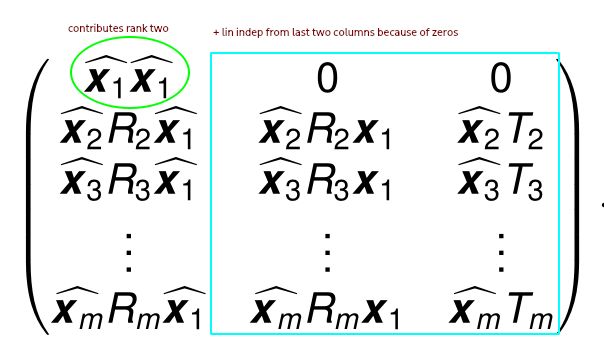
  
  $M_p$ is the **multiple-view matrix**. Summary: there exists a reconstruction iff the matrices $N_p, W_p, M_p$ satisfy:
  
  $$\text{rank}(M_p) = \text{rank}(W_p) - 2 = \text{rank}(N_p) - (m+2) \leq 1$$
  
  ##### Geometric interpretation of Multiple-View Matrix
  
  The rank constraint implies that the two columns of $M_p$ are linearly dependent. In fact, even $$\lambda_1 \widehat{x_i} R_i x_1 + \widehat{x_i} T_i = 0, i = 2, \dots, m:$$
  So the scaling factor is equal to the depth value $\lambda_1$.
  
  (Proof: from the projection equation we know $\lambda_i x_i = \lambda_1 R_i x_1 + T_i$, hence $\lambda_1 \widehat{x_i} R_i x_1 + \widehat{x_i} T_i = 0$.)
  
  ##### $M_p$ => Epipolar (bilinear) constraints
  Goal: if we consider only a pair of images, the epipolar constraint should emerge from $M_p$.
  
  Proof - *linear dependence of $\widehat{x_i} R_i x_1$ and $\widehat{x_i} T_i$ implies epipolar constraint $x_i^\top \hat{T}_i R_i x_1 = 0$*:
  
$\widehat{x_i} T_i$ and $\widehat{x_i} R_i x_1$ are each normals to planes spanned by $x_i, T_i$ and $x_i, R_ix_1$, respectively. Linear dependence of these normals implies: => $x_i, T_i, R_i x_1$ live in the same plane (*coplanar*). Therefore $x_i^\top \hat{T}_i R_i x_1 = x_i^\top \hat{T}_i R_i x_1 = 0$.

#####  $M_p$ <=> Trilinear constraints
**Theorem**: *a matrix $M = [a_1 b_1; \dots; a_n b_n]$ with $a_i, b_i \in \mathbb{R}^3$ is rank-deficient <=> $a_i b_j^\top - b_i a_j^\top = 0$ for all $i, j$.*

Applied to $M_p$, this yields the *trilinear constraints*:

$$\widehat{x_i} (T_i x_1^\top R_j^\top - R_i x_1 T_j^\top) \widehat{x_j} = 0, ~\forall i, j \in [n] \qquad \text{(trilinear constraints)}$$

Different than the epipolar constraints, the trilinear constraints actually characterize the rank constraint on $M_p$. Each constraint couples *three* images: one can show that constraints on pairs of images cannot capture all the information from $m$ images, but these trilinear constraints can.

Note: we can also obtain the epipolar constraints directly from the trilinear constraints in non-degenerate cases.

Question: what does the "3 x 3 = 9 scalar trilinear equations" part mean?

##### Uniqueness of the Preimage
This slide was skipped ("a little bit to technical")

##### Degenerate cases
If $\widehat{x_j} T_j = \widehat{x_j} R_j x_1 = 0$ for some view $j$, then the epipolar constraints cannot be obtained from the trilinear constraints; also the equivalence "trilinear constraints <=> rank constraint" does not hold in degenerate cases.
1. If between three images, each pair of epipolar constraints is fulfilled, they determine a unique preimage $p$ - except if all three lines $o_i x_i$ between optical center and image point lie in the same plane.

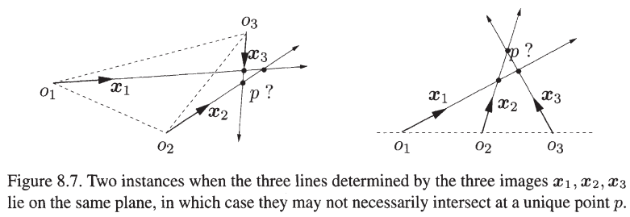

2. If between three images, all three trilinear constraints hold (3 out of 9 are different considering symmetry), the determine a unique preimage $p$ - except if the three lines $o_i x_i$ are collinear.


In the example where all optical centers lie on a line, going from bilinear to trilinear constraints solves the problem.

##### Summary: Rank of $M_p$
* $M_p$ has rank 2 => no point correspondence; empty preimage.
* $M_p$ has rank 1 => point correspondence + *unique* preimage
* $M_p$ has rank 0 => point correspondence, but non-unique preimage

## Multi-View Reconstruction

Two approaches: 
1. cost-function based: maximize some objective function subject to the rank condition => non-lin. opt. problem: analogous to bundle adjustment
2. decouple structure and motion, like in the 8-point algorithm. Warning: not necessarily practical, since not necessarily optimal in the presence of noise + uncertainty (like the 8-point algorithm)

Approach 2 is called *factorization approach* (because it factors - i.e. decouples - the problem)

### Factorization Approach for Point Features
Assume: $m$ images $x_1^j, \dots, x_m^j$ each of points $p^j$, $j \in [n]$.
 
 Rank constraint => columns of $M_{p^j}$ dependent => (first column) + $\alpha^j$ (second column) = 0. As seen above, $\alpha^j = 1/\lambda_1^j$.
 
 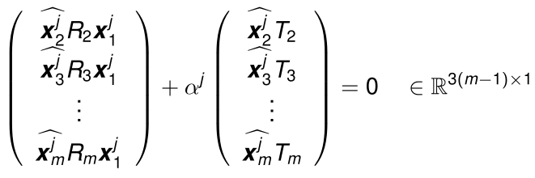
 
 This equation is linear in the camera motion parameters $R_i, T_i$, and can be written as:
 
 $$P_i \begin{pmatrix} R_i^s \\ T_i \end{pmatrix}
 = \begin{pmatrix} 
x_1^1{}^\top \otimes \widehat{x_i^1} & \alpha^1 \widehat{x_i^1} \\
x_1^2{}^\top \otimes \widehat{x_i^2} & \alpha^2 \widehat{x_i^2} \\
 \vdots & \vdots \\
x_1^n{}^\top \otimes \widehat{x_i^n} & \alpha^n \widehat{x_i^n}  \end{pmatrix}
 \begin{pmatrix} R_i^s \\ T_i \end{pmatrix}
= 0 \in \mathbb{R}^{3n}
$$

Here simply things were re-arranged, the $R$ and $T$ matrices stacked in one long vector.
One can show: $P_i \in \mathbb{R}^{3n \times 12}$ has rank 11, if more than 6 points (in general position) are given! (Intuition behind 6: 3n rows for n images, but only 2 out of three are lin. indep.)

=> one-dim. null space => projection matrix $\Pi_i = (R_i, T_i)$ given up to scalar factor!

In practice: use > 6 points, compute solution via SVD.

Like 8-point algorithm: not optimal in the presence of noise and uncertainty.

##### Decoupling compared to 8-point algorithm
Difference from 8-point algorithm: structure and motion not fully decoupled, since the 1/depth parameters $\alpha$ are needed to construct $P_i$. However, structure and motion can be iteratively estimated by estimating motion from a structure estimate, and vice versa, until convergence. Advantage: each step has a closed-form solution. This could be initialized by an 8-point algorithm reconstruction and further improve on it using the multi-view information.

Least-squares solution to find $\alpha_j$ from $R_i, T_i$: 

$$\alpha^j = - \frac{\sum_{i=2}^m (\widehat{x_i^j} T_i)^\top \widehat{x_i^j} R_i x_1^j}{\sum_{i=2}^m || \widehat{x_i^j} T_i || ^2}$$

Another interesting point: Estimating $Pi_i = (R_i, T_i)$ only requires two frames 1 and $j$, but estimating $\alpha$ requires all frames.

QUESTION: Don't we get $\alpha_j$ from $M_{p_j}$? (No... we need $R, T$ to get $M_{p_j}$).


### The Multi-View Matrix for Lines
Recall:  $\ell_i^\top \Pi_i X_0 = \ell_i^\top \Pi_i V = 0$ for the coimages $\ell_i$ of a line $L$ with base $X_0$, direction $V$; we constructed the multi-view matrix for lines:
$$W_l = [\ell_1^\top \Pi_1 ; \dots; \ell_m^\top \Pi_m] \in \mathbb{R}^{m \times 4}$$

The rank constraint is that $W_l$ should have rank at most 2, since $W_l X_0 = W_l V = 0$.  Goal: find more compact representaion; assume $\Pi_1 = (I, 0)$, i.e. first camera is in world coordinates.

Trick: multiply $W_l$ by 4x5 matrix $D_l$ s.t. last four columns of first row become zero, but keep rank the same.

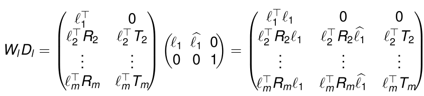

Now since the first column must be lin. indep. because of the zeros in the first row, and the matrix has rank at most 1, the submatrix starting $(W_l D_l)[2:, 2:]$ must have rank 1. This submatrix is called the *multi-view matrix for lines*.

$$M_l = \begin{pmatrix}
 \ell_2^\top R_2 \widehat{\ell_1} & \ell_2^\top T_2 \\
 \vdots & \vdots \\
 \ell_m^\top R_m \widehat{\ell_1} & \ell_m^\top T_m
 \end{pmatrix} \in \mathbb{R}^{(m-1) \times 4}$$

The previous rank-2-constraint can be characterized by a rank-1-constraint on $M_l$: A meaningful preimage of $m$ observed lines can only exist if

$$\text{rank}(M_l) \leq 1.$$

In other words: all rows and all columns must be linearly dependent.


##### Trilinear Constraints for a Line (from the Rows)
Since rows of $M_l$ are lin. dep., we have for all $i, j$: $\ell_i^\top R_i \widehat{\ell_1} \sim \ell_j^\top R_j \widehat{\ell_1}$. This states that the three vectors $R_i^\top \ell_j$, $R_j^\top \ell_j$, $\ell_1$ are coplanar. So $R_i^\top \ell_i$ is orthogonal to the cross product of $R_j^\top \ell_j$ and $\ell_1$, which leads to:

$$\ell_i^\top R_i \widehat{\ell_1} R_j^\top \ell_j = 0$$

Note: this constraint only contains the rotations, not the translations! (Observing lines allows us to directly put constraints on the rotation alone.)

By the same rank-deficiency lemma from before, we get that the linear dependency of the i-th and j-th row is equivalent to

$$\ell_j^\top T_j \ell_i^\top R_i \widehat{\ell_1} - \ell_i^\top T_i \ell_j^\top R_j \widehat{\ell_1} = 0$$

This relates the first, i-th and j-th images.

Both trilinear constraints are equivalent to the rank constraint if $\ell_i^\top T_i \neq 0$.

##### Generality of three-line constraints
Any multiview constraint on lines can be reduced to constraints which involve only three lines at a time. (Argument via 2x2 minors of matrix: see slides)


### Characterization of Unique Preimages for Lines
**Lemma:** *Given three camera frames with distinct optical centers and $\ell_1, \ell_2, \ell_3 \in \mathbb{R}^3$ represent three images lines, then their preimage $L$ is uniquely determined if*
$$
 \ell_i^\top T_{ji} \ell_k^\top R_{ki} \widehat{\ell_i} - \ell_k^\top T_{ki} \ell_j^\top R_{ji} \widehat{\ell_i} = 0
 \quad \forall i, j, k = 1, 2, 3,
$$
*except for one degenerate case: The only degenerate case is that in which the preimages of all $\ell_i$ are the same plane.*

Note: this constraint combines the two previous trilinear constraints.

Equivalent formulation using the rank constraint:

**Theorem:** *Given $m$ vectors $\ell_i$ representing images of lines w.r.t. $m$ camera frames, they correspond to the same line in space if the rank of $M_l$ relative to any of the camera frames is 1. If its rank is 0 (i.e. $M_l=0$, the line is determined up to a plane on which then all the camera centers must lie.*


## Summary of Multi-View Chapter
|       | (Pre)image                   | coimage                   | Jointly                   |
|-------|------------------------------|---------------------------|---------------------------|
| Point | $\text{rank}(N_p) \leq m+3$  | $\text{rank}(W_p) \leq 3$ | $\text{rank}(M_p) \leq 1$ |
| Line  | $\text{rank}(N_l) \leq 2m+2$ | $\text{rank}(W_l) \leq 2$ | $\text{rank}(M_l) \leq 1$ |

The rank constraints guarantee the existence of unique preimages in non-degenerate cases. 

# Lesson 7 - Bundle Adjustment & Non-Linear Optimization

## Reconstruction under Noise
Linear approaches are usually prone to noise. We now assume that $\tilde{x}_1, \tilde{x}_2$ are noisy data points. Goal:
* find $R, T$ *as close as possible* to the truth
* such that we get a *consistent reconstruction*

### Bayesian Formulation
(seen before [[09 - Two views II - Structure Reconstruction, Robustness, 4-Point Algorithm#Bayesian approach|here]])

Maximum aposteriori estimate: involves modeling probability distributions on $SO(3) \times \mathbb{S}^2$. Instead just assume a uniform prior (=> maximum likelihood estimate).

### Bundle Adjustment
Assume zero-mean Gaussian noise => MLE leads to *Bundle adjustment*: Minimize *reprojection error*

$$E(R, T, X_1, \dots, X_n) = \sum_j^N |\tilde{x}^j_1 - \pi(X_j)|^2 + |\tilde{x}^j_2 - \pi(R, T, X_j)|^2$$

(two-image case). $\pi(R, T, X_j)$ denotes the projection $\pi(R X_j + T)$.

Generalization to $m$ images:

$$E\big(\{R_i, T_i\}_{i \in [m]}, \{X_j\}_{j \in [N]}\big) = 
 \sum_{i=1}^m \sum_{j=1}^N \theta_{ij} |\tilde{x}_i^j - \pi(R_i, T_i, X_j)|^2$$

Here $\theta_{ij}$ is 1 if point $j$ is visible in image $i$,  0 otherwise. Also $T_1 = 0, R_1 = I$.
These error functions are non-convex.

##### Reparametrizations
- represent $X_j$ as $\lambda_1^j x_1^j$, and $\pi(X_j)$ in first image as $x_1^j$
- constrained optimization, minimize cost function $E(\{x_i^j\}_j, R, T) = \sum_j^N \sum_i^2 ||x_i^j - \tilde{x}_i^j||^2$, subject to consistent geometry constraints: $x_2^j{}^\top \widehat{T} R x_1^j = 0, x_1^j{}^\top e_3 = 1, x_2^j{}^\top e_3 = 1, j \in [N]$.
	- $R$ and $T$ do not appear in $E$, only in the constraints!

##### Constrained vs. Unconstrained

Note: even the "unconstrained" versions are in a way constrained, since $R \in SO(3)$ (and usually $||T||=1$). But $R$ can be expressed via the Lie algebra: $R = \exp(\hat{\omega})$, where $\hat{\omega} \in so(3)$ is unconstrained.

##### Noise models
Quadratic cost functions stem from the Gaussian noise model. Assuming e.g. Poisson noise $P(x) \sim e^{-|x|/\lambda}$ leads to norm terms in the sum without square instead.

##### More comments on Bundle Adjustment
- "bundles" refers to bundles of light rays
- approach was first used in the 1950s in photogrammetry
- typically last step in reconstruction pipeline: First construct an initial solution (e.g. spectral methods), then apply bundle adjustment


## Nonlinear Optimization
The cost function from [[#Bundle Adjustment]] is called a *non-linear least square* cost function, because the "modeled 2d point" function $\pi(R_i, T_i, X_j)$ is non-linear.

Iterative algorithms tend to work well if the function is "not too far from linear". If the scene is somewhat far away, this increasingly tends to be the case. Iterative algorithms for nonlinear optimization are called *non-linear programming*.

### Gradient Descent
First-order method, compute local minimum by stepping in the direction of steepest decrease iteratively ("energy decreases the mose" = error function decreases the most).

Mathematical Setup: $E: \mathbb{R}^n \to \mathbb{R}$ is the cost function. The *gradient flow* for $E$ is the differential equation
$$
 \begin{cases}
x(0) = x_0, \\
 \frac{dx}{dt} = -\frac{dE}{dx}(x)
 \end{cases}$$

Then the *gradient descent* is simply the (Euler) discretization of this equation:

$$x_{k+1} = x_k - \epsilon \frac{dE}{dx}(x_k), \quad k=0, 1, 2, \dots$$

##### Comments on Gradient Descent 
- very broadly applicable, but more specialized algorithms have better asymptotic convergence rates
	- optimal convergence rates: e.g. Nesterov Momentum (Yurii Nesterov)
- many iterations for anisotropic cost functions
- More specialized techniques:
	- conjugate gradient method
	- Newton methods
	- BFGS method


### Least Squares and its Variants
Motivation of this section: clear up terminology.

*Linear* or *Ordinary Least Squares* is a method for estimating parameters $x$ in a linear regression model under zero-mean isotropic Gaussian noise:

$$a_i = b_i^\top x + \eta_i$$

where $b_i \in \mathbb{R}^d$ is the input vector, $a_i \in \mathbb{R}$ the scalar response, $\eta_i ~ N(0, \sigma^2 I)$. Ordinary least squares problem:

$$\min_x \sum_i (a_i - x^\top b_i)^2 = \min_x(a - Bx)^\top(a - Bx)$$

Historical note: Gauss invented the normal distribution when asking for which noise distribution the optimal estimator was the arithmetic mean.

##### Weighted least squares
Assume Gaussian noise with a diagonal $\Sigma$: This is called *weighted least squares*, and we minimize $\sum_i w_i (a_i - x^\top b_i)^2$, $w_i = 1/\sigma_i^2$.

The cost function from [[#Bundle Adjustment]] corresponds to weighted least squares because of the weights $\theta_{ij}$.

##### Generalized least squares
Assume general mean-centered Gaussian noise $N(0, \Sigma)$: this gives the *generalized least squares* problem

$$\min_x (a-Bx)^\top \Sigma^{-1} (a-Bx)$$

(i.e. minimize the Mahalanobis distance between $a$ and $Bx$). Closed-form solution:

$$\hat{x} = (B^\top \Sigma^{-1} B)^{-1} B^\top \Sigma^{-1} a$$

##### Least Squares with unknown $\Sigma$
There are iterative estimation algorithms: *feasible generalized least squares*, *iteratively reweighted least squares*. Watch out: this problem is non-convex! We usually only converge to local minima.

##### Iteratively Reweighted Least Squares
Assume there is a known weighting function $w_i(x)$ and a model $f_i(x)$ which replaces $b$. Then solve the minimization problem:

$$\min_x \sum_i w_i(x) |a_i - f_i(x)|^2$$

To solve it, iteratively solve 

$$x_{t+1} = \arg\min_x \sum_i w_i(x_t) |a_i - f_i(x)|^2$$

If $f_i$ is linear, i.e. $f_i(x) = x^\top b_i$, each subproblem is just a weighted least-squares problem with a closed-form solution.

##### Non-Linear Least Squares

Goal: fit observations $(a_i, b_i)$ with a non-linear model $a_i \approx f(b_i, x)$, and minimize $\min_x \sum_i r_i(x)^2$, $r_i(x) = a_i - f(b_i, x)$.
This is just the same problem as in [[#Iteratively Reweighted Least Squares]].

Optimality condition: 
$$\sum_i r_i \frac{\partial r_i}{\partial x_j} = 0, \quad j \in [d]$$

Solve this approximately via iterative algorithms, such as *Newton methods*, *Gauss-Newton*, or *Levenberg-Marquardt*.

## Iterative optimization algorithms

### Newton Methods
Second-order methods: take second derivatives into account.

Some intution: Fitting a parabola at the point and go to its minimum => does work well in *convex* parts of the function, does not work well in *concave* part.

We could actually decide at each point whether to use a Newton-method step or a gradient-descent step (also see [[#Levenberg-Marquardt Algorithm]]).

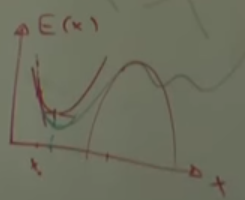

Fit with a quadratic term:

$$E(x) \approx E(x_t) + g^\top (x-x_t) + \frac{1}{2} (x - x_t)^\top H (x - x_t)$$

Here $g = \frac{dE}{dx}(x_t)$ is the Jacobian, and $\frac{d^2 E}{d x^2} (x_t)$ is the Hessian. The optimality condition is $\frac{dE}{dx} = g + H(x - x_t) = 0$, which yields the iteration rule

$$x_{t+1} = x_t - H^{-1} g \qquad \text{(Newton method iteration rule)}$$

An additional step size $\gamma \in (0, 1]$ can be added (more conservative):

$$x_{t+1} = x_t - \gamma H^{-1} g$$

##### Convergence Properties
Usually converges in *fewer iterations* than usual gradient descent; around each optimum there is a local neighborhod where the Newton method converges quadratically for $\gamma = 1$, if $H$ is invertible and Lipschitz continuous.

- matrix inversion not trivial on GPUs (not trivially parallelizable)
- one alternative: solve optimality condition from above iteratively
- quasi-Newton methods: approximate $H$ or $H^{-1}$ with psd matrix


### Gauss-Newton Algorithm
In the Newton method, there are the gradient $g$ and Hessian $H$:

$$g_j = 2 \sum_i r_i \frac{\partial r_i}{\partial x_j}$$
$$H_{jk} = 2 \sum_i \bigg(\frac{\partial r_i}{\partial x_j}\frac{\partial r_i}{\partial x_k} + r_i \frac{\partial^2 r_i}{\partial x_j \partial x_k} \bigg)$$

Drop the second-order term in the Hessian for the approximation:

$$H_{jk} \approx 2\sum_i \frac{\partial r_i}{\partial x_j}\frac{\partial r_i}{\partial x_k} = 2 \sum_i J_{ij} J_{ik} = 2 J^\top J$$

This approximation is guaranteed to be positive definite. Also, $g = J^\top r$. This gives the Gauss-Newton update rule:

$$x_{t+1} = x_t + \Delta := x_t - (J^\top J)^{-1} J^\top r$$

- advantage: no second derivatives, positive definiteness guaranteed
- approximation valid if the first-order part dominates, i.e. the second-order term we dropped is much smaller in magnitude. In particular, if the function is linear or almost linear


### Damped Newton and Levenberg-Marquardt 
Intuition: mixes between gradient descent and Newton method.

##### Damped Newton Algorithm
Modify Newton update rule as follows:
$$x_{t+1} = x_t - (H + \lambda I_n)^{-1} g$$
- hybrid between Newton method and gradient descent: $\lambda = 0$ => pure Newton method. If $\lambda \to \infty$ => approaches pure gradient descent (with learning rate $\frac{1}{\lambda}$).

##### Levenberg-Marquardt Algorithm
Analogously, a damped version for Gauss-Newton (Levenberg 1944):

$$x_{t+1} = x_t + \Delta := x_t - (J^\top J + \lambda I_n)^{-1} J^\top r$$

A different variant (Marquardt 1963), which is more adaptive and avoids slow convergence in small-gradient directions (and also generally slow convergence if all gradients are small):

$$x_{t+1} = x_t + \Delta := x_t - (J^\top J + \lambda \, \text{diag}(J^\top J))^{-1} J^\top r$$


## Example Applications
(see slides + video)

# Lesson 8 - Direct Approaches to Visual SLAM
SLAM = Simultaneous Localization And Mapping

## Indirect vs. Direct methods
### Classical Multi-View Reconstruction Pipeline
The classical approach tackles structure + mostion estimation (i.e. *visual SLAM*) like this:

1. Extract feature points (e.g. corners)
2. Determine correspondence of feature points across the images
	- either via local tracking (optical flow approach)
	- or random sampling of possible partners based on feature descriptor
3. Estimate camera motion
	- eight-point algorithm and/or bundle adjustment
4. Compute dense reconstruction from camera motion
	- photometric stereo approaches

### Disadvantages of classical "indirect" approaches
- disregards any information not included in the selected feature points: all remaining information in the color
- lack robustness to errors in the point correspondence

### Toward Direct Approaches
Skip feature point extraction: reconstruct dense/semi-dense scene directly from input images.

- more robust to noise: exploit all available information
- provide semi-dense reconstruction: better than sparse point cloud by eight-point algorithm/bundle adjustment!
- even faster: no feature point extraction

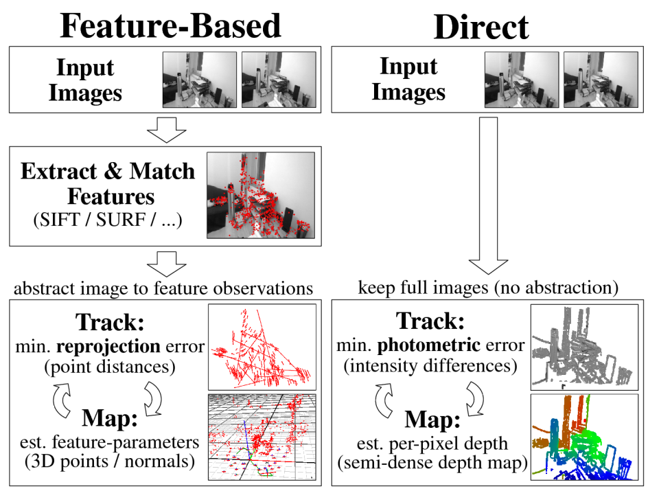

Idea: "find geometry of the scene in a way such that the colors in the images are consistent".

## Some Concrete Direct SLAM Methods

### Stühmer, Gumhold, Cremers, DAGM 2010: Real-Time Dense Geometry from Handheld Camera
Suppose we have $n$ images, $g_i \in SE(3)$ is the i-th image rigid body motion, $I_i: \Omega \to \mathbb{R}$ the i-th image. Goal: compute depth map $h: \Omega \to \mathbb{R}$ that maps each pixel to its depth.

Solve optimization problem:
$$\min_h \sum_{i=2}^{n} \int_\Omega |I_1(x) - I_i(\pi g_i(h(x) x)) | \,dx + \lambda \int_\Omega |\nabla h(x)| \,dx$$

- For each image $i$ and each point $x$ in image 1, the intensity of $x$ in image 1 should be close to the intensity of the corresponding point in image i
- The total variation of depths should be small (depths should not wildly fluctuate) - achieved via the regularization term

Actual minimization achieved with similar strategies like in optical flow estimation (above integral looks similar) - not detailed here. Roughly:
- linearize above terms in h (via Taylor expansions) - only holds for small h
- coarse-to-fine linearization

**Comment:** the total variation regularization adds in a "soap film" effect, where unknown/unseen parts are filled in/"made up" for the reconstruction.

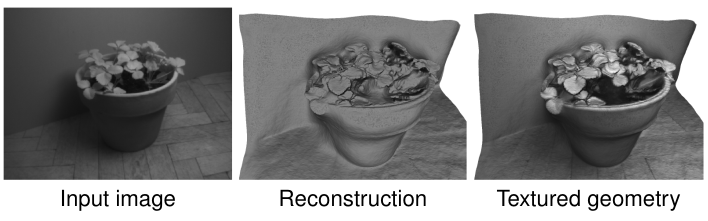

### Steinbrücker, Sturm & Cremers (2011): Camera motion of RGB-D Camera
Use a similar cost function as [[12d - Examples of Direct SLAM papers from 2011 - 2014#Stühmer Gumhold Cremers DAGM 2010 Real-Time Dense Geometry from Handheld Camera|before]] (without the regularization and with L2 instead of L1), but assume the depth is known and optimize over the rigid body motion $\xi \in se(3)$.

$$E(\xi) = \int_\Omega \big(I_1(x) - I_2(\pi g_{\xi}(h(x) x))\big)^2 \,dx$$

Linearize this by using the Taylor expansion around some initial $\xi_0$:

$$E(\xi) \approx \int_\Omega \big(I_1(x) - I_2(\pi g_{\xi_0}(h(x) x)) - \nabla I_2^\top (\tfrac{d\pi}{d g_\xi})(\tfrac{dg_\xi}{d\xi}) \xi \big)^2 \,dx$$

=> Convex quadratic cost function, linear optimality condition $\tfrac{dE(\xi)}{d\xi} = A\xi + b = 0$ (Linear system with 6 equations).

The linearization is identical to Gauss-Newton (approximation of a Hessian by a PSD matrix).

**Comment:** The Taylor approximation only works well for small camera movements (which you typically have in practice). For too large movements, the baseline generalized iterated closest points (GICP) works better.

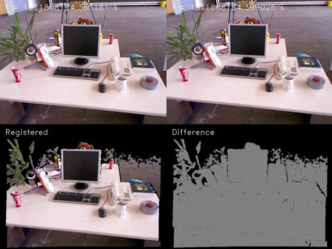


##### Kerl, Sturm, Cremers (IROS 2013): Extension
Additionally to color consistency, also ask for depth value consistency. Assume the vector $r_i = (r_{ci}, r_{zi})$ of color and geometric discrepancy for the i-th pixel follows a bivariate t-distribution, the max-likelihood pose estimate depending on the parameter $\nu$ from the t-distribution is

$$\min_xi \sum_i w_i r_i^\top \Sigma^{-1} r_i, ~
w_i = \frac{\nu + 1}{\nu + r_i^\top \Sigma^{-1} r_i}$$

=> non-linear weighted least squares problem

(t-distribution in a sense interpolates between a uniform and a Gaussian distribution)


##### Loop Closure/Global Consistency
What to do about errors that accumulate when walking around?
1. either bundle adjustment which produces globally consistent solution (expensive though, not online)
2. Loop closure: estimate a lot of camera motions $\hat{\xi}_{ij}$ for image pairs $(i, j)$. Then estimate a globally consistent trajectory $\{\xi_i\}_{i}$ that minimizes: $$\min_\xi \sum_{i,j} (\hat{\xi}_{ij} - \xi_i \circ \xi_j^{-1})^\top \Sigma_{ij}^{-1} (\hat{\xi}_{ij} - \xi_i \circ \xi_j^{-1})$$ Here $\Sigma_{ij}$ denotes the uncertainty of measurement $(i, j)$. This minimization can be solved by [[12c - Optimization Algorithms, Direct Visual SLAM#Levenberg-Marquardt Algorithm|Levenberg-Marquardt]]

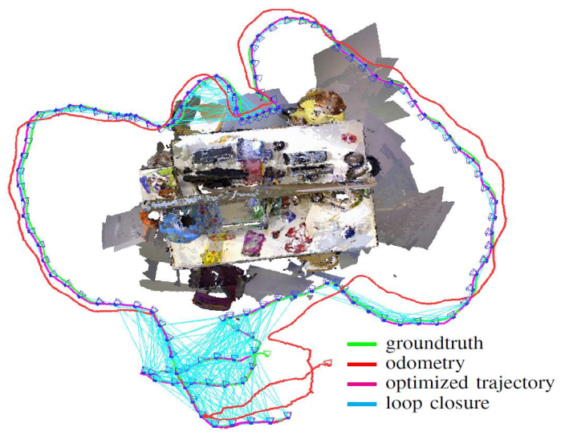

In the loop closure approach, we don't store all camera positions for efficiency, but a lot of *keyframes*.


### Newcombe, Lovegrove & Davison (ICCV 2011): Dense Tracking and Mapping - *DTAM*
Combines the previous tasks of (a) reconstructing dense geometry, and (b) reconstructing camera motion (and actually one of the first papers to do this).

Chicken-egg-problem! (Since here, RGB instead of RGB-D camera)

##### Depth estimation
Depth estimation very similar to [[#Stühmer Gumhold Cremers DAGM 2010 Real-Time Dense Geometry from Handheld Camera|Stühmer et al.]], but regularization over total variation of inverse depth $u=1/h$ instead of depth $h$. This alleviates a bias such that farther-away structures which have less pixels don't have a difference surface smoothing strength.

The regularization terms is also made *adaptive* by weighting the integrand by $\rho(x) = \exp(-|\nabla I_\sigma(x)|^\alpha)$: This is small if a big gradient exists at $x$, which means that big changes are penalized less at points in the image where the color changes by a lot. The final regularization term is 

$$\lambda \int_\Omega \rho(x) |\nabla u| \,dx$$

This can, but needn't be a good idea (e.g. reduced smoothing on a zebra).

##### Camera tracking
Similar to [[#Steinbrücker Sturm Cremers 2011 Camera motion of RGB-D Camera|Steinbrücker et al.]] (not detailed here).

Then: find good initialization (initial estimate for camera motion), alternate

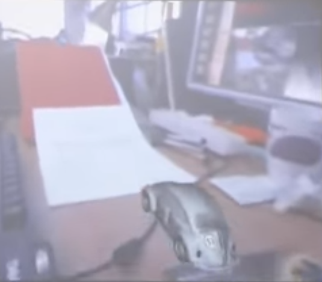

### Engel, Sturm, Cremers (ICCV 2013): LSD-SLAM (Large-Scale Direct Monocular SLAM)
- not dense, but semi-dense: reconstruct everywhere where there is a usable gradient (~50% of points in practice)
- additional uncertainty propagation, similar to Kalman filter
- additional scale parameter in camera motions: Use Lie group of 3D similarity transformations $$\textit{Sim}(3) = \bigg\{ \begin{pmatrix} sR & T \\ 0 & 1 \end{pmatrix} \mid R \in SO(3), T \in \mathbb{R}^3, s \geq 0 \bigg\}$$

Minimize non-linear least squares problem
$$\min_{\xi \in \textit{sim}(3)} \sum_i w_i r_i^2(\xi)$$
Here $r_i$ is a color residuum, $w_i$ a weighting, similar to [[#Kerl Sturm Cremers IROS 2013 Extension|Kerl et al.]]; this is minimized by a weighted Gauss-Newton algorithm on $\textit{Sim}(3)$

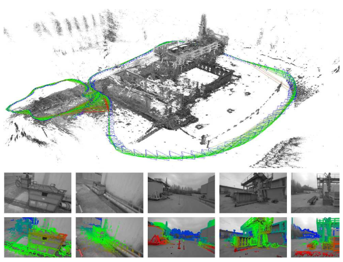

# Lesson 9 - Introduction to Variational Methods

Motivation: Optimization-Based Methods let you *specify what you want* from a solution directly. This can be much better than "cooking up" an algorithm using some made-up heuristics.

Variational Methods are especially suited for *infinite-dimensional problems* and *spatially continuous representations*. Applications include
- image denoising / restoration
- image segmentation
- motion estimation / optical flow
- spatially dense multi-view construction
- tracking

They are called *variational* because some parameters are varied to decrease a cost function.

### Advantages of Variational Methods
Example why heuristic "cook recipe" methods are problematic: *Canny edge detector*. Modifying some step in the middle basically means that the rest also needs to be re-engineered.

In constrast, Variational Methods (or in general, optimization methods)
- allow mathematical analysis of the cost function (uniqueness/existence of solutions?)
- make all modeling assumptions transparent
- have fewer tuning parameters with clearer effects
- are easily fused together (just add together cost functions)


### Variational Image Denoising
Input: Noisy grayvalue input image $f: \Omega \to \mathbb{R}$ that is assumed to arise from some true image by adding noise. Goal: find denoised $u$ s.t.
- $u$ is as similar as possible as $f$
- $u$ should be *spatially smooth* (i.e. noise-free)

=> $E(u) = E_\text{data}(u, f) + E_\text{smoothness}(u)$

Define $E_\text{data} = ||u - f||_2^2$, $E_\text{smoothness}(u) = ||\nabla u||_2^2$ (both function norms, i.e. integrals over all image points $x$). Result:

$$E(u) = ||u - f||_2^2 + \lambda ||\nabla u||_2^2$$

Choosing $\lambda$ comes down to: how much do you trust your prior assumptions about the world, and how much do you trust your observations of the world.

Since the error functional is convex, we can get a unique solution. The descent methods from the next section will converge towards a smoothed image which is the minimizer.

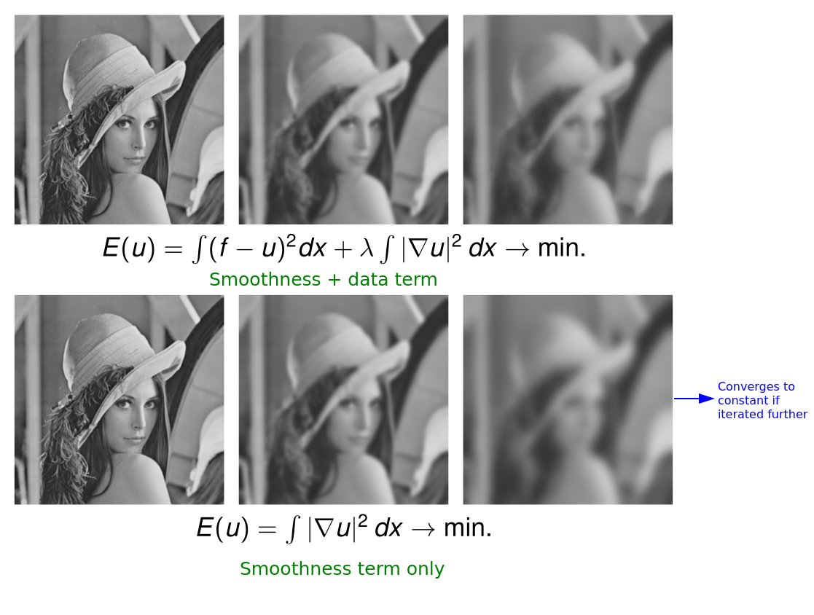

To allow edges to be not smoothed too much: don't square the gradient penalty. Intuitively, little variations are still smoothed out, but "semantically important information" (e.g. outline of hat) survive.

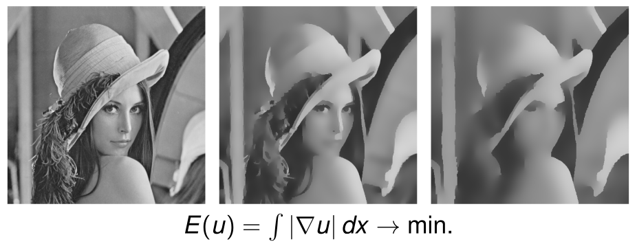

A powerful algorithm: Perona-Malik Algorithm (Perona & Malik, 1990) for discontinuity-preserving smoothing (smoothes image, but preserves details). This was PDE-based, but formulated as variational method in Rudin, Osher & Fatemi 1992.

### Minimizing Error *Functionals*

How to solve an error functional as seen above? Here $E$ assigns an error to a *function $u$* (the solution space has *infinite dimensions*, $E$ is a *functional*). How to minimize over infinite dimensions?

##### Euler-Lagrange equation

**Theorem** (necessary condition for minimizers of functionals): Assume a differentiable functional of the form $E(u) = \int \mathcal{L}(u, u')\,dx$. If $u$ is a minimizer, the associated *Euler-Lagrange* equation holds:
$$\frac{dE}{du} = \frac{\partial\mathcal{L}}{\partial u} - \frac{d}{dx}\frac{\partial\mathcal{L}}{\partial u'} = 0$$

General goal of variational methods: determine solutions for Euler-Lagrange equation. This is difficult for general non-convex functionals.

##### Descent methods
Descent methods can be used to solve the Euler-Lagrange equation. For example, gradient descent: Start at $u(x, t=0)$, then go in the direction of the negative gradient.

For the class of functionals from above, the gradient descent is given by the PDE
$$
 \begin{cases}
u(x,0) &= u_0(x) \\
 \frac{\partial u(x, t)}{\partial t} &= -\frac{dE}{du} = -\frac{\partial\mathcal{L}}{\partial u} + \frac{d}{dx}\frac{\partial\mathcal{L}}{\partial u'} = 0
 \end{cases}
$$

Just as an example: For the specific functional $\mathcal{L}(u, u') = \frac{1}{2}(u(x) - f(x))^2 + \frac{\lambda}{2}(u'(x))^2$, this translates to

$$\frac{\partial u}{\partial t} = (f - u) + \lambda \frac{\partial^2 u}{\partial x^2}$$

If the gradient descent converges, i.e. $\frac{\partial u}{\partial t} = 0$, we have found a solution to the Euler-Lagrange equation.

*Comment: Variational Methods and PDEs typically go hand in hand, i.e. people who work on variational methods often also work on PDEs*

## Variational Multiview Reconstruction

## Shape optimization
Shape optimization: find 3d shape that best corresponds to the given images. 

### Explicit shape representations
For example, *splines*: Parametric models (e.g. of curve or surfaces). Here, a linear combination of basis functions $\sum_i C_i B_i(s)$

- interpolating vs. approximating spline: must the control points be met?
- intuition: basis function specify how much impact control points have in certain regions

- for surfaces: open vs. closed surfaces (with/without boundaries) corresponds to cyclical/non-cyclical basis functions. Formula then $\sum_{ij} C_{ij} B_i(s) B_j(t)$

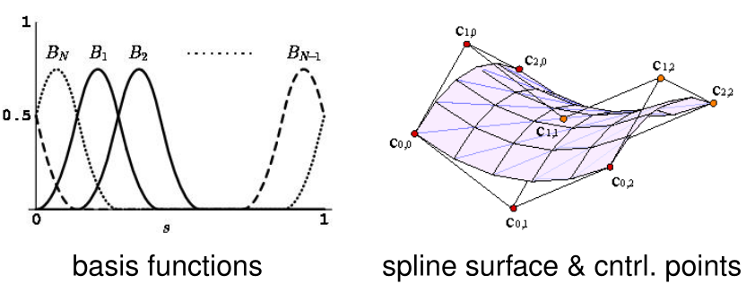

### Implicit shape representations
In optimization: people have moved towards implicit representations.

Advantages:
- union/difference easy to compute
- not depending on reparametrization (e.g. in explicit polygons, you could renumber the vertices; here we get rid of these degrees of freedom)
- arbitrary topology (i.e. arbitrary number of holes)
- many shape optimization problems wrt. implicit representations lead to a convex cost function

Drawbacks: 
- more memory intensive
-  Updating an implicit representations over time is less efficient.

##### Indicator function
Implicit repr. of a closed surface $S$: $u(x) = 1$ if $x \in \text{int}(S)$, otherwise $u(x) = 0$.

##### Signed distance function
$\varphi: V \to \mathbb{R}$ s.t. $\varphi(x) = d(x, S)$ if $x \in \text{int}(S)$, otherwise $\varphi(x) = -d(x, S)$.

Example: Matlab function `bwdist`.


## Multiview Reconstruction as Shape Optimization
Goal again: several images; reconstruct geometry. Importantly, we assume that camera orientations are given.

Idea: For a voxel on the surface, projecting this into different images should give same color. => Assign each voxel $x \in V$ a value via the *photoconsistency function* $\rho(x) \in [0, 1]$. $\rho(x)$ is small if projected voxels have similar colors, large otherwise. (Actually, this measures non-photoconsistency)

Underlying assumptions:
- visibility in all images
- Lambertian (non-reflecting) surface
- textured surface

### Weighted minimal surface approach [Faugeras & Keriven 1998]
Cost function of a surface $S$:

$$\int_S \rho(S) \, ds$$

A good surface is a surface which has good photoconsistency.

Problem: global minimizer is $\emptyset$ (this has cost 0) => there is a *shrinking bias*! One "solution" is to just optimize locally (this probably eliminates $\emptyset$, but not the bias itself)

### Imposing silhouette consistency [Cremers & Kolev, PAMI 2011]
Trying to alleviate the bias problem of [[#Weighted minimal surface approach Faugeras Keriven 1998|previous approach]].

Idea: *impose our knowledge that there actually is an object; not the empty object*. Do that via a *silhouette* and impose that projections of the shape should match the silhouettes seen in the images.

$$\min_S \int_S \rho(s) \,ds ~ \text{ s.t.}~ \pi_i(S) = S_i$$

*Compute a photoconsistent surface that is also silhouette-consistent*.

##### Formulation wrt. indicator functions
Written wrt. the indicator function:

$$\min_{u: V \to \{0,1\}} \int_V \rho(x) |\nabla u(x)| \,dx$$

s.t.

$$\int_{R_{ij}} u(x) \,d R_{ij} \geq 1 \Leftrightarrow j \in S_i$$

First equation: rewrite above cost function (using a weighted total variation; apparently it's a well-known fact in optimization that it can be rewritten like this).

Second equation: The ray $R_{ij}$ should hit the object if and only if it intersects the silhouette in the image area.

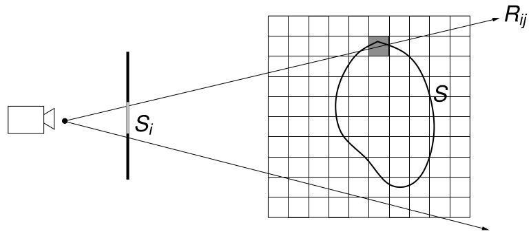

##### Convexity
Problem: set of indicator functions $u: V \to \{0, 1\}$ is not convex.
 
Instead use $$\mathcal{D} = \bigg\{u: V \to [0,1] \bigg\lvert \int_{R_{ij}} u(x) \,d R_{ij} \geq 1 \Leftrightarrow j \in S_i \bigg\}$$

This is called the set of *silhouette-consistent configurations*. It is a convex set. Interpretation: $u(x) \in (0, 1)$ represents some uncertainty (soft constraint). Like this, we avoid a difficult combinatorial problem and use an easier continuous problem.

Thresholding: You get an energy $E_{\text{thresh}}$ from the relaxed problem $E_{\text{relaxed}}$. For the actual optimal binary solution $E_{\text{optim}}$, it holds that $$E_{\text{thresh}} \geq E_{\text{optim}} \geq E_{\text{relaxed}}$$

The paper shows: thresholding can be performed in a way s.t. silhouette consistency is preserved.

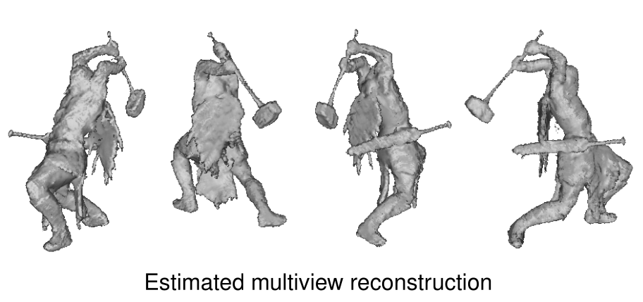

### Multi-view Texture Reconstruction [Goldlücke & Cremers, ICCV 2009]
Motivation: The things we saw above could also (and more precisely) be done with a laser scanner. What laser scanners *cannot* capture, but cameras can, are colors.

- Very simple approach: just backprojeçt from image to 3d shape to find colors. But: need multiple views to cover whole object
	-  => averaging multi-view values leads to blurring. 
	-  Stitching instead of averaging instead leads to seams.

Alternative: Variational approach [Goldlücke & Cremers, ICCV 2009]. Intuition: find a *sharp texture* s.t. after blurring and downsampling (i.e. what a real digital camera does), it matches the observations.

##### Cost function for textures
Solve:

$$\min_{T: S \to \mathbb{R}^3} \sum_i^n \int_{\Omega_i} \bigg(b \ast (T \circ \pi_i^{-1}) - \mathcal{I}\bigg)^2 \,dx
+ \lambda \int_S ||\nabla_s T|| \,ds$$

Regularization constant $\lambda$ is typically very small. $b$ represents a linear operator including blurring and downsampling ($\ast$ is a little misleading notation). The $\nabla$ is taken along the two degrees of freedom of the surface.

Advantage: this cost function is convex!

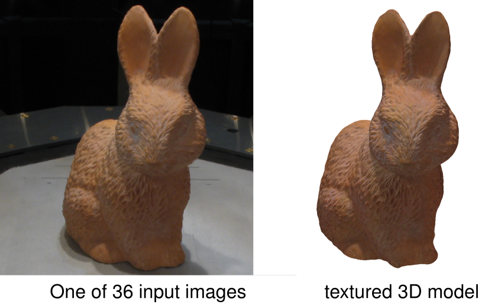

Important: the color includes the shading effects.

##### Super-resolution textures
The blurring + downsampling can be undone, we get the actual sharp texture (*super-resolution textures*).

How can we hallucinate details that aren't there in the input image?
1. we know a bit how the degradation (downsample + blurring) works (we also have to know how exactly the camera blurs, else it won't work!)
2. we have many images => the more, the sharper we can get


### Space-Time Reconstruction from MV Video [Oswald & Cremers, 4DMOD 2013]

Another advantage of cameras vs. laser scanners: reconstruct actions over time filmed with multiple cameras.

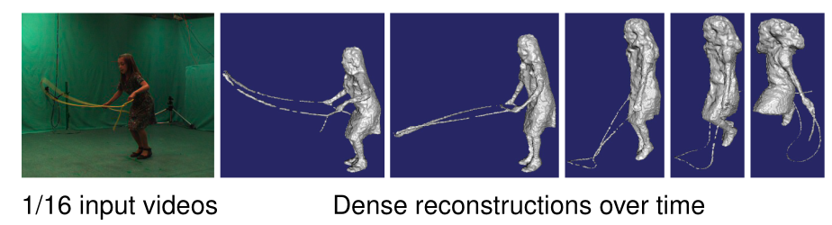

Some interesting applications:
- video conferencing with full 3D model of speaker
- sports analysis
- free-viewpoint television


