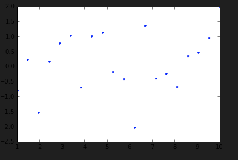

# Pattern Recognition and Machine Learning Note

[MIT 6.867 Machine Learning](https://ocw.mit.edu/courses/6-867-machine-learning-fall-2006/pages/syllabus/)

[All lecture node](https://ocw.mit.edu/courses/6-867-machine-learning-fall-2006/pages/lecture-notes/)

# Lecture 1 - Introduction

## 1.1. Task, Training Data, Performance Metric

<b> Example: Spam detection (classification) </b>

Task: design program to decide if message is spam or not

Training data: examples of SPAM and not SPAM messages

Performance Metric: minimize $P(h(x) \ne y)$


Some reasonable rules:

h(x) = SPAM if {unknown sender} AND {subject contains 'meds' or '$'}

h(x) = SPAM if 2 $\times$ 1{money} + 3 $\times$ 1{meds} + O.S.(# spelling errors)$^2$

h(x) = SPAM if time sent(x) $\in$ timesent $(x)^{(i)}$ such that $y^{(i)}$ = 1}

## 1.2. Supervised Learning

$(x^{(i)}, y^{(i)}, ..., x^{(n)}, y^{(n)})$ labeled training data

$x^{i} \in \mathbb{X}$, $y^{(i)} \in \mathbb{Y}$

$(x^{(i)}, y^({i)}) ~ p(x,y)$ learning algorithm

x --> hypothesis --> y


<b> Example </b>

Task: observe a 2 second video of soccer play and predict if results in goal

Examples: many clips labeled 0 or 1

Performance metric: maximize expected

<b> Example </b>

Task: predict the stopping distance of a car based on mass, speed

Examples: lots of data from stopping over and over again

Performance metric: might want to have a cost function that really heavily  overestimates the stopping distance!


If $\mathbb{y}$ is finite: "classification"

If $\mathbb{y}$ is continuous: "regression"

Side note: discrete and infinite is classification


## 1.2.1. Loss function

L: $Y \times Y \rightarrow \mathbb{R}$

0-1 Loss: L(h,y) = {0 if h = y, 1 otherwise}

<b> General loss function </b>
 
L(h,y) = $sum_j \sum_k L_{jk} \mathbb{1} {h = j, y = k}$

<b> Squared loss </b> 

$Y \subset \mathbb{R}$

$L(h,y) = (h-y)^2$

<b> Linear loss </b> 

$L(h,y) = | h-y |$

Could also minimize "Risk": the average value of the y's

$\mathbb{E}[L] = \mathbb{P}[h(x) \ne y]$

Suppose we know $p(x,y)$

Claim: For general loss matrix $L_i$

$h(x) = \underset{x}{argmin} \sum_j L_jk p(y=j \ | \ x)$

Proof: $Risk = \mathbb{E} [ something can't read ] = \sum_k \int \sum_j L_{jk} p(x,y=j) dx$

If we have the distribution for x and y, then designing the optimal hypothesis is easy and is given by this formula.


<b> Regression with squared loss </b>

$h* = \underset{h}{argmin} \mathbb{E}[(h(x)-y)^2]$

Claim but won't go through derivation $h*(x) = \mathbb{E}_y[y|x] = \int_y y \ p(y|x)dy$

Proof: pg 46-47 of Bishop

If had p(x,y) then we are happy.


Another idea which bypasses first trying to estimate the joint distribution.

Let's alternatively try to estimate the risk $\mathbb{E}[L(h(x),y)]$ directly?

? $\approx$ \frac{1}{N} \sum_{i=1}^N L(h(x^{(i)},y^{(i)})$

This above is the empirical risk.


<b> Law of large numbers </b>

Let $Z_1, ..., Z_N$ iid ~ $p(z)$ s.t. $\mathbb{E}[Z_1] < \infty$

The tilde means distributed according the p(z)

Then $\frac{1}{N} \sum_{i=1}^N Z_i \rightarrow \mathbb{E}[Z_i]$


Choosing $h \in \mathbb{H}$ minimizing empirical risk is called ERM (Empirical Risk Minimization)

So, choosing $h \in \mathbb{H}$ is important!


Back to estimating p(x,y)

Often done by fitting a *parametric model* to the data

Data: $y^{(i)}, ..., y^{(n)} \in {0,1}$. $ y^{(i)} ~ Ber(\theta)  \mathbb{P}(y^{(i)}=1) = \theta$

Goal: find best parameter


Choose $\theta*$ to maximize some score

<b> Maximum Likelihood score </b>

($\theta$) $= \mathbb{P}(D \ | \ \theta) = \prod_{i=1}^N \theta^y(i)(1-\theta)^{1 - y(i)}$


Other machine learning problems you might be interested in.

Might be thinking "oh but mine isn't a supervised classification problem".

## 1.3. Semi-supervised learning.

## 1.4. Unsupervised learning 

Don't have labels for your training data.  Might want to estimate probability distribution for the data, might want to 

## 1.5. Reinforcement learning

Very interesting and quite different.  You have a robot going around and trying things out.  Has sensors, gets some feedback, it's training data depends on its actions.  Guy Breseler's interest in reinforcement learning is so that he can find the best way to sleep.

# Lecture 2 - Probability distributions

- Modeling (esp. discrete models) - how do we estimate that probability?
- Bayesian inference

We were considering data that maybe didn't have features.

Suppose we have

Data: $y^{(1)}, ..., y^{(n)}$

Risk = $\mathbb{E}_YL(h,Y) = \int L(h,y)p(y)dy$

$p(y)$ unknown

Last time, in order to come up with some guess of p(y)
- We considered the *empirical distribution*
- We also tried assuming a *parametric model*.  We say $p(y)$ takes some particular form, and now the thing we don't know is just $\theta$, a particular parameter.  $p(y \ | \ \theta)$

**Example (continued)**

$Y^{(i)} \in {0,1}$ $Y^{(i)} ~ iid. \text{Bern}(\theta)$   $\ \ \ \theta \in [0,1]$

$p_Y(y) = \theta^y(1-\theta)^{1-y}$


Nobody actually goes to iTunes and flips a coin to decide whether or not to buy a song.


Useful quote from George Box, a statistician: "All models are wrong, but some are useful."

Great, so now we have the Bernoulli model, and it's appropraite for a lot of data.  But we don't know $\theta$.

This is a Bayesian idea to have some distribution on what $\theta$ is.

## 2.1. Bayes Theorem

Random variables $Y, \Theta$

Bayes says:

$$P_{\Theta\  | \ Y} (\theta\  | \ y) = \frac{P_{Y \ | \ \Theta}(y \ | \ \theta) P_{\Theta}(\theta)}{P_Y(y)}$$

## 2.2. Bayesian Inference

$P_{Y \ | \ \Theta} (y\  | \ \theta)$: likelihood

$P_{\Theta}(\theta)$: prior.  This is what really makes it Bayesian.

$P_{\Theta\  | \ Y} (\theta\  | \ y)$: posterior.  Your uncertainty after seeing the data.

$P_{Y}(y)$: evidence


Proposed distribution is a Beta distribution.  We want a continuous distribution that puts mass on 0 and 1.

$$\Theta \approx Beta(a,b)$$

$a,b > 0$ "hyperparameters".  Called hyperparameters because they are parameters for our parameter.

$p(\theta) = Beta(\theta) = \frac{\Gamma(a + b)}{\Gamma(a)\Gamma(b)} \theta^{a-1} (1-\theta)^{b-1}$

Gamma function
- $m \in \mathbb{Z}_+ \ \ \ \ \ \Gamma(m) = (m-1)!$
- $t > 0: \ \ \ \ \Gamma(t+1) = t\Gamma(t)$

What is Beta distribution is $a = 1$ and $b = 1$?  The uniform distribution.

Play with Beta distribution for $(a,b) = (0.5,0.5) ; (a,b) = (2,2) ; (a,b) = (2,5).$

What we're really doing is drawing a random distribution.

We are drawing a $\theta$, but we are also drawing a $1 - \theta$.


Calculate on my own (don't just look up on Wikipedia)

Mean: $E[\Theta] = \frac{a}{a+b}$

Var$[\Theta] = \frac{ab}{(a+b)^2(a+b+1)}$

We have something that can go from very smooth to very sharp.

$p(\theta \ | y^{(1)},...,y^{(n)}) = p(\theta \ | \ y^{(1:n)})$

(Professor is dropping subscripts so that it's easier to write.)

Proportional in $\theta to p_n(y^{(1:n)} \ | \ \theta)p(\theta)$

$= [ \prod_{i=1}^{n} p(y^{(i)} \ | \ \theta)] p(\theta)$


proprotional in $\theta$ [\Theta^{\sum_{i = 1}^ny^{(i)}(1 - \theta)^{n - \sum_{i=1}^ny^{(i)}]

* $\theta^{a-1}(1 - \theta)^{b - 1}$

$p(\theta \ | \ y^{(1:n)}) = Beta(\sum_{i=1}^ny^{(i)} + a, n - \sum_{i = 1}^ny^{(i)} + b)$


$E[\Theta \ | \ Y^{(1:n)} = y^{(1:n)})$

$= \frac{\sum y^{(i)} + a}{n + a + b}$ $ \ \ \ c.f. \theta_ML = \frac{\sum_{i=1}^n y{(i)}}{n}$

$= (\frac{n}{n+a+b})\frac{\sum y^{(i)}}{n} + (\frac{a+b}{n+a+b})\frac{a}{a+b}$


How do we choose the prior?  This is a huge question.

- 1 option: hey, I've worked at Google before, I have some data
- 2 option: we can collect some data

We assumed we would have a beta distribution, which lets us have nice different shapes.  But it doesn't, for example, let us have a bimodal distribution.

For now beta will let us do some things, but it won't let us do a lot of things.

Entire book about choosing priors and related topics: **Robert 2007, The Bayesian Choice**.  Another good book: **Bayesian Data Analysis**.

The way we motivated starting this discussion was to say, "hey we really want the distribution $p(y)$".  The Bayesian method gives us a way to get at that.

Risk = $E_Y L(h,Y)$

$= \int L(h,Y)p(Y)dY$

$p(y) \approx \frac{1}{n} \sum_{i=1}^n \mathbb{1}\{ y = y^{(i)} \}$


Another option that we pursued was maximum likelihood estimation, in the service of prediction.

$p(y) \approx  p(y \ | \ \theta_{ML})$

But now the Bayesian approach. 

$p(y) \approx p(y^{n+1} = y \ | \ y^{(1)},...,y^{(n)})$

posterior predictive distribution.


New example

$p(y^{(n+1)} \ | \ y^{(1:n)} ) = \int p(y^{(n+1)}, \theta \ | \ y^{(1:n)}) d\theta$

$= \int p(y^{(n+1)} \ | \ \theta, y^{(1:n)}) p(\theta \ | \ y^{(1:n)}) d\theta$

$= \int p(y^{(n+1)} \ | \ \theta) p(\theta \ | \ y^{(1:n)}) d\theta$


$p(y^{(n+1)} = 1 \ | \ y^{(1:n)}) = \int \theta p(\theta \ | \ y^{(1:n)}) d\theta$

$= \frac{\sum_{i=1}^n y^{(i)} + a}{n+a+b}$


**Note**

$Y^{(i)} \approx iid \ \ \ \ text{Bern}(\theta)$

$\iff$

$\backsim Y(1)\backsim\text{Bin}(n,\theta) \ \ \ $   Binomial


Consider


$Y^{(i)} \approx iid \{ 1 .... K   |   w.p. \theta_1 ... w.p \theta_k \}$

Discrete categorical multinoulli


n draws:   $M_k = \sum_{i=1}^n \mathbb{1}{Y^{(i)} = k}$

$ (M_1, ..., M_k) \approx \text{Mult}(n, \theta)$


Prior is **conjugate** for a likelihood if the posterior has the same form as the prior.

Beta is conjugate for the Bernoulli.  (We proved that in class).


What would a conjugate prior for the multinomial might look like?

Answer: it's going to be a product of $\theta$s to the something.


Propose the following prior:


$p(\theta_{1:K}) = \ \ \text{...} \ \ \ \prod_{k=1}^K \theta_k^{a_k-1}$

Will only work if our distribution is over probabilities.

$\theta_k \in [0,1]$


$\sum_{k=1}^{K} \theta_l = 1$  The (K-1)-dimensional simplex


$p(\theta_{1:K}) = \frac{\Gamma(\sum_{k=1}^K a_k)}{\Gamma(a_k)} \prod_{k=1}^K \theta_k^{a_k-1}$


$\theta_{1:K} \approx Dirichilet(a_{1:k}) a_k > 0$

# Lecture 3 - Regression

Observe data $(x^{(1)},y^{(1)}), ..., (x^{(n)},y^{(n)})$

$x^{(i)} \in \mathbb{R}^n$ examples

$y^{(i)} \in \mathbb{R}$ labels

Task: come up with prediction $\hat{y} = h(x) \in \mathbb{R}$

Risk: $\mathbb{E}_{xy}L(h(x),Y)$

$L(h,y) = (h-y)^2$


(Since we have labels, this is an example of supervised learning)

```python
import numpy as np
import matplotlib.pyplot as plt
%matplotlib inline

x = np.linspace(-10,10,201)
y = x**2
plt.plot(x,y); plt.show()
```

If we know $p(y \ | \ x): h(x) = \mathbb{E}[Y \ | \ X = x]$  (page 46=47 of Bishop)


Often useful to assume a parametric form for the relationship between x and y.

$$y = f(x) = \theta_0 + \theta_1x_1 + ... + \theta_dx_d = \theta^Tx$$

$$x = \begin{bmatrix} 1 \\ x_1 \\ x_2 \\ \vdots \\ x_d \end{bmatrix}$$

<b> Question is: can we find a line that describes the data as best as possible? </b>


```python
x = np.linspace(-0,2,201)
y = 3*x + np.random.randn(1,201)[0]*1
plt.plot(x,y, 'x'); plt.show()
```

Empirical

Empirical Risk (MSE)

n * MSE = RSS = SSE


$$\Phi = \begin{bmatrix} 1 -- (X^{(1)})^T -- \\  \\ \\ \\ 1 -- (X^{(n)})^T -- \end{bmatrix}$$

$RSS(\theta) = (\Phi \theta - \bar{y})^T (\Phi \theta - \bar{y})$

Find $\underset{\theta}{argmin} RSS(\theta).$

$$ \frac{\partial RSS}{\partial \theta_i} = 0$$

$$ \nabla f(\theta) = [ \frac{\partial f}{\partial \theta_0}, \frac{\partial f}{\partial \theta_1}, ..., \frac{\partial f}{\partial \theta_n} ]$$

$$ \nabla RSS(\theta) = 0$$

$$ \nabla RSS(\theta) = 2 \Phi^T (\Phi \theta - \bar{y}) = 0$$

$$ \theta_{OLS} = (\Phi^T \Phi)^{-1} \Phi^T \hat{y}$$

Least squares, again!

<b> 2nd order condition </b>

RSS(\theta) is convex

if $\nabla^2 RSS(\theta)$ is pos definite.

$(\nabla^2)_{ij} = \frac{\partial^2}{\partial \theta_i \partial \theta_j}$

$ \nabla^2 RSS(\theta) = 2 \Phi^T \Phi $

$ \Phi^T \Phi > 0  \rightarrow (both ways) a^T(\Phi^T \Phi)a > 0 $ for all $||a||_2 = 1$

$|| \Phi a ||_2^2$ if $\Phi$ is full rank and $n > d$.

Note that the 2nd order condition is just a proof that the least squares is actually the optimal estimate, and it's nice: we can write it in closed form.

<b> Geometric Interpretation </b>

$n > d$.  Assume that $\Phi$ is full rank.


$$\Phi = \begin{bmatrix} | & | & & | \\ x_0 & x_1 & ... & x_d \\ | & | & & | \end{bmatrix}$$

$ RSS(\theta) = \sum (\hat{y}_i = \bar{y}_i)^2 = || \hat{y}_i = \bar{y}_i||_2^2 $

We are trying to choose a point spanned by $\tilde{x}_i$s that minimizes the Euclidean distance.

We see that the first order optimality conditions are just telling us that

$$ \Phi^T(\Phi \theta - \hat{y}) = \Phi^T(\hat{y} - y) = 0$$

We see that $\hat{y}$ is the projection of $\bar{y}$ onto the subspace.

$$ \hat{y} = \Phi \theta = \Phi (\Phi^ \Phi)^{-1} \Phi^T \bar{y} $$

The orthongonal projection onto the span of {$\tilde{x}_0,\tilde{x}_1,...,\tilde{x}_d$}

Suppose that $\Phi$ is invertible $(d = n)$:

$$ \theta_{OLS} = (\Phi^T Phi)^{-1} \Phi^T \hat{y}$$

$$ \Phi^{-1} \bar{y} $$

$$ \hat{y} = \Phi \theta = \bar{y} $$

Suppose that $d +1 > n$:

$$  \Phi = \begin{bmatrix} ... \end{bmatrix}  \Rightarrow \Phi^T\Phi \in \mathbb{R}^{(d+1)\times(d+1)}$$

$Rank(\Phi) \le n$

$ (\Phi^T \Phi)^{-1} \Phi^T = \Phi^{\dagger}$  Moore-Penrose psuedo inverse

$Y = \theta^Tx + \epsilon$  

$\epsilon \approx N(0,\beta^{-1})$

Recall:

$ Z \backsim N(\mu,\sigma^2) $

$p_Z(z) = \frac{1}{\sqrt{2\pi\sigma^2}} \exp \big[ -(z-\mu)^2 / 2\sigma^2 \big]$

$y^{(i)} = \theta^T x^{(i)}$

<b> Maximum Likelihood </b>

$ p(y^{lin} \ | \ x^{lin}, \theta, \beta) $

$ = \prod p(y^{(i)} \ | \ x^{(i)}, \theta, \beta)$

$ = \prod_{i=1}^n \frac{1}{\sqrt{2\pi\sigma^2}} \exp \big[ -(y^{i}- \theta^Tx)^2 / 2\beta^{-1} \big] $

Take the $\log$ so it's easier!

$$ \beta_{ML}^{-1} = \frac{1}{n} \sum_{i=1}^n (\theta^Tx^{(i)} -y^{(i)})^2 = MSE(\theta) $$

Basis functions

$y = \theta_0 + \theta_1x_1 + ... + \theta_dx_d $

Since linear in parameters, can still use linear least squares

$y = \theta_0 + \theta_1\phi_1(x) + \theta_2\phi_2(x) ... + \theta_d\phi_d(x) $

"basis function expansion"

$\phi(x) = (x_i)^j$

$\phi(x) = x_i*x_j$

$\phi(x) = \sin(x)$ sinusoid

$\phi(x) = \frac{1}{1 + e^{-x_i}}$ "logistic"

Wavelets, splines... lots of options for basis functions

# Lesson 4 - Bayes approach to maximum likelihood

- Bayes + Gaussians
- Bayesian regression
- Ridge regression
- (Bias-variance)

Today we're going to consider a Bayes approach to maximum likelihood.

We'll build up to talking about Bayesian regression.

Then we'll see how this magically becomes ridge regression.

Recall Bayes Theorem

$$ p(\theta \ | y \ ) \propto_\theta p(y \ | \ \theta) p(\theta) $$

Recall conjugate priors

Consider multivariate Gaussian likelihood [HW \#0, Bishop 2.3]

$$ Y^{(i)} \overset{i.i.d.}{\sim} N(\mu, \Sigma) $$

Data, $Y^{(i)}$ is a column of dimension d.

Mean, $\mu$, is a column of dimension d.

Covariance matrix, $\Sigma$ is a $d \times d$ matrix, and is positive definite

$p(y^{(i)} \ | \ \mu)$ = multivariate gaussian

You could go through all the math, and that's correct, just takes a while.  Could also just say, hey this has a quadratic form, so we need to have a prior with a quadratic form.

Here we have the posterior as a normal distribution:

$ p(\mu \ | y^{(i)}) = N(\mu \ | \ \mu_1, \Sigma_1) $

$ \propto \exp \{ -  \frac{1}{2}(\mu - \mu_1)^T \Sigma_1^{-1} (\mu - \mu_1) \} $

$ \mu^T \Sigma^{-1}\mu + \mu^T \Sigma_0^{-1}\mu = \mu^T\Sigma_1^{-1}\mu $

$ \Sigma_1^{-1} = \Sigma^{-1} + \Sigma_0^{-1}  \ \ \ \ \ \text{this is precision matrix}$

$y^{{(1)}^T} \Sigma^{-1}\mu + \mu_0^T \Sigma_0^{-1}\mu = \mu_1^T \Sigma_1^{-1}\mu$

$ \Sigma_1^{-1} \mu_1 = \Sigma_0^{-1}\mu_0 + \Sigma^{-1}y^{(1)} $

## 4.1. Bayesian sequential learning

batch: all data at once

streaming: some data at time intervals

$$ Y^{(i)} \overset{iid}{\sim} p(y \ | \ \theta)$$

$$ p(\theta \ | \ y^{(1 : n)} \propto_\theta p(y^{(1:n)} \ | \ \theta) p(\theta)$$

$$ = \big[ \prod_{i=1}^n p(y^{(i)} \ | \ \theta \big] p(\theta) $$

$$ = p(y^{(1:m)} \ | \ \theta) p(y^{(m+1:n)} \ | \ \theta) p(\theta) $$

$$ \propto p( \theta \ | \ y^{(1:m)}) p(y^{(m+1:n)} \ | \ \theta)  $$

First term above is the old posterior, which we then use as the new prior

Point is that you get the same thing whether you take a streaming or batch approach

$$p(\mu \ | \ y^{(1:n)} = N(\mu \ | \ \mu, \Sigma_n)$$

$$ \Sigma_n^{-1}= n\Sigma^{-1} + \Sigma_0^{-1} $$

$$ \Sigma_n^{-1} \mu_n = \Sigma_0^{-1} \mu_0 + \Sigma^{-1} (\Sigma_{i=1}^n y^{(i)} ) $$

Next thing we'll do is apply this to regression.  What we've done at this point is talk about a bunch of data that are i.i.d. from a Gaussian distribution.

But regression isn't so different.  It's pretty close.  We're just muliplying the mean by some linear term.

## 4.2. Back to regression

$$ Y^{(i)} \overset{indep}{\sim} N(\theta^T \phi(x^{(i)}), \sigma^2)$$

Assume $ \sigma^2 > 0 $ is fixed and known

Assume $ \theta \in \mathbb{R}^d $

In this case again have Gaussian likelihood

$$ p(y^{(i)} \ | \ \theta) = \frac{1}{\sqrt{2\pi\sigma^2}} \exp(-\frac{1}{2\sigma^2} ( y^{(i)} - \theta^T \phi(x^{(i)}))^2) $$

$$p(\theta) = N(\theta \ | \ \mu_0, \Sigma_0)$$

$$ p(\theta \ | \ y^{(i)})   = N(\theta \ | \ \mu_1, \Sigma_1)$$

$$ \Sigma_1^{-1} = \Sigma_0^{-1} + (\sigma^2)^{-1} \phi(x^{(1)}) \phi(x^{(1)})^T$$

In fact if we look at the linear terms then we get the following

$$ \Sigma_1^{-1} \mu_1 = \Sigma_0^{-1} \mu_0 + (\sigma^2)^{-1} \phi(x^{(1)})y^{(1)}$$ 

# Lesson 5 - Linear Regression

- First: how do you get a point estimate?  What if you have to guess, what is $\theta$?
- Regularization
- Bias-variance tradeoff
- Model selection (how to choose $\lambda$)

```python
import numpy as np
import matplotlib.pyplot as plt
%matplotlib inline

N = 20
x = np.linspace(1,10,20)
y = np.random.randn(1,20)[0]

plt.plot(x,y, '.'); plt.show()

print x
print y
```



Basis functions will be the powers of $x$: $\phi(x) = \{ 1, x, x^2, ..., x^d-1\}$ 

$$\hat{\theta}_{\text{OLS}} = \underset{\theta}{\text{argmin}} \text{ RSS}(\theta)$$

Gaussian prior

$$p(\theta) = N(\theta \ | \ 0, \sigma_0^2 I_{d\times d})$$

$\hat{\theta}_{\text{MAP}} = \underset{\theta}{\text{argmax}}$ $\log p(y^{(lim)} \ | \ \theta) + \log p(\theta)$

Then plug in the form of the density...

$$=\underset{\theta}{\text{argmin}} \big[\text{RSS}(\theta) + \lambda||\theta||_2^2 \big]$$

where 
$\lambda := \frac{\sigma^2}{\sigma_0^2}$ and $||\theta||_2^2 = \theta^T \theta$

Solve for $\theta$

$$\nabla_{\theta}  \ f(\theta) = 0$$

$$\hat{\theta} = (\lambda I_{d \times d} + \Phi^T \Phi)^{-1} \Phi^T Y$$

"Ridge regresion"

Exercise: For $\lambda > 0, \lambda I_{d \times d} + \Phi^T \Phi$ is invertible.

**Bias-variance tradeoff**

$$Y = \theta^T \phi(X) + \epsilon$$

$$\mathbb{E}_{XY}[(\mathbb{E}[Y|X]-Y)^2] = \sigma^2$$

Risk: 

$$\mathbb{E}[(h(X) - \mathbb{E}[Y|X])^2] = \mathbb{E}_X[(h(X,D)=\mathbb{E}[Y|X])^2]$$

$$\mathbb{E}_D[Risk] = (check this!) = \mathbb{E}_X \{ (\mathbb{E}_D[h(X,D)] - \mathbb{E}[Y|X])^2\} + \mathbb{E}_X\mathbb{E}_D[(h(X,D) - \mathbb{E}_D[h(X,D)])^2]$$

$ =$ bias-term + variance-term

$$\mathbb{E}_D[RISK] = (bias)^2 + variance + noise$$

**Exercise**: What is the bias of $\hat{\theta}_{\text{OLS}}$?

Answer: it's 0


How to choose $\lambda$?

$h(x) = \hat{\theta}^T \phi(X)$

Risk = $\mathbb{E}_{XY}[((\theta_{D_1}^{(\lambda)})^T \phi(X) - Y)^2]$

$$\lambda^* = \underset{\lambda}{\text{argmin}} \frac{1}{|D_2|} \sum_{i \in D_@} [(\hat{\theta}_{D_1}^{(\lambda)})^T \phi(x^{(i)}) - y^{(i)}]^2$$

There are other regularizers that are useful

$$\hat{\theta}_{LASSO} = \underset{\theta}{\text{argmin}} \text{ RSS}(\theta) + \lambda||\theta||_1$$


# Lesson 6 - Linear Model for Classification

- Bias-variance trade-off for estimation
- Classification

## 6.1. Prediction vs. estimation

Recall: Loss $L(guess,actual)$

Estimation: 
- "actual" is a parameter $\theta$ of the model
- "guess" is a function $\hat{\theta}(x^{(1:n)}, y^{(1:n)})$

Prediction:
- "actual" is now a new data point
- "guess" is a function $h(D, x^{(n+1)})$

## 6.2. Risk in Estimation

Risk = $$E_D L(\hat{\theta}, \theta)$$

## 6.3. Squared error loss

Let's think about squared error loss in relation to estimation

$$L(\hat{\theta}, \theta) = (\hat{\theta} - \theta)^2$$

$$E_d(\hat{\theta} - \theta) = E_D(\hat{\theta} - E_D\hat{\theta} + E_D\hat{\theta} - \theta)^2$$

$$=E_D(\hat{\theta} - E_D\hat{\theta})^2 + (E_D\hat{\theta} - \theta)^2$$

First term above is variance, second term above is bias^2

Bias and variance are the same as accuracy and precision, conceptually


#### Example

$$Y^{(i)} \sim N(\mu, \sigma^2)$$

Want to estimate $\mu$

$$\hat{\mu}_1 = Y^{(1)}$$

or

$$\hat{\mu}_N = \frac{1}{n} \sum_{i=1}^n Y^{(i)}$$

#### Example

$$Y^{(i)} \sim N(\mu, \sigma^2)$$

$$\sigma_a^@ = \frac{1}{a}\sum_{i=1}^n(Y^{(i)} - \frac{1}{n} \sum_{j=1}^n Y^{(j)})^2$$

$$a = n \Rightarrow MLE$$

Hey, MLE is biased, why don't we checked out unbiased estimator

$a = n-1 \Rightarrow$ an unbiased estimator for $\sigma^2$

(Check out Wikipedia article on mean square error)

$a = n+1$ so if you really care about squared error loss

## 6.4. Shrinkage

Averaging an estimator with the origin with $0_d$ (or some other fixed point) tends to improve its risk for squared error loss.

#### Example

Ridge regression, LASSO, etc.  $\underset{\theta}{\text{min}} \text{ RSS}(\theta) + \lambda || \theta ||_q$

#### Example (bonus)

Stein's phenomenon.

Take one data point, $Y^{(1)}$

$$Y^{(1)} \sim N(\mu, \sigma^2I_{d \times d}), d > 2$$

$$\hat{\mu}_{MLE} = Y^{(1)}$$  

(Stigler 1990 paper)

### Prediction

Risk = $E_{X^{(n+1)},Y^{(n+1)}} [ (h(D, X^{(n+1)}) - Y^{(n+1)})^2]$

$= E_{X^{(n+1)}} [(h(D,X^{(n+1)}) - E[Y^{(n+1)} \ | \ X^{(n+1)}])^2] + E_{X^{(n+1)}} \text{ Var} (Y^{(n+1)} \ | \ X^{(n+1)})$

In general for prediction, we have some true curve.  For each x, we have some mean.  Around that t(x), we generate some data.  There is some intrinsic noise of the data around the curve.

The thing that says variance is actually the intrinsic noise.

#### Example

Ridge regression.

Imagine that we actually know the truth, and it's the green line.

$E[Y \ | \ X]:$ green line

$\phi$: 25 basis functions

100 data sets

25 data points per set

## 6.6. Classification


#### Example

Time $x^{(i)}$ is time that student studied for exam

$y^{(i)}$ is whether i passed $1 = pass, 0 = not pass$

We can just use linear regression, but that doesn't work well

Recall: $y^{(i)} \overset{indep}{\sim} N(\theta^T \phi(x^{(i)}), \sigma^2)$

MLE $\Rightarrow$ OLS

MAP $\Rightarrow$ ridge regression

Model misspecification: The "true" mechanism generating the data isn't in the model family

Observe data $(x^{(i)}, y^{(i)})$ for $i = 1,...,n$

- $x^{(i)} \in \mathbb{R}^d$
- $y^{(i)} \in \{ C_1, ..., C_K\}$

Task is to come up with some prediction $\hat{y} = h(x)$

Risk: $E_{XY} L(h(X), Y)$

Gaussian noise is really intrinsically tied with square error loss

###0-1 loss

$L(h(x),y) = 1 \{h(x) \ne y\}$

### Consider K=2

$P(Y^{(i)} = C_1 \ | \ X^{(i)} = x) = sigmoid(\theta^T x)$

#### Example

$\phi(x) = (x_1, x_2)^T$    Murphy, uses w for $\theta$

### Prediction 

Assume $\theta$ fixed and known

As always, we go to the risk.  What is going to be the prediction that minimizes the risk?

Risk $= E_{X,Y}1\{h(X) \ne Y\}$

$= P_{X,Y} (h(X) \ne Y)$

$h^* = \{C_1 if \ q(x) > 0.5, C_2 if \ q(x) < 0.5\}$

For each point, we want to predict the highest probability class.

At a high conceptual level, we are at the same point we were for regression.

The problem is that our model implicitly depends on some parameter, $\theta$.

Recall that with regression, we could use $\hat{\theta}_{\text{MLE}}$ or $\hat{\theta}_{\text{MAP}}$ or take a fully Bayesian approach and have a prior on $\theta$, then calculate posterior on $\theta$ and predictive on $\theta$

With regression, everything was Gaussian.  Noise was Gaussian... priors were Gaussian and led to Gaussian posteriors.  Nicely got closed-form solution for MLE and MAP.  

Classification is much more realistic in that there are no closed form solutions.

# Lesson 7 - Logistic Regression

- Logistic regression MLE
- Newton-Raphson
- Stochastic gradient descent

### Binary classification 

$y \in \{0,1\}$

### Logistic regression

$Y^{(i)} = 1 \ | \ X^{(i)} = x \overset{indep}{\sim} Bern [\sigma(\theta^T\phi(x))]$

$\sigma(t) = \frac{exp(t)}{1 + exp(t)}$

(plot sigmoid function)

### Optimization

Option: Netwon Raphson method
- Second order


#### Aside

heteroskedasticity

### Weighted least squares

$\hat{\theta}_{MLE} = (\Phi^TS\Phi)^{-1}\Phi^TSy$ for $S=diag(\sigma_i^2)$

Weighted least squares method where we keep iterating is called iterative re-weighted least squares.

While logistic regression is a classification model, it also closely tied to these methods of linear regression.

### Stochastic gradient descent

Recall: batch vs. streaming

Option: stochastic gradient descent

- Before: minimizing f($\theta$)
- Now: minimizing $E_{X,Y} \tilde{f}(\theta,X,Y)$

$$f(\theta) = \frac{1}{n} \log p(y^{(1:n)} \ | \ \theta, x^{(1:n)})$$

$$= - \frac{1}{n} \Sigma_{i=1}^{n} - \log (p(y^{(i)} \ | \ \theta, x^{(i)}))$$

$$\approx \mathbb{E}_{X,Y}\overset{\sim}{f} (\theta,X,Y) \approx \frac{1}{n} \sum_{i=1}^n \tilde{f}(\theta, x^{(i)}, y^{(i)}$$

**Comparison**

IN gradient descent

$$ \theta^{(t+1)} = \theta^{(t)} + \eta_t + \frac{1}{n} \nabla \tilde{f}(\theta^{(t)}, x^{(i)}, y^{(i)}) $$

In gradient descent, every data point appears in our update

In stochastic gradient descent, just one data point appears in every update

### Logistic Regression

- Before $y \in \{0, 1\}$
- Today $y \in \{-1.+1\}$

$$P(Y = 1 \ | \ \theta, X = x) = \sigma(\theta^T \phi(x))$$

$$P(Y = -1 \ | \ \theta, X = x) = 1 - P(Y = 1 \ | \ \theta, X = x)  = 1 - \sigma(\theta^T \phi(x)) = \sigma(-\theta^T \phi(x))$$

$$p(y \ | \ x) = \sigma(y\theta^T\phi(x))$$


**MLE**

Minimize $-\log p(y^{(1:n)} \ | \ \theta, x^{(1:n)}) = \Sigma_{i=1}^n - \log p(y^{(i)} \ | \ \theta_1 x^{(i)}) $

$= \sum_{i=1}^n - \log \sigma(y^{(i)} \theta^T \phi(x^{(i)})) $

$= \sum_{i=1}^n \log [ 1 + \exp(-y^{(i)}\theta^T\phi(x^{(i)}))] $

Function to the right of sum sign is $\tilde{f}(\theta, x^{(i)}, y^{(i)})$

$\nabla_{\theta} \sum_{i=1}^n \tilde{f}(\theta, x^{(i)}, y^{(i)}) = ...$

We don't always have the ability to store the whole dataset, so stochastic gradient descent makes a lot of sense.

**SGD**

1. Start with some $\theta^{(0)}$
2. for i = 1,2,...
 1. $(X^{(i)}, Y^{(I)}) \overset{iid}{\sim} p(x,y)$
 2. $\theta^{(i+1)} = \theta^{(i)} + \eta_i Y^{(i)} \phi(x^{(i)}) [1 - \sigma(Y...$
 
Papers on SGD, Robbins & Monro 1951.  Also Nemirovski and Yudin 1978


...

$P(Y=1 \ | \ X=x) = \sigma(\theta^T\phi(x))$

$h(x) = sign(\sigma(\theta^T\phi(x)) - \frac{1}{2})$

0-1 Loss $L(h,y) = \mathbb{1}\{y \ne h\} = \mathbb{1}\{yh<0\}$

Risk = $P(h(x) \ne y)$

ERM: $\underset{\theta}{minimize} \sum_{i=1}^n \mathbb{1} \{ y^{(i)} \theta^T \sigma(x^{(i)}) < 0\}$


Might be hard to minimize the 0-1 loss.  So we can use one of the 0-1 surrogates:


0-1: $l(z) = \mathbb{1}(z<0)$

logistic: $l(z) = \log [ 1 + exp(-z)]$

hinge: $l(z) = max\{0,1-z\}$

...


**Hard SVM**

Input $(x^{(i)},y^{(i)})_{i=1}^n$

$\underset{\theta,\theta_0}{Maximize} \frac{1}{||\theta||} \underset{i}{min} [ y^{(i)} (\theta^T x^{(i)} + \theta_0) ]$


Can scale $\theta$ by whatever you want.

Fix $||\theta|| = 1$, produces a sphere, don't know how to optimize over that since it's not convex

Scale $\theta$ so that $\underset{i}{min}[y^{(i)} (\theta^T x^{(i)} + \theta_0)] = 1$

$y^{(i)} (\theta^T x^{(i)} + \theta_0) \ge 1 $

**Hard SVM**

Minimize $\frac{1}{2}||\theta||^2$ such that $y^{(i)}(\theta^T x^{(i)} + \theta_0) \ge 1)$

This is a QP, has a quadratic objective and affine constraints.  Can solve on a computer.  Yay!


What is this max margin thing doing?


**Soft-SVM** (Cortes-Vapnik '93-95)

$Y_i (\theta^T x^{(i)} + \theta_0) \ge 1 \rightarrow y_i(\theta^T x^{(i)} + \theta_0 \ge 1 - \psi_i$ , $\psi_i \ge 0, \forall i$

Soft-SVM: Input $(X^{(i)},Y^{(i)})_{i=1}^n, \lambda > 0$

$$ \underset{\theta,\theta_0}{minimize} \frac{\lambda}{2} ||\theta||^2 + \frac{1}{n}\sum_{i=1}^n \psi_i$$

Equation above is same as

$$ \underset{\theta,\theta_0}{min} \bigg[  \frac{\lambda}{2}||\theta||^2 + \frac{1}{n}\sum l^{hinge}(y^{(i)}(\theta^T\phi(x)) \bigg] $$


Proof: fix $(\theta, \theta_0)$, consider maximizer in $\psi$

For each $i: \psi_i = \{ 0 if y^{(i)}(\theta^Tx + \theta_0) \ge 1,   \ \ \ \ or 1 - y^{(i)}(\theta^Tx + \theta_0) otherwise$


### SGD for SVM

One approach to computing SVM really fast is SGD.

$$\nabla_{\theta} ||\theta||^2 \frac{\lambda}{2} = \lambda \theta $$

We can't differentiate the hinge function at the elbow point.  What do we do?  We can compute a sub-gradient.

*Subgradient*

For a smooth convex $f$

Can define the gradient at $\theta$ as the unique $v$ s.t. $\forall w, f(w) \ge f(\theta) + (w-\theta,v)$

For a non-smooth function, call $v$ a subgradient.  $v \in \partial f(\theta)$ set.  subdifferential

**Claim:** Let $g(\theta) = \underset{i \in [r]}{max} g_i(\theta)$, where $g_i$ convex $\forall i$ and smooth

Given some $\theta$, let $j \in \underset{i}{argmax} g_i (\theta)$ then $\nabla g_j(\theta) \in \partial g(\theta)$

...

For convex $f$, $v$ is a subgradient at $\theta$ if:

$$ \forall f(w) \ge f(\theta) + v^T(w-\theta) $$

Subdifferential $\partial f(\theta)$ is the *set* of subgradients

**Claim:**  Let $g(\theta)$ = \underset{i}{max}g_i(\theta) for convex differentiable functions $g_1, ..., g_n$

Given \theta let $j \in \underset{i}{\text{argmax}} g_i(\theta)$.  Then $\nabla g_j(\theta) \in \partial g(\theta)$


Apply to hinge loss.

$$ l_{hinge}(z) = max\{0, 1-z\} $$

$$ f(\theta) = max\{0, 1 - y\theta^Tx\}$$

Find a $v \in \partial g(\theta): v = \lambda \theta + \frac{1}{n} \sum_{i=1}^n(-y^{(i)}x^{(i)}) \mathbb{1}\{1-y^{(i)} \theta^T x^{(i)} > 0 \}$


### Dual form of SVM:

Hard-SVM

$$\underset{\theta}{\text{min}} ||\theta||^2 s.t. \forall i y^{(i)} \theta^Tx^{(i)} \ge 1$$

$$g(\theta) = \underset{\alpha \in \mathbb{R}^n, \alpha_i \ge 0}{\text{max}} \sum_{i=1}^n \alpha_i (1 - y^{(i)} \theta^Tx^{(i)}) = \{ \infty if y^{(i)}\theta^Tx^{(i)} < 1 for some i, 0 if y^{(i)}\theta^Tx^{(i)} \ge 1 \forall i\}$$

Equivalently can write Hard-SVM as: $\underset{\theta}{\text{min}} (\frac{1}{2} ||\theta||^2 + g(\theta))$

**Claim**:

$$\underset{a}{\text{min}} ( \underset{b}{\text{max}} f(a,b))$$

$$ \ge \underset{b}{\text{max}} ( \underset{a}{\text{min}} f(a,b))$$

Let $b^* = \underset{b}{\text{argmax}} \underset{a}{\text{min}} f(a,b)$

Due to strong duality:

$$ = \underset{\alpha \in \mathbb{R}^n, \alpha_i \ge 0}{\text{max}} \underset{\theta}{\text{min}} \big[ \frac{1}{2} ||\theta||^@ + \sum_{i=1}^n \alpha_i(1 - y^{(i)} \theta^T x^{(i)}) \big]$$

This is just quadratic in $\theta$.  We can differntiate and solve.

# Lesson 8 - Kernel Methods

### Recall Soft-Margin SVM

$\underset{\alpha}{\text{max}} \sum_{i=1}^N \alpha_1 - \frac{1}{2} \sum_{i=1}^n\sum_{j=1}^n \alpha_i\alpha_j y^{(i)}y^{(j)} (x^{(i)})^T x^{(j)}$

At new point, predict $y=1$ if $\theta^Tx + \theta+0 > 0$

Boundary: $\theta^Tx + \theta = 0$

What if we have an idea of similarity that's beyond just an inner product

###Recall

In Hard SVM, we assume all of our features are linearly separable

In Soft SVM, we assume our data is linearly seperable but there's some noise, so the data might not be


6.034 notes on SVM

Let's imagine we have just 1-dimensional data that is clearly not seprable.

Might help to go to higher dimensions

#### Example

What if we consider the basis functions:

$$\phi(x) = (x, x^2)^T $$

Or for the 2D data, let's consider" 

$$\phi(x) = (x_1, x_2, x_1x_2)^T$$

A function $k$: $\mathcal{X} \times \mathcal{X} \rightarrow \mathbb{R} (x \in \mathcal{X})$ is called a **kernel** on $\mathcal{X}$ if there is some function $\phi: \mathcal{X} \rightarrow \mathcal{Y}$ for some space $\mathcal{F}$ with an inner product $<\cdot,\cdot>$ s.t. k(x,z) = <\phi(x), \phi(z)>

$\forall x, z, \in \mathcal{X}$

Kernel is anything that's an inner product between our basis functions.

When we refer to "kernel trick", or kernels for SVM, this is what we mean.

Why kernels? You might have some savings by computing a kernel rather than the basis functions directly.

### Example

From last lectuer

$$x,z \in \mathbb{R}^m = \mathcal{X}$$

$$\phi(x) = (x_i x_j) 1 \le i,j \le m \in \mathbb{R}^d$$

Kernel we've been seeing all along: the linear kernel

### Example

Linear kernel

$$ x,z \in \mathbb{R}^m $$

So we just have phi as the identity function

$$ \phi(x) = x $$

And kernel is the usual inner product

$$ k(x,z) = x^Ty $$

____

Now let's look at some other basis functions that might lead to kernels

### Example

We are about to introduce Gaussian basis functions.  These are not the same as the Gaussian kernel.

Imagine that we have some mean, $w_1$.

Then the idea of the Gaussian basis function that corresponds to 

$$\phi_1(x) = \mathcal{N}(x \ | \ w_1, \sigma^2 I)$$

$$\phi_2(x) = \mathcal{N}(x \ | \ w_2, \sigma^2 I)$$

Note that $w$'s have same dimensionality as $x$.

Maybe I have an infinite amount of basis functions.

What if I put a mean at every possible value?

$$\phi \in \mathbb{R}$$

$$\phi \in \mathbb{R}^d $$

$$\phi = (\phi_1, \phi_2, \phi_3, ...)^T $$

We have an infinite dimensional $\phi$ in the last one.

What if I have a function-valued $\phi$?

Function-valued $\phi$

$$\phi: \mathcal{X} \rightarrow \mathcal{F}$$

$$\phi(x)(w) = \mathcal{N}(x \ | \ w, \sigma^2I) $$

$$= \mathcal{N}(w \ | \ x, \sigma^2I) $$

Where we can write the equality above due to the symmetry of the normal distribution.

$ \mathcal{X} = \mathbb{R}^m $

$ \mathcal{F} =$ {continuous, integrable function on $\mathbb{R}^m$}

Remember that when we defined kernels, we required an inner product.

Define an inner product on $\mathcal{F}$.

What would a function-valued inner product look like?

Say that $\forall f,g \in \mathcal{F}$

$$<f(w),g(w)> = \int f(w), g(w) dw $$

Recall the finite dimensional inner product

$$ <x,z> = x^Tz = \sum_{i=1}^m x_iz_i $$

If our two $\phi$ are function-valued, what will the integral be?

$$ <\phi(x),\phi(z)> = \int \phi(x)(w)\phi(z)(w)dw $$

For our example before, we have Gaussians...

The amazing thing about our Gaussians is that we can use the Gaussian fact and then we no longer have $w$ in both of our terms, so we can take it out of the integral

$$<\phi(x),\phi(z)> = \int \mathcal{N}(x \ | \ z, 2 \sigma^2I) \mathcal{N}(w \ | \ c, C)dw$$

$$= \mathcal{N}(x \ | \ z, 2\sigma^2I) \int \mathcal{N}(w \ | \ c, C) dw$$

The integral integrates to 1!

$$= \mathcal{N}(x \ | \ z, 2\sigma^2I)$$

So we had $\phi$ infinite dimensional, but $k$ is a scalar $\in \mathbb{R}$

Typically:

$$ k(x,z) = \exp (\frac{-1}{2\sigma^2} ||x-z||^2) $$

$\sigma^2 > 0$: $\sigma$ is called the "bandwidth" "radial basis function" (RBF) kernel
"Gaussian kernel"

### Example

We have 

$$k(x,z) = (x^Tz + 1)^d$$

"degree-of-polynomial kernel"

**Definition** "kernel trick"

Substitute $k(x,z)$ everywhere $<x,z>$ occurs.

### Mercer's Thm [Scholkopf & Smola 2002]

Suppose $k: \mathcal{X} \times \mathcal{X} \rightarrow \mathbb{R}$ is symmetric

Then the following are equivalent:

1. $k$ is a kernel
2. $\forall$ square-integrable functions $f$ $\int_{\mathcal{X}^2} k(x,z)f(x)f(z)dxdz \ge 0$
3. The **Gram matrix**

$$K = ...$

is positive definite for any $n$ and any set of $x^{(i)}$

**Corollary**

k_1, k_2 kernels, then:

- k_1 + k_2 kernel
- f(x)k_1(x,z)f(z)
- ck_1 kernel

More in Bishop 6.2

### Kernel examples

RBF:

$$ k(x,z) = \exp (-\frac{1}{2\sigma^2} || x-z ||_2^2)  $$

Polynomial:

$$ k(x,z) = (x^T z + 1)^d $$

String kernel:

$$ x \in A^d, x' \in A^{d'} $$

Say $s$ is a substring of $x$ if $x = usv$.

$u$ and $v$ are some strings, possibly empty.

Let $\phi(x) =$ # of times that $s$ appears in $x$.

$$K(x,x') = \sum_{s \in A^*} w_s \phi_s(x) \phi_s(x') $$

Examples: 

1. $w_s = 0$ for $|s| > 1$.  Called the "bag of characters" kernel.
2. $w_s = 0$ unless $s$ has a space at start and end. "bag of words" kernel.
3. $w_s = 0$ unless $|s| = l$.  $l$-spectrum kernel

### Computation

Let $\phi_l(x) = (\phi_s(x))_{s \in A^l}$

$K_l(x,z) = \phi_l(x) \phi_l(z)$

Create a sorted list of all $l$ substring of $x$ (with the counts), assume that there is some ordering on the alphabet.

Create a sorted list of all $l$ substring of $z$ (with the counts), assume that there is some ordering on the alphabet.

Go down the list adding up contributions $\phi_s(x) \phi_s(z)$.

Runtime is dominated by sorting, so runtime is $O(|x|\log|x|)$


____

As another example, could compare subtrees rather than substrings.


### Ridge regression with kernels

Remember ridge regression:

$$J(\theta) = \frac{1}{2} \sum_{i=1}^n(\theta^T \phi(x^{(i)}) - y^{(i)})^2 + \frac{\lambda}{2} ||\theta||^2$$

Prof. Bresler claims it's hard to see how we can kernelize this.

Set $$\nabla_{\theta} J(\theta) = 0 \Rightarrow \Phi^T \Phi \theta + \lambda \theta = \Phi^T Y$$

$$ \theta = (\Phi^T\Phi + \lambda I_d)^{-1} \Phi^T Y $$

Rewrite (1):

**Matrix Inversion Lemma** (on page 117 of Murphy)

$$M = \begin{bmatrix}E & F \\ G & H \end{bmatrix}, E, H \text{invertible}$$

...look up in Murphy


Set

$E = \lambda I_d$

$F = -\Phi^T$

$G = \Phi$

$H = I_n$

Use matrix inversion lemma and get

$$ \theta = \Phi^T(\Phi \Phi^T + \lambda I_n)^{-1} Y $$

$$ K(x^{(i)},x^{(j)} = <\phi(x^{(i)}, \phi(x^{(j)}> $$

$ K = \Phi \Phi^T $ gram matrix

$$ \alpha = (K + \lambda I_n)^{-1} Y $$

then

$$ \theta = \Phi^T\alpha = \sum_{i=1}^n \alpha_i \phi(x^{(i)}) $$

$$ h(x) = \theta^T \phi(x) = \sum_{i=1}^n \alpha_i k(x^{(i)}, x) $$


In general, when can I kernelize?  What else can I kernelize?

Let's consider a problem where we have a predictor $h(x) = g(<\theta, \phi(x)>$

$$\underset{\theta}{\text{min}} \{f(<\theta, \phi(x^{(i)}>, ..., <\theta, \phi(x^{(n)})>) + R(||\theta||) \ \ \ (2)$$

$f: \mathbb{R}^n \rightarrow \mathbb{R}$ arbitrary

$R: \mathbb{R}^+ \rightarrow \mathbb{R}$ non-decreasing


### Examples

Soft-SVM

$R(a) = \frac{\lambda}{2} a^2$

$f(a_1,...,a_n) = \frac{1}{n} \sum_i max \{0, 1 - y^{(i)} a_i\}$

Hard-SVM

$R(a) = a^2$

$f(a_1, ..., a_n) = \{0 \text{ if } \exists \ b \ s.t. y^{(i)}(a_i + b) \ge 1, \infty otherwise \}$

**Theorem** Representer Theorem

Assume that $\phi$ is a mapping from $X$ to a Hilbert Space.  Then, there exists a vector $\alpha \in \mathbb{R}^n$ s.t. $\theta = \sum_{i=1}^n \alpha_i \phi(x^{(i)})$ that's an optimal solution of (2)

**Proof**

Let $\theta$^* be an optimal solution to (2)

$\theta^* = \sum_{i=1}^n a_i \phi(x^{(i)}) + u$   $ \ \ \ <u, \phi(x^{(i)})> = 0 \ \ \ \forall i$

$\theta = \theta^* - u$

Pythagoras says $||\theta^*||^2 = ||\theta||^2 + ||u||^2$

$\Rightarrow ||\theta|| \le ||\theta^*||$

$\Rightarrow R(||\theta||) \le R(||\theta^*||)$

$$ <\theta, \phi(x^{(i)}> = <\theta^* - u, \phi(x^{(i)})> = <\theta^*, \phi(x^{(i)})> $$

$f(\theta) = f(\theta^*)$

$\theta = \ sum_{i=1}^n \alpha_i \phi(x^{(i)})$

$||\theta||^2 = \sum_{i,j} \alpha_i \alpha_j K(x^{(I)}, x^{(j)}$

Prediction $h(x) = g(M\theta, \phi(x)>) = g(\sum_{i=1}^n \alpha_i K(x^{(i)}, x))$


## Linear and logistic regression, united

Can write down in one general form, both linear and logistic regression

$\mathbb{E} [ Y \ | X = x, \theta] = g(\sum_{j=1}^d \theta_j \phi_j(x))$

For logistic regression, $g(t) = \frac{1}{1 + e^{-t}}$

For linear regression, $g(t) = t$

### Learning basis functions from data

Neural networks work well for this, so do other methods.

$$ a_j^{(1)} = \sum_{i=1}^M w_{ji}^{(1)}x_i + w_{j0}^{(1)} $$

$$ z_j = g(a_j) $$

In general $g$ will be a nonlinear function.  For example could be the logistic function, hyperbolic tangent, etc.

$$ inputs \ \ \ x_1, ..., x_d$$

**Universal Approximation**

Look up this theorem


